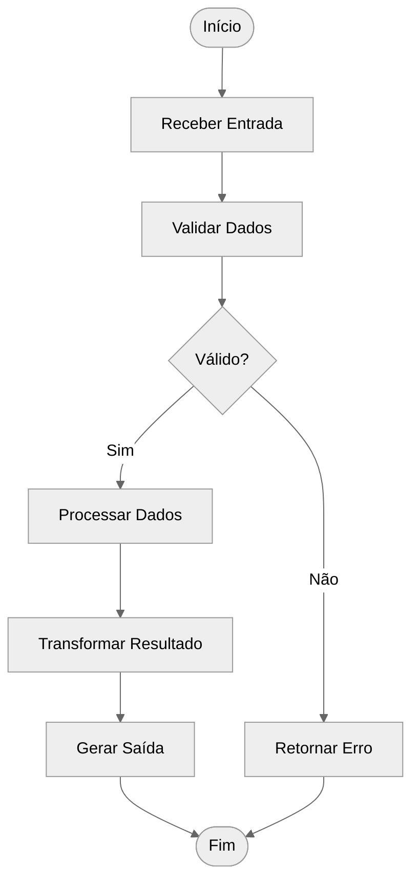
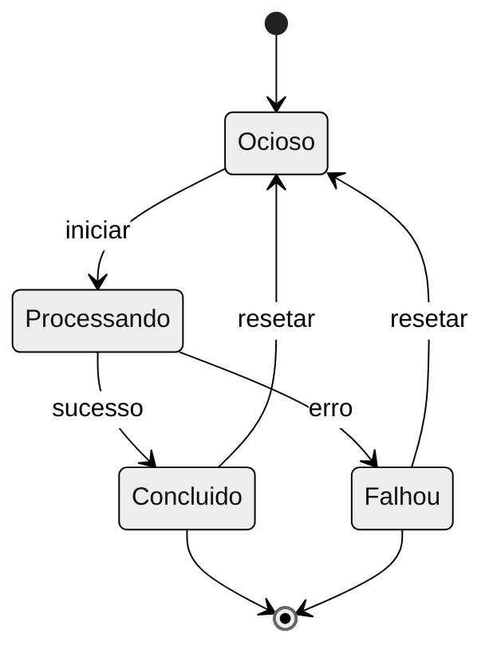
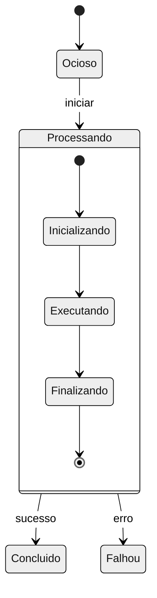
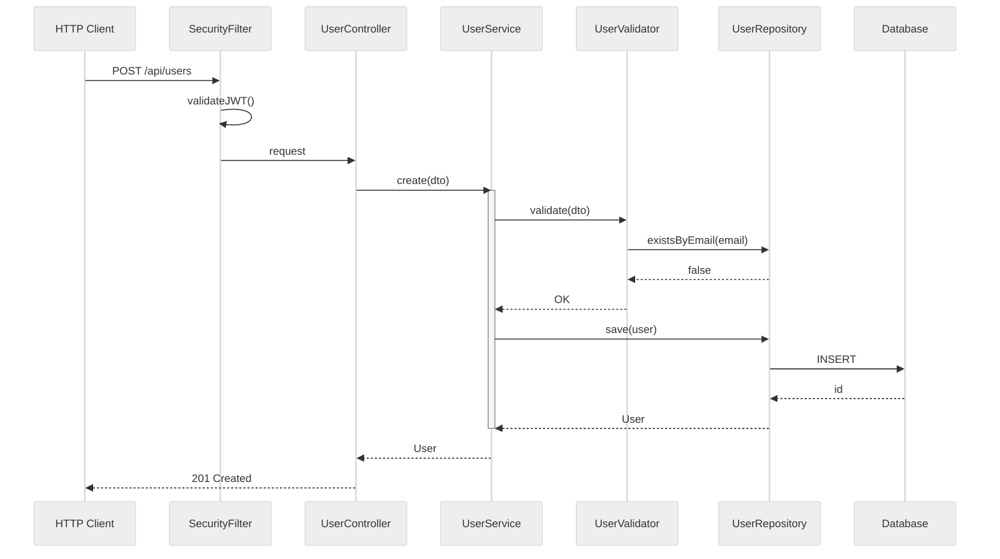
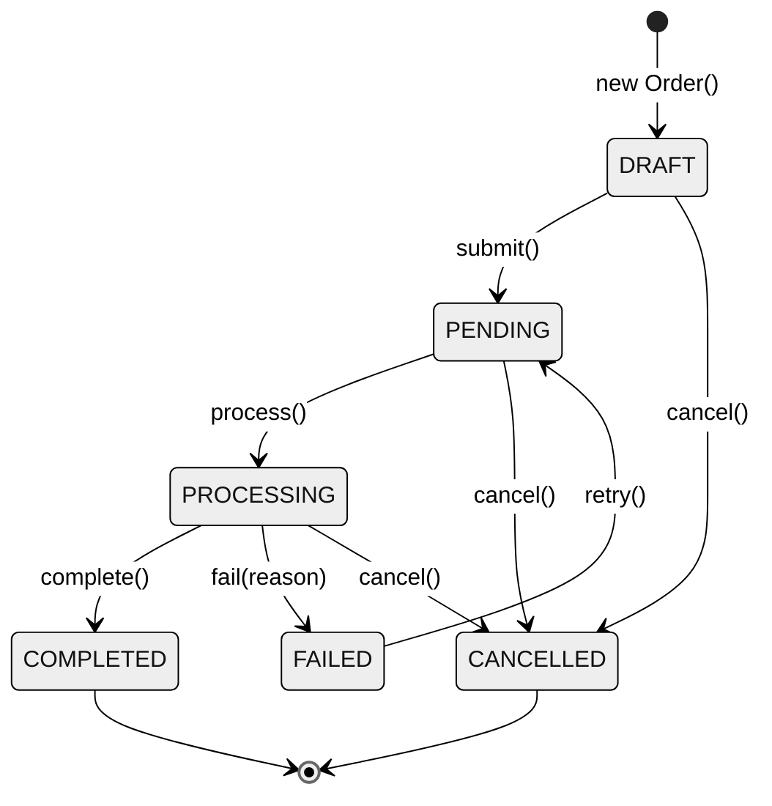
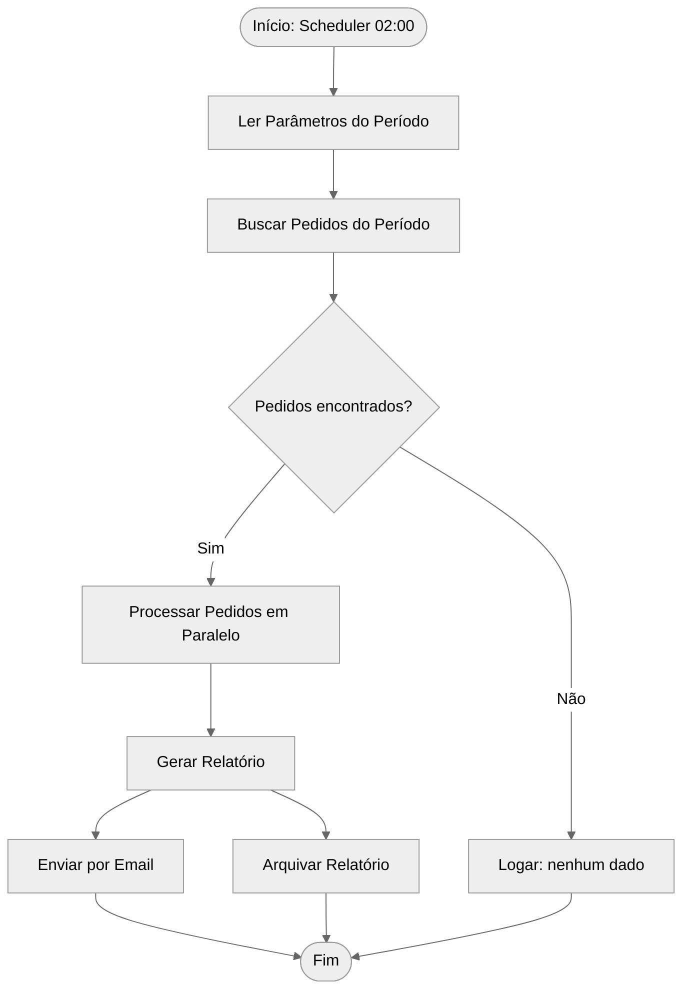

# Modelagem Comportamental (Java)

Como modelar o comportamento dinâmico de um componente Java durante a execução.

---

## Propósito

Modelos comportamentais mostram:
- Como o componente responde a eventos e entradas
- Sequência de ações durante processamento de dados
- Transições de estado em resposta a estímulos
- Comportamento em tempo de execução vs. estrutura estática

---

## Tipos de Modelos Comportamentais

### 1. Modelos Orientados a Dados
Mostram sequência de ações processando dados de entrada para produzir saída.
- Diagramas de atividade
- Representações de fluxo de dados

### 2. Modelos Orientados a Eventos
Mostram como o componente responde a eventos internos e externos.
- Diagramas de estado
- Mapeamentos de evento-resposta

---

## Modelagem Orientada a Dados

### Quando Usar
- Pipelines de processamento de dados
- Sistemas de processamento em lote
- Fluxos de trabalho requisição-resposta
- Operações ETL (Extrair-Transformar-Carregar)

### Elementos do Diagrama de Atividade

| Elemento | Símbolo | Propósito |
|----------|---------|-----------|
| **Início** | ● | Ponto inicial |
| **Fim** | ◉ | Ponto final |
| **Atividade** | ⬜ (arredondado) | Etapa de processamento |
| **Decisão** | ◇ | Ponto de ramificação |
| **Fork/Join** | ━ (barra) | Execução paralela |
| **Objeto de Dados** | 📄 | Dados fluindo entre atividades |

### Template de Diagrama de Atividade



### Documentação de Fluxo de Dados

| Etapa | Entrada | Processamento | Saída |
|-------|---------|---------------|-------|
| 1 | Dados brutos | Validação | Válido/Erro |
| 2 | Dados válidos | Transformação | Processado |
| 3 | Processado | Formatação | Resultado |

---

## Modelagem Orientada a Eventos

### Quando Usar
- Sistemas em tempo real
- Arquiteturas baseadas em eventos
- Máquinas de estado
- Interações de UI
- Implementações de protocolos

### Elementos do Diagrama de Estado

| Elemento | Símbolo | Propósito |
|----------|---------|-----------|
| **Estado** | ⬜ (arredondado) | Condição do sistema |
| **Inicial** | ● | Estado inicial |
| **Final** | ◉ | Estado final |
| **Transição** | → | Mudança de estado |
| **Guarda** | [condição] | Condição de transição |
| **Ação** | do: ação | Atividade no estado |

### Template de Diagrama de Estado



### Documentação de Estados

| Estado | Descrição | Ação de Entrada | Ação de Saída |
|--------|-----------|-----------------|---------------|
| Ocioso | Aguardando entrada | Inicializar | - |
| Processando | Executando tarefa | Iniciar timer | Parar timer |
| Concluido | Tarefa finalizada | Logar sucesso | - |
| Falhou | Tarefa falhou | Logar erro | - |

### Documentação de Estímulos

| Estímulo | Origem | Descrição | Dispara |
|----------|--------|-----------|---------|
| iniciar | Usuário | Inicia operação | Ocioso → Processando |
| sucesso | Interno | Tarefa completada | Processando → Concluido |
| erro | Interno | Tarefa falhou | Processando → Falhou |
| resetar | Usuário | Retorna ao ocioso | * → Ocioso |

---

## Superestados (Máquinas de Estado Complexas)

Para componentes com muitos estados, usar superestados para gerenciar complexidade:



---

## Processo de Análise Comportamental

### 3 Passos para Documentar Comportamento

1. **Decidir que perguntas responder** — Foco varia por tipo de sistema (web, batch, real-time)
2. **Determinar informação disponível** — Constraints de ordering, time-based stimulation
3. **Escolher notação** — Sequência para traces, Estado para comportamento completo

### Processo Detalhado

#### Passo 1: Identificar Tipo de Comportamento
- Este componente é principalmente orientado a dados ou eventos?
- Ou uma combinação de ambos?

**Indicadores em Java:**
- **Orientado a dados**: `@Service` com métodos que transformam DTOs, `Stream` pipelines
- **Orientado a eventos**: `@EventListener`, `@KafkaListener`, `@Scheduled`, `StateMachine`

#### Passo 2: Para Componentes Orientados a Dados
1. Identificar os dados de entrada (DTOs, entidades, mensagens)
2. Traçar as etapas de processamento (métodos do service)
3. Identificar pontos de decisão (validações, regras de negócio)
4. Documentar a saída (responses, eventos publicados)

#### Passo 3: Para Componentes Orientados a Eventos
1. Listar todos os estados possíveis (enum de status, flags)
2. Identificar todos os estímulos (eventos Spring, mensagens Kafka, HTTP requests)
3. Mapear transições de estado (métodos que mudam status)
4. Documentar ações em cada estado (side effects, notificações)

#### Passo 4: Documentar Cenários Principais
- Caminho feliz (fluxo de sucesso)
- Tratamento de erros
- Casos limite

---

## Padrões Comportamentais Comuns

### Padrão Pipeline (Orientado a Dados)
```
Entrada → [Etapa 1] → [Etapa 2] → [Etapa 3] → Saída
```

### Padrão Requisição-Resposta
```
Requisição → Validar → Processar → Formatar → Resposta
```

### Padrão Máquina de Estado (Orientado a Eventos)
```
Ocioso ↔ Ativo ↔ Completo
          ↓
        Erro
```

### Padrão Workflow (Combinado)
```
Início → [Estado 1 com processamento] → [Estado 2 com processamento] → Fim
```

---

## Formato de Saída

### Resumo Comportamental

```markdown
## Comportamento do Componente: [nome]

### Tipo de Comportamento
- **Principal**: [Orientado a dados / Orientado a eventos / Misto]
- **Características**: [Descrição]

### Fluxo de Processamento de Dados

| Entrada | Etapas de Processamento | Saída |
|---------|------------------------|-------|
| Requisição | Validar → Processar → Transformar | Resposta |

### Modelo de Estados

| Estado | Descrição | Transições Permitidas |
|--------|-----------|----------------------|
| Ocioso | Aguardando | iniciar → Processando |
| Processando | Trabalhando | sucesso → Concluido, erro → Falhou |

### Estímulos

| Evento | Origem | Efeito |
|--------|--------|--------|
| iniciar | Comando do usuário | Inicia processamento |
| timeout | Timer | Cancela operação |

### Cenários Principais

#### Cenário 1: Caminho de Sucesso
1. Usuário inicia [ação]
2. Sistema transiciona para [estado]
3. Processamento completa
4. Resultado retornado

#### Cenário 2: Tratamento de Erro
1. Erro ocorre durante [etapa]
2. Sistema transiciona para [estado de erro]
3. Erro logado e reportado
```

---

## Checklist

Antes de completar a análise comportamental:

- [ ] Tipo de comportamento identificado (dados/eventos/misto)
- [ ] Para orientado a dados: etapas de processamento documentadas
- [ ] Para orientado a eventos: estados e estímulos documentados
- [ ] Transições de estado mapeadas
- [ ] Ações em cada estado documentadas
- [ ] Cenário de sucesso descrito
- [ ] Tratamento de erro documentado

---

## Traces em Java

### Trace: Requisição HTTP Completa (Controller → Service → Repository → DB)

```
Trace: "Criar Usuário via REST API"
Estímulo: POST /api/users com body JSON
Participantes: SecurityFilter, UserController, UserService, UserValidator, UserRepository, Database

1. SecurityFilter recebe POST /api/users
2. SecurityFilter valida JWT token → OK
3. SecurityFilter encaminha para UserController
4. UserController deserializa body → UserDTO
5. UserController chama UserService.create(dto)
6. UserService chama UserValidator.validate(dto)
7. UserValidator verifica campos obrigatórios → OK
8. UserValidator verifica email único via UserRepository.existsByEmail() → false
9. UserService cria entidade User a partir de UserDTO
10. UserService chama PasswordEncoder.encode(dto.password())
11. UserService chama UserRepository.save(user)
12. UserRepository executa INSERT via JPA/Hibernate → Database
13. Database retorna ID gerado
14. UserService publica UserCreatedEvent via ApplicationEventPublisher
15. UserService retorna User
16. UserController converte para UserResponse (201 Created)

Resultado: Usuário persistido, evento publicado, 201 retornado
QA Notes:
- @Transactional em UserService.create() (atomicidade)
- PasswordEncoder.encode() é operação CPU-intensiva
- Chamada síncrona end-to-end
```



### State Machine: Entidade JPA com Ciclo de Vida

```java
@Entity
public class Order {
    @Enumerated(EnumType.STRING)
    private OrderStatus status; // DRAFT, PENDING, PROCESSING, COMPLETED, CANCELLED, FAILED

    public void submit() {
        if (status != OrderStatus.DRAFT)
            throw new IllegalStateException("Só pode submeter pedido em DRAFT");
        this.status = OrderStatus.PENDING;
    }

    public void process() {
        if (status != OrderStatus.PENDING)
            throw new IllegalStateException("Só pode processar pedido PENDING");
        this.status = OrderStatus.PROCESSING;
    }

    public void complete() {
        if (status != OrderStatus.PROCESSING)
            throw new IllegalStateException("Só pode completar pedido em PROCESSING");
        this.status = OrderStatus.COMPLETED;
    }

    public void cancel() {
        if (status == OrderStatus.COMPLETED || status == OrderStatus.CANCELLED)
            throw new IllegalStateException("Não pode cancelar pedido " + status);
        this.status = OrderStatus.CANCELLED;
    }

    public void fail(String reason) {
        if (status != OrderStatus.PROCESSING)
            throw new IllegalStateException("Só falha durante PROCESSING");
        this.status = OrderStatus.FAILED;
        this.failureReason = reason;
    }
}
```



### Activity Diagram: Batch Processing

```java
@Component
public class MonthlyReportBatch {
    @Scheduled(cron = "0 0 2 1 * ?") // 1o dia do mês, 02:00
    public void execute() {
        // 1. Ler parâmetros
        LocalDate period = LocalDate.now().minusMonths(1);
        // 2. Buscar dados
        List<Order> orders = orderRepository.findByPeriod(period);
        // 3. Processar em paralelo
        List<ReportLine> lines = orders.parallelStream()
            .map(this::processOrder)
            .collect(toList());
        // 4. Gerar relatório
        Report report = reportGenerator.generate(lines);
        // 5. Enviar por email
        emailService.send(report);
        // 6. Arquivar
        archiveService.store(report);
    }
}
```



### Identificando Quality Attribute Issues em Java

| Issue | Indicador no Código Java | Exemplo |
|-------|-------------------------|---------|
| **Deadlock potencial** | Múltiplos `synchronized` aninhados, `@Transactional` com locks | `synchronized(lockA) { synchronized(lockB) {...} }` |
| **Bottleneck** | Chamada síncrona a serviço externo sem timeout | `restTemplate.getForObject(url, ...)` sem timeout config |
| **Race condition** | Estado compartilhado mutável sem sincronização | Campo de instância `private int counter` em `@Service` singleton |
| **Starvation** | Pool de threads esgotado por operações lentas | `@Async` com pool fixo de 5 threads, operação de 30s |
| **Timeout ausente** | `@Transactional` sem timeout, HTTP client sem timeout | `@Transactional` default (sem timeout) |

---

## Exemplos Java

### Identificando Comportamento via Código

```java
// Orientado a dados: transformação de entrada → saída
@Service
public class OrderService {
    public OrderResult processOrder(OrderRequest request) {
        validate(request);           // Etapa 1
        Order order = create(request); // Etapa 2
        return toResult(order);      // Etapa 3
    }
}

// Orientado a eventos: resposta a estímulos
@Component
public class OrderEventHandler {
    @EventListener
    public void onOrderCreated(OrderCreatedEvent event) { }

    @KafkaListener(topics = "orders")
    public void onOrderMessage(OrderMessage message) { }
}
```

### Estados em Entidades JPA

```java
@Entity
public class Order {
    @Enumerated(EnumType.STRING)
    private OrderStatus status;  // PENDING, PROCESSING, COMPLETED, CANCELLED

    public void process() {
        if (status != OrderStatus.PENDING) {
            throw new IllegalStateException();
        }
        this.status = OrderStatus.PROCESSING;
    }
}
```

### Padrões de Fluxo Java

| Padrão | Indicador | Exemplo |
|--------|-----------|---------|
| Pipeline | Stream API | `list.stream().filter().map().collect()` |
| Async | CompletableFuture | `CompletableFuture.supplyAsync()` |
| Reactive | Flux/Mono | `Mono.just().flatMap().subscribe()` |
| Callback | Interfaces funcionais | `service.execute(result -> ...)` |

### Máquina de Estados com Spring Statemachine

```java
@Configuration
public class OrderStateMachineConfig extends StateMachineConfigurerAdapter<OrderState, OrderEvent> {
    @Override
    public void configure(StateMachineTransitionConfigurer<OrderState, OrderEvent> transitions) {
        transitions
            .withExternal()
                .source(OrderState.PENDING).target(OrderState.PROCESSING)
                .event(OrderEvent.PROCESS)
            .and()
            .withExternal()
                .source(OrderState.PROCESSING).target(OrderState.COMPLETED)
                .event(OrderEvent.COMPLETE);
    }
}
```

---

## C&C Components e Connectors em Java

### Identificando Components em Java

| Padrão Java | C&C Component Type | Exemplo |
|-------------|-------------------|---------|
| `@RestController` | Server | Expõe endpoints HTTP |
| `@Service` | Processing component | Lógica de negócio |
| `@Repository` | Data accessor | Acesso a dados |
| `@Component` + `main()` | Process | Aplicação executável |
| `@KafkaListener` | Subscriber | Consome eventos |
| `@Scheduled` | Active component | Executa periodicamente |

### Identificando Connectors em Java

| Padrão Java | C&C Connector Type | Roles |
|-------------|-------------------|-------|
| `RestTemplate` / `WebClient` | Request-Reply | client → server |
| `JdbcTemplate` / JPA | Data read/write | accessor → repository |
| `KafkaTemplate` | Publish-Subscribe | publisher → subscriber |
| `@Async` / `CompletableFuture` | Async call | caller → callee |
| `@EventListener` / `ApplicationEventPublisher` | Event connector | publisher → listener |

### Exemplos de C&C Styles em Java

#### Client-Server: REST API

```java
// Component: Server (expõe serviços)
@RestController
@RequestMapping("/api/orders")
public class OrderController {
    // Port: HTTP endpoint (interface do component)
    @PostMapping
    public ResponseEntity<OrderResponse> create(@RequestBody OrderRequest req) {
        // ...
    }
}

// Component: Client (consome serviços)
@Service
public class PaymentClient {
    private final WebClient webClient;

    // Connector: Request-Reply via HTTP
    public PaymentResult processPayment(PaymentRequest req) {
        return webClient.post()
            .uri("/payments")
            .bodyValue(req)
            .retrieve()
            .bodyToMono(PaymentResult.class)
            .block();
    }
}
```

#### Publish-Subscribe: Kafka/Spring Events

```java
// Component com Publish Port
@Service
public class OrderService {
    private final KafkaTemplate<String, OrderEvent> kafka;

    public Order createOrder(OrderRequest req) {
        Order order = orderRepository.save(new Order(req));
        // Connector: Pub-Sub via Kafka
        kafka.send("order-events", new OrderCreatedEvent(order.getId()));
        return order;
    }
}

// Component com Subscribe Port
@Component
public class InventoryService {
    // Attachment: subscribe port → pub-sub connector
    @KafkaListener(topics = "order-events")
    public void onOrderCreated(OrderCreatedEvent event) {
        reserveInventory(event.getOrderId());
    }
}
```

#### Shared-Data: Repository Pattern

```java
// Component: Repository (data store)
@Repository
public interface OrderRepository extends JpaRepository<Order, Long> {
    // Port: Data access interface
    List<Order> findByStatus(OrderStatus status);
}

// Component: Data Accessor
@Service
public class OrderReportService {
    private final OrderRepository orderRepository;

    public Report generateReport() {
        // Connector: Data reading
        List<Order> orders = orderRepository.findByStatus(COMPLETED);
        return buildReport(orders);
    }
}
```

#### Pipe-and-Filter: Stream Processing

```java
// Filter 1: Validação
@Component
public class ValidationFilter implements Function<OrderEvent, Optional<ValidatedOrder>> {
    @Override
    public Optional<ValidatedOrder> apply(OrderEvent event) {
        return isValid(event) ? Optional.of(validate(event)) : Optional.empty();
    }
}

// Filter 2: Enriquecimento
@Component
public class EnrichmentFilter implements Function<ValidatedOrder, EnrichedOrder> {
    @Override
    public EnrichedOrder apply(ValidatedOrder order) {
        return enrich(order);
    }
}

// Pipeline: Filters conectados por Pipes
@Configuration
public class OrderPipeline {
    @Bean
    public Function<OrderEvent, ProcessedOrder> pipeline(
            ValidationFilter validation,
            EnrichmentFilter enrichment,
            ProcessingFilter processing) {
        // Pipe: Stream API conectando filters
        return event -> validation.apply(event)
            .map(enrichment)
            .map(processing)
            .orElseThrow();
    }
}
```

### Properties de Runtime em Java

| Property | Onde Encontrar | Exemplo |
|----------|----------------|---------|
| **Concurrency** | Thread pool configs | `@Async("taskExecutor")` com pool de 10 threads |
| **Reliability** | Circuit breaker | `@CircuitBreaker(failureRateThreshold=50)` |
| **Performance** | Response timeout | `WebClient.builder().timeout(Duration.ofSeconds(5))` |
| **Security** | Authentication | `@PreAuthorize("hasRole('ADMIN')")` |
| **Tier** | Deployment unit | `spring.profiles.active=api-tier` |
