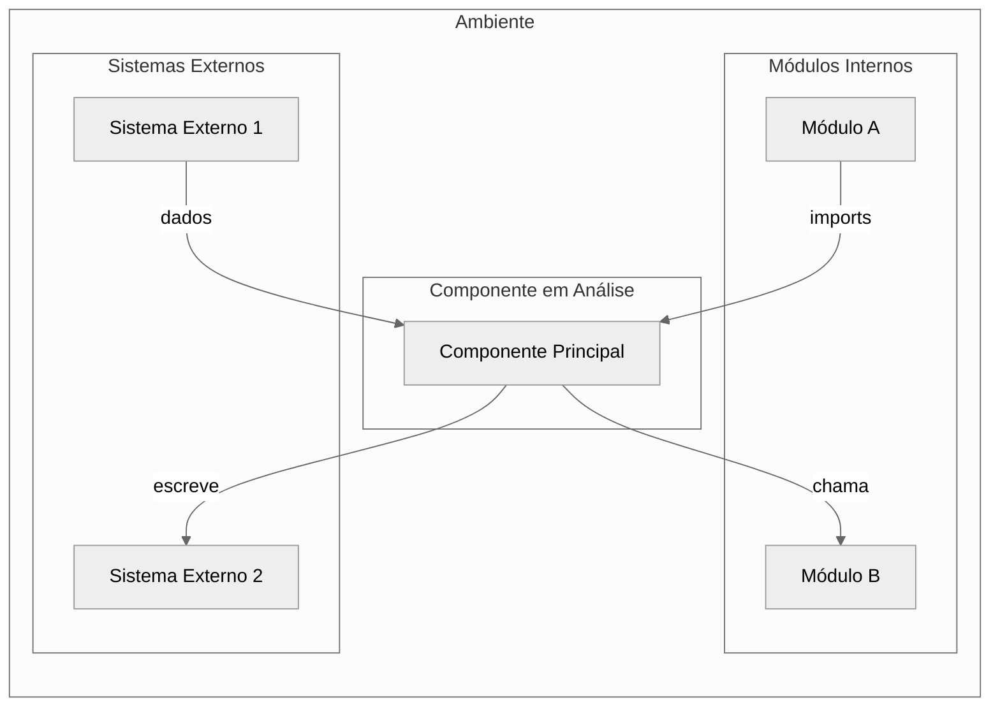
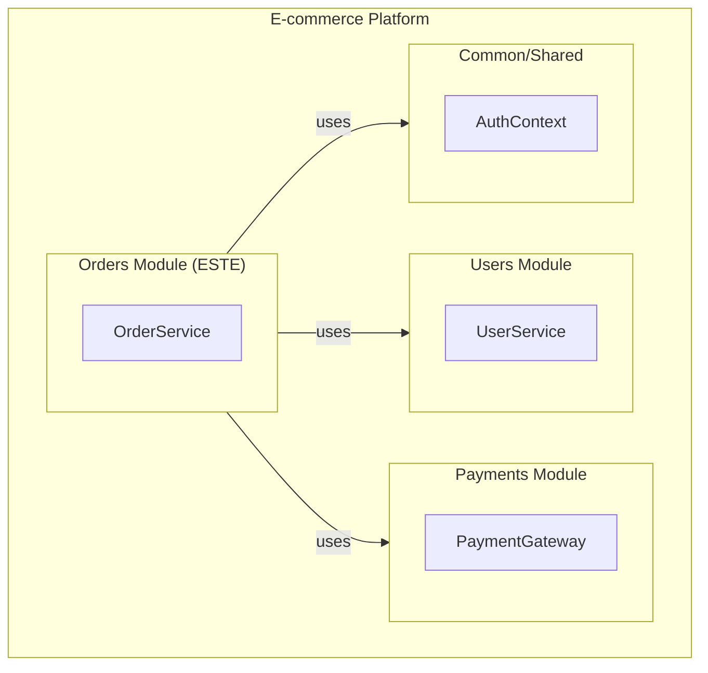
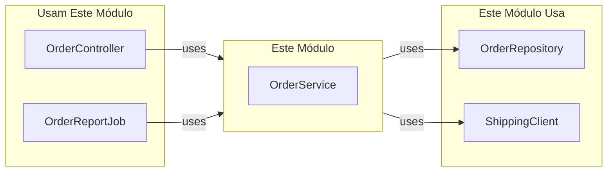
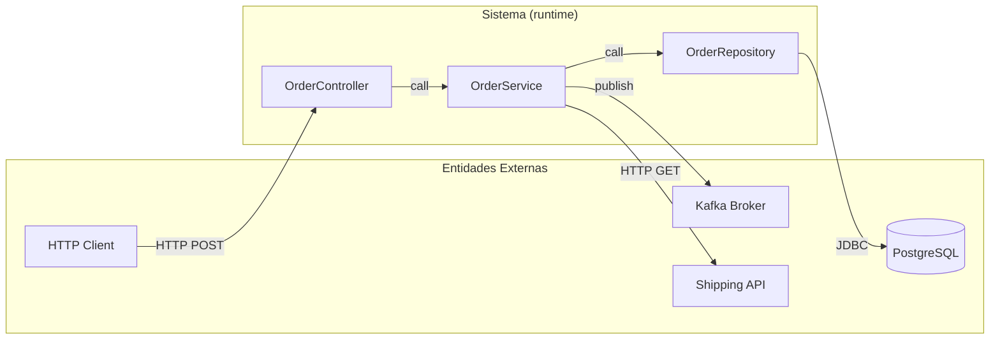

# Modelagem de Contexto (Java)

Como modelar o ambiente e as fronteiras de um componente Java.

---

## Propósito

Modelos de contexto mostram como um componente se encaixa no ambiente mais amplo. Eles ajudam a:
- Definir o que está dentro vs. fora do escopo do componente
- Identificar dependências de sistemas e módulos externos
- Entender fluxo de dados e controle com o ambiente
- Tomar decisões informadas sobre fronteiras do componente

---

## Definição de Fronteiras do Sistema

### Perguntas a Responder

| Pergunta | Orientação |
|----------|------------|
| Qual funcionalidade está dentro deste componente? | Listar responsabilidades principais |
| Qual funcionalidade depende de outros componentes? | Identificar responsabilidades delegadas |
| Com quais sistemas externos este componente interage? | APIs, serviços, bancos de dados, etc. |
| Quais processos são manuais vs. automatizados? | Identificar fronteiras de automação |
| Onde há potenciais sobreposições com outros componentes? | Risco de duplicação |

### Tipos de Fronteira

```
┌─────────────────────────────────────────────────┐
│                  Ambiente                        │
│  ┌─────────────┐      ┌─────────────┐           │
│  │Sistema Ext. │      │Outro Módulo │           │
│  └──────┬──────┘      └──────┬──────┘           │
│         │                    │                   │
│         ▼                    ▼                   │
│  ┌────────────────────────────────────────┐     │
│  │       Fronteira do Componente          │     │
│  │  ┌──────────────────────────────────┐  │     │
│  │  │    Componente em Análise         │  │     │
│  │  │                                  │  │     │
│  │  │  [Funcionalidade Principal]      │  │     │
│  │  │                                  │  │     │
│  │  └──────────────────────────────────┘  │     │
│  └────────────────────────────────────────┘     │
└─────────────────────────────────────────────────┘
```

---

## Componentes do Diagrama de Contexto

### Componente em Análise
- Nome e propósito principal
- Responsabilidades principais (lista)
- Interfaces expostas

### Componentes Adjacentes
Para cada componente conectado, documentar:

| Campo | Descrição |
|-------|-----------|
| **Nome** | Identificador do componente |
| **Relacionamento** | Depende-de / Fornece-para / Compartilha-com |
| **Dados Trocados** | Quais dados fluem entre eles |
| **Tipo de Conexão** | Import direto / Event bus / API / Estado compartilhado |

### Sistemas Externos
Para cada sistema externo:

| Campo | Descrição |
|-------|-----------|
| **Nome** | Identificador do sistema |
| **Tipo** | Banco de dados / API / Serviço / Hardware / Sistema de arquivos |
| **Direção** | Produz dados / Consome dados / Ambos |
| **Protocolo** | HTTP / gRPC / Arquivo / Chamada direta |

---

## Template de Diagrama de Contexto (Mermaid)



---

## Contexto de Processo de Negócio

Modelos de contexto devem ser usados junto com modelos de processo de negócio mostrando como o componente participa dos fluxos de trabalho.

### Perguntas do Modelo de Processo

1. Quais processos de negócio usam este componente?
2. Qual é o papel do componente em cada processo?
3. O que dispara a execução do componente?
4. Quais saídas o componente produz?

---

## Formato de Saída

### Resumo de Contexto

```markdown
## Contexto do Componente: [nome]

### Fronteira do Sistema
- **Escopo**: [Pelo que o componente é responsável]
- **Exclusões**: [O que está explicitamente fora do escopo]

### Componentes Adjacentes
| Componente | Relacionamento | Dados Trocados |
|------------|----------------|----------------|
| UserRepository | Depende-de | Entidades User |
| AuthController | Fornece-para | Tokens de autenticação |

### Sistemas Externos
| Sistema | Tipo | Direção |
|---------|------|---------|
| Banco PostgreSQL | Banco de dados | Ambos |
| API de Email | Serviço | Produz |

### Contexto de Processo
- Usado em: [Lista de processos de negócio]
- Disparado por: [O que inicia o componente]
- Produz: [Quais saídas gera]
```

---

## Checklist

Antes de completar a análise de contexto:

- [ ] Fronteiras do componente claramente definidas
- [ ] Todos os componentes adjacentes identificados
- [ ] Todos os sistemas externos documentados
- [ ] Direção do fluxo de dados documentada
- [ ] Tipos de conexão especificados
- [ ] Contexto de processo de negócio entendido

---

## Exemplos Java

### Identificando Fronteiras via Imports

```java
// Analisar imports para identificar dependências externas
import org.springframework.stereotype.Service;        // Framework
import com.example.repository.UserRepository;        // Componente interno
import javax.mail.MessagingService;                  // Sistema externo
```

### Identificando Fronteiras via Anotações

```java
@Service
public class UserService {
    // Dependências injetadas = componentes adjacentes
    private final UserRepository userRepository;     // Repository layer
    private final EmailClient emailClient;           // Sistema externo
    private final CacheManager cacheManager;         // Infraestrutura

    // Interfaces expostas = o que este componente fornece
    public User createUser(UserDTO dto) { }
    public void notifyUser(Long userId) { }
}
```

### Fronteiras Típicas em Spring

| Anotação | Fronteira |
|----------|-----------|
| `@RestController` | Entrada HTTP (API REST) |
| `@Repository` | Saída para banco de dados |
| `@FeignClient` | Saída para serviço externo |
| `@KafkaListener` | Entrada de eventos |
| `@Scheduled` | Entrada temporal |

---

## Allocation Views em Java

Allocation views mapeiam software para elementos não-software do ambiente.

### Deployment Style: Java para Hardware

**Elementos típicos de deployment Java**:

| Componente C&C | Nó de Hardware | Indicador |
|----------------|----------------|-----------|
| Application Server (Tomcat, JBoss) | VM ou Container | `server.xml`, Dockerfile |
| Database Connection Pool | Database Server | `DataSource` config |
| Message Consumer | Message Broker Host | `@KafkaListener`, `@JmsListener` |
| Scheduled Job | Job Scheduler (Kubernetes CronJob) | `@Scheduled` |

**Identificando deployment via configuração**:

```yaml
# application.yml - indica deployment topology
spring:
  datasource:
    url: jdbc:postgresql://db-server:5432/mydb  # DB em servidor separado
  kafka:
    bootstrap-servers: kafka-broker:9092         # Kafka em servidor separado
  redis:
    host: redis-cache                            # Cache em servidor separado
```

**Kubernetes deployment (indica allocated-to)**:

```yaml
# Deployment.yaml
apiVersion: apps/v1
kind: Deployment
metadata:
  name: user-service
spec:
  replicas: 3                    # Software alocado a 3 pods
  template:
    spec:
      containers:
      - name: app
        image: user-service:1.0
        resources:
          requests:              # Properties REQUIRED
            memory: "512Mi"
            cpu: "500m"
          limits:                # Properties PROVIDED (máximo)
            memory: "1Gi"
            cpu: "1000m"
```

**Docker Compose (deployment local)**:

```yaml
# docker-compose.yml
services:
  app:                           # allocated-to: container 'app'
    image: myapp:latest
    depends_on:
      - db
      - redis
  db:                            # allocated-to: container 'db'
    image: postgres:14
  redis:                         # allocated-to: container 'redis'
    image: redis:7
```

### Install Style: Estrutura de Arquivos Java

**JAR (executável)**:

```
myapp.jar
├── BOOT-INF/
│   ├── classes/                 # Classes compiladas
│   │   └── com/example/...
│   └── lib/                     # Dependências
│       ├── spring-core.jar
│       └── hibernate.jar
├── META-INF/
│   └── MANIFEST.MF              # Main-Class
└── org/springframework/boot/loader/  # Spring Boot loader
```

**WAR (web application)**:

```
myapp.war
├── WEB-INF/
│   ├── classes/                 # Classes compiladas
│   ├── lib/                     # JARs de dependências
│   └── web.xml                  # Deployment descriptor
├── META-INF/
└── static/                      # Recursos estáticos
```

**EAR (enterprise application)**:

```
myapp.ear
├── myapp-web.war                # Módulo web
├── myapp-ejb.jar                # Módulo EJB
├── lib/                         # Bibliotecas compartilhadas
└── META-INF/
    └── application.xml          # Deployment descriptor EAR
```

**Maven structure (development → production mapping)**:

| Módulo Maven | Artefato Produzido | Deployment Target |
|--------------|-------------------|-------------------|
| `user-api` | user-api.jar | Shared library |
| `user-service` | user-service.jar | Application Server |
| `user-web` | user-web.war | Web Container |

### Work Assignment Style: Organização de Equipes Java

**Mapeamento típico módulo → time**:

| Módulo/Pacote | Time | Skill Set Required |
|---------------|------|-------------------|
| `com.example.api` | Time API | REST, OpenAPI |
| `com.example.service` | Time Core | DDD, Spring |
| `com.example.repository` | Time Data | JPA, SQL |
| `com.example.infra.security` | Time Security | OAuth2, JWT |
| `com.example.infra.messaging` | Time Integration | Kafka, RabbitMQ |

**Multi-module Maven e work assignment**:

```xml
<!-- pom.xml (parent) -->
<modules>
    <module>common</module>           <!-- Time: Core -->
    <module>user-service</module>     <!-- Time: Users -->
    <module>order-service</module>    <!-- Time: Orders -->
    <module>payment-service</module>  <!-- Time: Payments -->
</modules>
```

**Indicadores de work assignment no código**:

| Indicador | Significado |
|-----------|-------------|
| `@author` em Javadoc | Responsável pelo componente |
| `CODEOWNERS` file | Time responsável por path |
| Package naming (domain) | Bounded context = time |
| Git history | Commits por autor = ownership |

### Checklist Allocation Views Java

- [ ] **Deployment**: Componentes C&C mapeados para containers/VMs
- [ ] **Deployment**: `application.yml` analisado para topologia
- [ ] **Deployment**: Resources requests/limits documentados (K8s)
- [ ] **Install**: Estrutura JAR/WAR/EAR documentada
- [ ] **Install**: Artefatos Maven/Gradle identificados
- [ ] **Work Assignment**: Módulos mapeados para times
- [ ] **Work Assignment**: CODEOWNERS ou ownership implícita identificada

---

## Context Diagrams em Java

Descreva o contexto do sistema usando o **vocabulário da view** que você está documentando.

### Context Diagram por Tipo de View

#### Decomposition Context (Module View)

Mostra o sistema como parte de um sistema maior:

```java
// Context: Este módulo faz parte de um sistema maior
// Parent system: E-commerce Platform
package com.empresa.ecommerce.orders;  // <- Este é o escopo do contexto

// Dependências externas ao módulo:
import com.empresa.ecommerce.users.UserService;       // Módulo adjacente
import com.empresa.ecommerce.payments.PaymentGateway; // Módulo adjacente
import com.empresa.common.security.AuthContext;       // Shared module
```



#### Uses Context (Module View)

Mostra quem usa este módulo e quem ele usa:

```java
// Este módulo é USADO por:
//   - com.empresa.web.OrderController (interface REST)
//   - com.empresa.batch.OrderReportJob (job batch)

// Este módulo USA:
//   - com.empresa.repository.OrderRepository
//   - com.empresa.external.ShippingClient
```



#### C&C Context (Runtime View)

Mostra interação runtime com entidades externas:

```java
// Runtime interactions:
@RestController
public class OrderController {
    // Interação: Client HTTP → Este componente
    @PostMapping("/orders")
    public Order createOrder(@RequestBody OrderDTO dto) { }
}

@Service
public class OrderService {
    @Autowired
    private KafkaTemplate<String, OrderEvent> kafka;
    // Interação: Este componente → Kafka Broker

    @Autowired
    private RestTemplate shipping;
    // Interação: Este componente → Shipping API
}
```



#### Deployment Context

Mostra software externo no mesmo hardware:

```yaml
# docker-compose.yml - Context diagram em forma de config
services:
  order-service:        # ESTE sistema
    image: order-svc:1.0
    depends_on:
      - postgres        # Entidade externa: database
      - redis           # Entidade externa: cache
      - kafka           # Entidade externa: broker

  postgres:             # Software externo no mesmo "hardware" (Docker network)
    image: postgres:14

  redis:
    image: redis:7

  kafka:
    image: confluentinc/cp-kafka:7.0
```

---

## Variability Guide em Java

**Variability Guide**: Documento que explica todos os variation points e como exercê-los.

### Mecanismos de Variação em Java

#### 1. Spring Profiles (Parameterization - Load time)

```java
// VP1: Database Configuration
@Configuration
public class DataSourceConfig {

    @Bean
    @Profile("dev")
    public DataSource h2DataSource() {
        return new EmbeddedDatabaseBuilder()
            .setType(EmbeddedDatabaseType.H2)
            .build();
    }

    @Bean
    @Profile("prod")
    public DataSource postgresDataSource() {
        HikariDataSource ds = new HikariDataSource();
        ds.setJdbcUrl(env.getProperty("spring.datasource.url"));
        return ds;
    }
}
```

```yaml
# application-dev.yml
spring:
  profiles: dev
  datasource:
    url: jdbc:h2:mem:testdb

# application-prod.yml
spring:
  profiles: prod
  datasource:
    url: jdbc:postgresql://db-server:5432/orders
```

| VP | Element | Options | Binding |
|----|---------|---------|---------|
| VP1 | DataSource | H2 (dev), PostgreSQL (prod) | Load time (profile) |

#### 2. @ConditionalOn* (Optional Inclusion - Load time)

```java
// VP2: Cache Habilitado
@Configuration
@ConditionalOnProperty(name = "cache.enabled", havingValue = "true")
public class CacheConfig {

    @Bean
    @ConditionalOnProperty(name = "cache.type", havingValue = "redis")
    public CacheManager redisCacheManager(RedisConnectionFactory factory) {
        return RedisCacheManager.builder(factory).build();
    }

    @Bean
    @ConditionalOnProperty(name = "cache.type", havingValue = "caffeine")
    public CacheManager caffeineCacheManager() {
        return new CaffeineCacheManager();
    }
}

// VP3: Feature condicional por classe existente
@Configuration
@ConditionalOnClass(KafkaTemplate.class)
public class KafkaIntegrationConfig {
    // Só carrega se Kafka está no classpath
}
```

| VP | Element | Options | Condition | Binding |
|----|---------|---------|-----------|---------|
| VP2 | CacheManager | Redis, Caffeine, None | cache.enabled=true | Load time |
| VP3 | KafkaIntegration | Enabled, Disabled | kafka-clients no classpath | Build time |

#### 3. Dependency Injection (Element Substitution - Build/Load time)

```java
// VP4: Provider de Pagamento
public interface PaymentGateway {
    PaymentResult process(Payment payment);
}

@Service
@Profile("stripe")
public class StripePaymentGateway implements PaymentGateway {
    public PaymentResult process(Payment payment) { /* Stripe API */ }
}

@Service
@Profile("paypal")
public class PayPalPaymentGateway implements PaymentGateway {
    public PaymentResult process(Payment payment) { /* PayPal API */ }
}

// Consumer não sabe qual implementação
@Service
public class OrderService {
    private final PaymentGateway paymentGateway; // Injetado pelo container
}
```

| VP | Element | Options | How to Exercise | Binding |
|----|---------|---------|-----------------|---------|
| VP4 | PaymentGateway | Stripe, PayPal | Ativar profile correspondente | Load time |

#### 4. Feature Toggles (Parameterization - Runtime)

```java
// VP5: Feature Toggle para nova funcionalidade
@Service
public class OrderService {

    @Value("${features.new-checkout.enabled:false}")
    private boolean newCheckoutEnabled;

    public Order createOrder(OrderDTO dto) {
        if (newCheckoutEnabled) {
            return createOrderNewFlow(dto);  // Nova implementação
        } else {
            return createOrderLegacy(dto);   // Implementação atual
        }
    }
}

// Ou usando biblioteca de feature flags (ex: FF4J, Unleash)
@Service
public class OrderService {

    @Autowired
    private FeatureFlagClient featureFlags;

    public Order createOrder(OrderDTO dto) {
        if (featureFlags.isEnabled("new-checkout", currentUser())) {
            return createOrderNewFlow(dto);
        }
        return createOrderLegacy(dto);
    }
}
```

| VP | Element | Options | Condition | Binding |
|----|---------|---------|-----------|---------|
| VP5 | Checkout Flow | New, Legacy | User segment, % rollout | Runtime |

#### 5. Component Replication (Runtime)

```yaml
# Kubernetes Deployment - VP6: Número de réplicas
apiVersion: apps/v1
kind: Deployment
metadata:
  name: order-service
spec:
  replicas: 3  # VP6: Pode variar de 1 a 10
  template:
    spec:
      containers:
      - name: app
        image: order-svc:1.0

---
# HorizontalPodAutoscaler - Dynamic architecture
apiVersion: autoscaling/v2
kind: HorizontalPodAutoscaler
spec:
  scaleTargetRef:
    name: order-service
  minReplicas: 2      # Mínimo
  maxReplicas: 10     # Máximo
  metrics:
  - type: Resource
    resource:
      name: cpu
      targetAverageUtilization: 70
```

| VP | Element | Options | Condition | Binding |
|----|---------|---------|-----------|---------|
| VP6 | OrderService replicas | 2-10 pods | CPU > 70% | Runtime (auto) |

### Template: Variability Guide Java

```markdown
## Variability Guide

### Variation Points

| VP ID | Description | Affected Element | Options | Binding Time |
|-------|-------------|------------------|---------|--------------|
| VP1 | Database provider | DataSource | H2, PostgreSQL, MySQL | Load (profile) |
| VP2 | Cache enabled | CacheManager | Redis, Caffeine, None | Load (property) |
| VP3 | Kafka integration | KafkaConfig | Enabled, Disabled | Build (classpath) |
| VP4 | Payment gateway | PaymentGateway | Stripe, PayPal | Load (profile) |
| VP5 | New checkout flow | OrderService | New, Legacy | Runtime (flag) |
| VP6 | Service replicas | Deployment | 2-10 pods | Runtime (HPA) |

### Dependencies

- VP2 depende de VP1 (cache só faz sentido com DB real)
- VP5 não compatível com VP3 disabled (novo flow usa Kafka)

### How to Exercise

**VP1 (Database)**:
```bash
# Desenvolvimento
java -jar app.jar --spring.profiles.active=dev

# Produção
java -jar app.jar --spring.profiles.active=prod
```

**VP5 (Feature Toggle)**:
```properties
# application.properties
features.new-checkout.enabled=true
# ou via ConfigMap/Secret em Kubernetes
```
```

### Checklist Variability Guide Java

- [ ] Spring Profiles identificados como variation points
- [ ] @ConditionalOnProperty/@ConditionalOnClass mapeados
- [ ] Feature toggles documentados (properties ou biblioteca)
- [ ] Interface + múltiplas implementações identificadas
- [ ] Binding time correto para cada VP
- [ ] Dependencies entre VPs documentadas
- [ ] Kubernetes replicas/HPA documentados (se aplicável)
- [ ] How to exercise cada VP documentado
