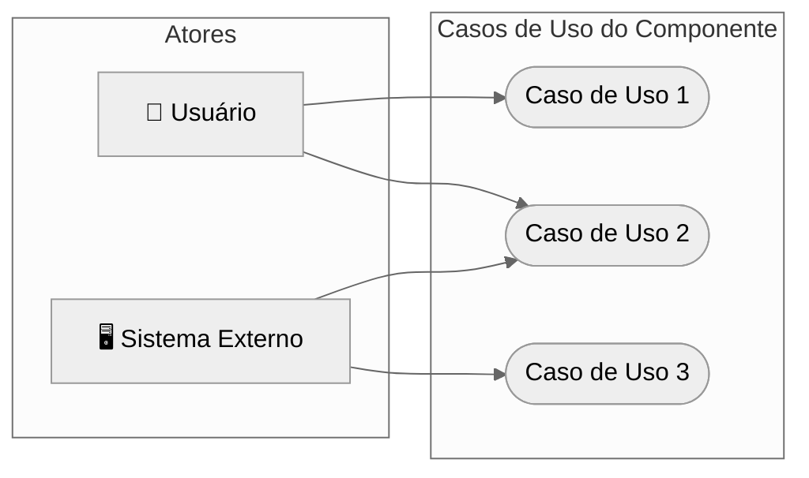
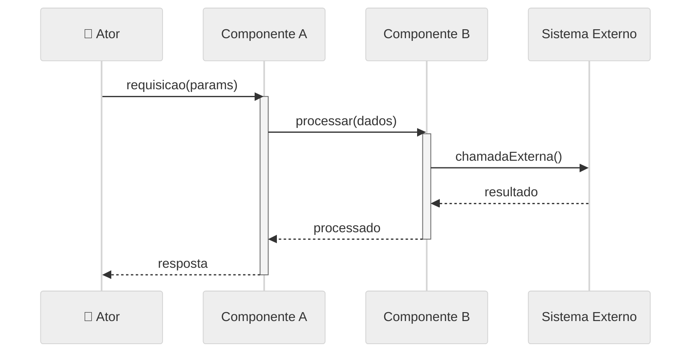
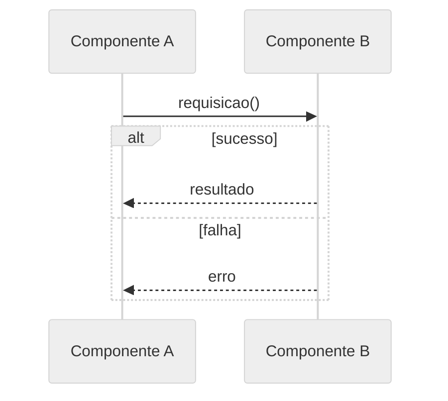
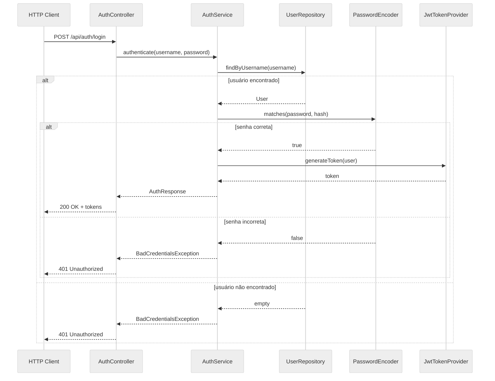
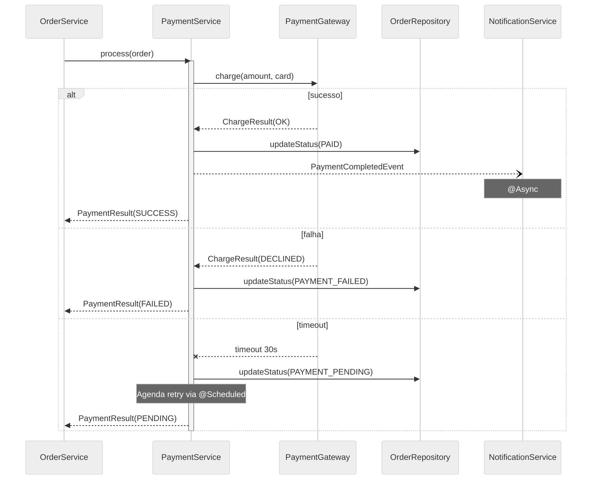
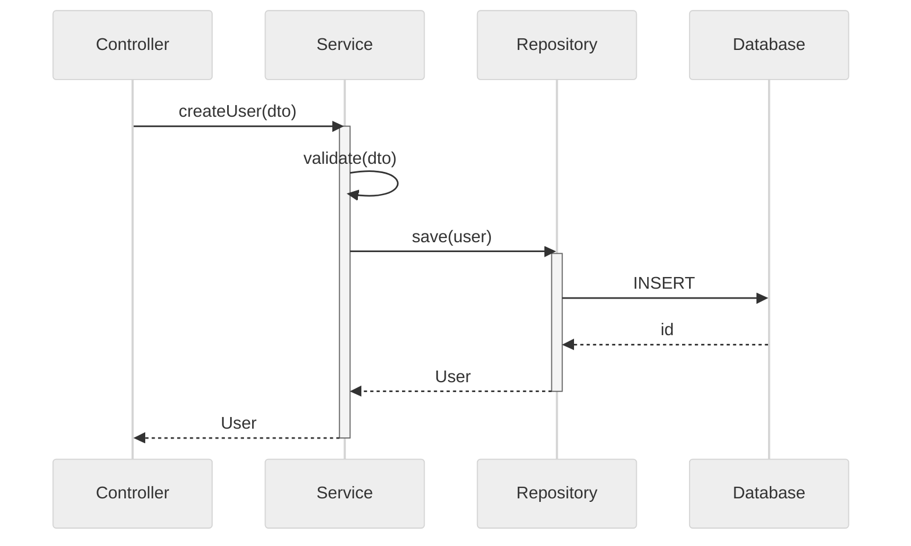
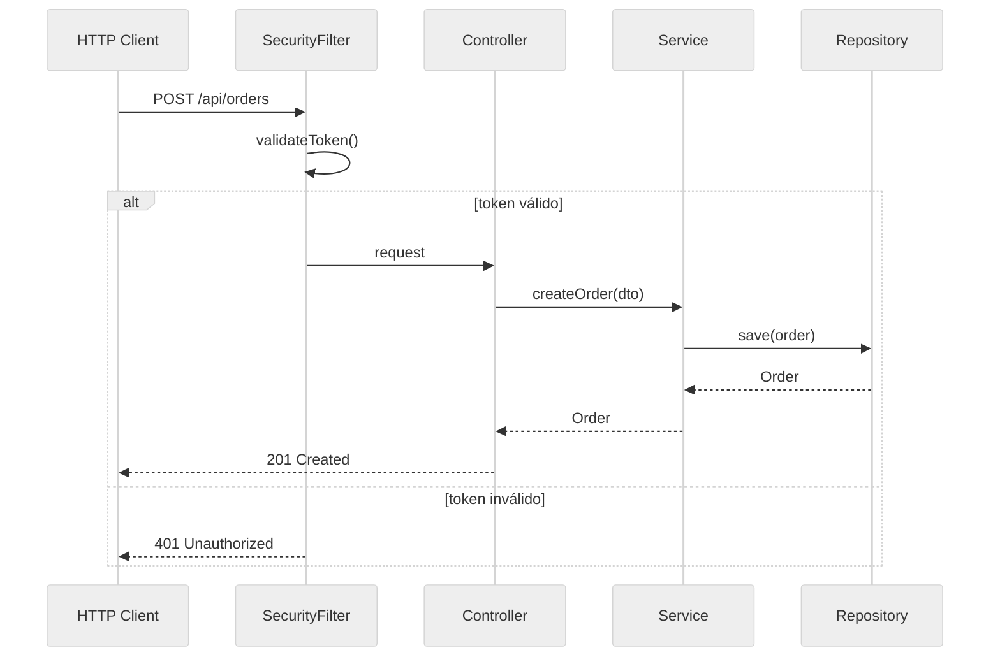

# Modelagem de Interações (Java)

Como modelar interações entre um componente Java e seu ambiente, e entre componentes internos.

---

## Propósito

Modelos de interação mostram:
- Como usuários interagem com o componente
- Como o componente se comunica com sistemas externos
- Como componentes internos colaboram
- Sequência de operações para casos de uso principais

---

## Tipos de Modelos de Interação

### 1. Modelagem de Casos de Uso
Modela interações entre o componente e atores externos (usuários ou sistemas).

### 2. Diagramas de Sequência
Modela interações detalhadas entre componentes, mostrando fluxo de mensagens ao longo do tempo.

---

## Modelagem de Casos de Uso

### Identificação de Casos de Uso

Para cada tarefa discreta envolvendo interação externa:

| Campo | Descrição | Exemplo |
|-------|-----------|---------|
| **Nome** | Verbo de ação + substantivo | "Autenticar Usuário" |
| **Ator(es)** | Quem/o que inicia | Usuário, Sistema Externo |
| **Descrição** | O que acontece | Usuário faz login no sistema |
| **Dados** | Dados de entrada/saída | Credenciais, token de sessão |
| **Estímulo** | O que dispara | Comando do usuário, job agendado |
| **Resposta** | Resultado esperado | Sessão criada |
| **Comentários** | Pré-condições, restrições | Requer conexão ativa |

### Template de Diagrama de Casos de Uso



### Formato Tabular de Casos de Uso

```markdown
| Caso de Uso | Ator(es) | Descrição | Estímulo | Resposta |
|-------------|----------|-----------|----------|----------|
| Autenticar | Usuário | Validar credenciais | Requisição login | Token de sessão |
| Processar Evento | EventBus | Tratar evento do sistema | Evento recebido | Estado atualizado |
```

---

## Diagramas de Sequência

### Quando Usar
- Documentar interações complexas entre componentes
- Mostrar ordem de operações
- Identificar problemas de comunicação
- Validar estrutura proposta

### Elementos Principais

| Elemento | Notação | Propósito |
|----------|---------|-----------|
| **Linha de Vida** | Linha vertical tracejada | Existência do objeto ao longo do tempo |
| **Ativação** | Retângulo na linha de vida | Objeto processando |
| **Mensagem** | Seta entre linhas de vida | Chamada de método ou dados |
| **Retorno** | Seta tracejada | Resposta da chamada |
| **Alt** | Caixa rotulada "alt" | Fluxos alternativos |
| **Loop** | Caixa rotulada "loop" | Operações repetidas |

### Template de Diagrama de Sequência



### Alternativas e Condicionais



---

## Processo de Análise de Interações

### Passo 1: Identificar Atores
- Quem/o que inicia interações com o componente?
- Quem/o que recebe saída do componente?

### Passo 2: Listar Casos de Uso
- Quais tarefas discretas o componente suporta?
- Quais interações externas são necessárias?

### Passo 3: Documentar Sequências Principais
Para cada caso de uso importante:
1. Identificar componentes participantes
2. Traçar o fluxo de mensagens
3. Notar caminhos alternativos
4. Documentar tratamento de erros

### Passo 4: Validar Interações
- Todos os atores foram considerados?
- Todas as interfaces públicas estão cobertas?
- Caminhos de erro estão documentados?

---

## Formato de Saída

### Resumo de Interações

```markdown
## Interações do Componente: [nome]

### Atores
| Ator | Tipo | Descrição |
|------|------|-----------|
| Usuário | Humano | Operador CLI |
| EventBus | Sistema | Despachante de eventos |
| Dispositivo | Hardware | Dispositivo conectado |

### Casos de Uso
| Caso de Uso | Ator(es) | Descrição |
|-------------|----------|-----------|
| Executar Tarefa | Usuário | Executa operação principal |
| Tratar Evento | EventBus | Processa eventos do sistema |

### Sequências Principais

#### Sequência: [Nome do Caso de Uso]
[Diagrama de sequência ou descrição]

**Fluxo**:
1. Ator inicia [ação]
2. Componente A processa [dados]
3. Componente B chama [externo]
4. Resultado retornado ao ator
```

---

## Checklist

Antes de completar a análise de interações:

- [ ] Todos os atores identificados (usuários, sistemas, hardware)
- [ ] Todos os casos de uso documentados
- [ ] Descrições de casos de uso incluem estímulo/resposta
- [ ] Sequências principais documentadas
- [ ] Caminhos alternativos identificados
- [ ] Caminhos de tratamento de erro documentados
- [ ] Interfaces públicas cobertas pelos casos de uso

---

## Traces Java

### Trace 1: Autenticação JWT

```
Trace: "Login com JWT"
Estímulo: POST /api/auth/login com {username, password}
Participantes: AuthController, AuthService, UserRepository, PasswordEncoder, JwtTokenProvider

1. AuthController recebe POST /api/auth/login
2. AuthController chama AuthService.authenticate(username, password)
3. AuthService chama UserRepository.findByUsername(username)
4. UserRepository executa SELECT via JPA → Database
5. alt: usuário encontrado
     5a. AuthService chama PasswordEncoder.matches(password, user.getHash())
     5b. alt: senha correta
           AuthService chama JwtTokenProvider.generateToken(user)
           AuthService retorna AuthResponse(token, refreshToken)
         else: senha incorreta
           AuthService lança BadCredentialsException
6. else: usuário não encontrado
     AuthService lança BadCredentialsException (mesma exceção - não revelar se user existe)

Resultado (sucesso): JWT token + refresh token retornados (200 OK)
Resultado (falha): 401 Unauthorized (mensagem genérica)
QA Notes:
- PasswordEncoder.matches() é intencionalmente lento (bcrypt)
- Mesma exceção para user not found e wrong password (segurança)
- Rate limiting recomendado no endpoint
```



### Trace 2: Transação com Compensação

```
Trace: "Processar Pagamento com Rollback"
Estímulo: Serviço de pedidos chama PaymentService.process(order)
Participantes: OrderService, PaymentService, PaymentGateway, OrderRepository, NotificationService

1. OrderService chama PaymentService.process(order) dentro de @Transactional
2. PaymentService valida dados do pagamento
3. PaymentService chama PaymentGateway.charge(amount, card) [chamada HTTP externa]
4. alt: gateway responde sucesso
     4a. PaymentService cria PaymentRecord(status=SUCCESS)
     4b. PaymentService chama OrderRepository.updateStatus(PAID)
     4c. PaymentService publica PaymentCompletedEvent
     4d. NotificationService envia confirmação (assíncrono via @Async)
5. else: gateway responde falha
     5a. PaymentService cria PaymentRecord(status=FAILED)
     5b. @Transactional faz rollback do status do pedido
     5c. PaymentService publica PaymentFailedEvent
6. else: gateway timeout (> 30s)
     6a. PaymentService cria PaymentRecord(status=PENDING)
     6b. PaymentService agenda verificação via @Scheduled (retry pattern)

QA Notes:
- @Transactional não abrange chamada HTTP ao gateway (não é XA)
- Compensação manual necessária se gateway cobra mas save falha
- @Async para notificação evita bloquear fluxo principal
- Timeout configurado em RestTemplate/WebClient
```



### Trace 3: Error Handling com Circuit Breaker

```
Trace: "Chamada a Serviço Externo com Circuit Breaker"
Estímulo: ProductService.getExternalPrice(productId)
Participantes: ProductService, CircuitBreaker, ExternalPricingAPI, CacheService

1. ProductService chama getExternalPrice(productId)
2. CircuitBreaker verifica estado
3. alt: circuito FECHADO (normal)
     3a. CircuitBreaker permite chamada
     3b. ExternalPricingAPI chamada via HTTP
     3c. alt: resposta OK
           CircuitBreaker registra sucesso
           ProductService retorna preço
         else: falha (5xx, timeout)
           CircuitBreaker registra falha
           CircuitBreaker verifica threshold (ex: 5 falhas em 60s)
           alt: threshold atingido
               CircuitBreaker transiciona para ABERTO
           end
           ProductService busca preço no CacheService (fallback)
4. else: circuito ABERTO (proteção)
     4a. CircuitBreaker rejeita chamada imediatamente
     4b. ProductService busca preço no CacheService (fallback)
5. else: circuito MEIO-ABERTO (teste)
     5a. CircuitBreaker permite uma chamada de teste
     5b. alt: sucesso → CircuitBreaker transiciona para FECHADO
         else: falha → CircuitBreaker volta para ABERTO

QA Notes:
- @CircuitBreaker(name="pricing", fallbackMethod="getCachedPrice")
- Resilience4j ou Spring Cloud Circuit Breaker
- Evita cascading failures em arquitetura de microserviços
```

---

## Exemplos Java

### Identificando Interações via Código

```java
// Ator externo: requisição HTTP
@RestController
@RequestMapping("/api/users")
public class UserController {
    @GetMapping("/{id}")
    public User getUser(@PathVariable Long id) { }

    @PostMapping
    public User createUser(@RequestBody UserDTO dto) { }
}

// Ator externo: mensagem Kafka
@Component
public class OrderListener {
    @KafkaListener(topics = "orders")
    public void onMessage(OrderMessage message) { }
}

// Ator interno: job agendado
@Component
public class CleanupJob {
    @Scheduled(cron = "0 0 2 * * ?")
    public void cleanup() { }
}
```

### Interação entre Camadas Spring



### Tipos de Atores em Java

| Tipo de Ator | Indicador | Exemplo |
|--------------|-----------|---------|
| HTTP Client | `@RestController`, `@Controller` | Usuário via browser/API |
| Message Queue | `@KafkaListener`, `@JmsListener` | Sistema externo |
| Scheduler | `@Scheduled` | Timer interno |
| Event Bus | `@EventListener` | Componente interno |
| gRPC | `@GrpcService` | Outro microserviço |

### Sequência REST Típica


