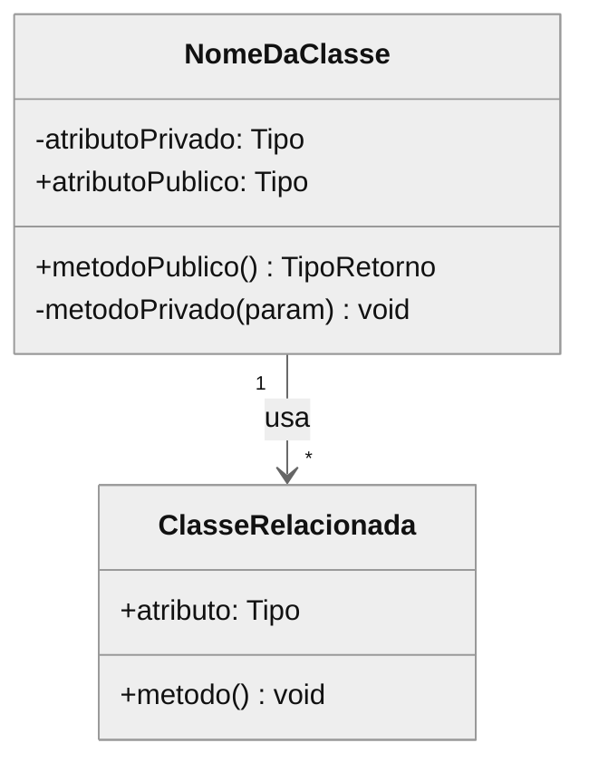
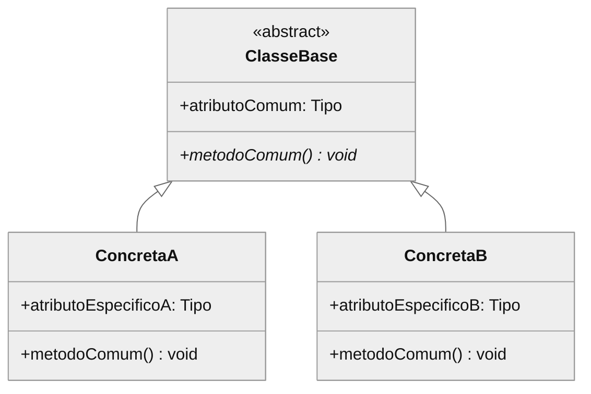
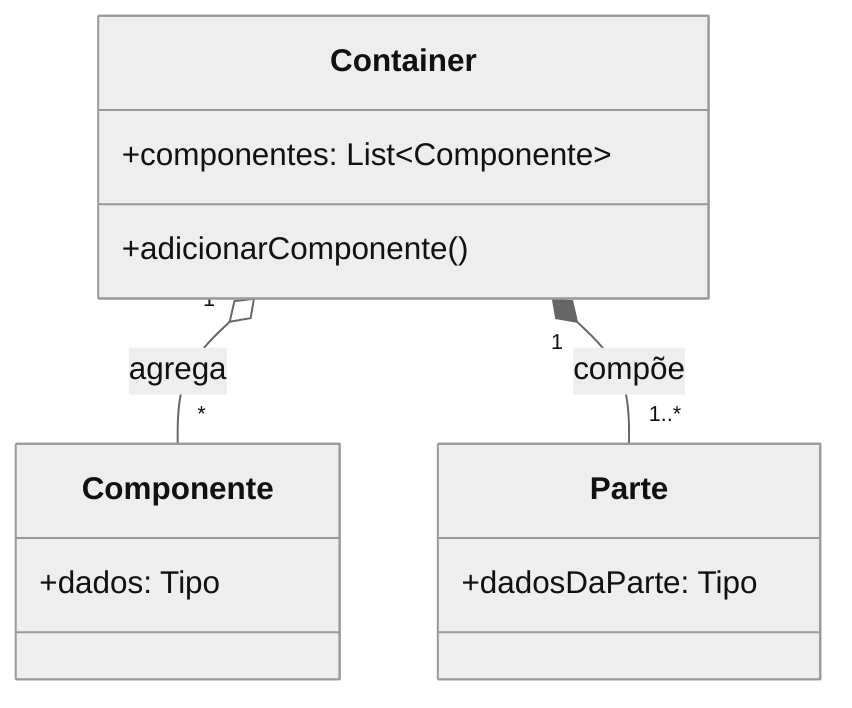

# Modelagem Estrutural (Java)

Como modelar a estrutura estática e organização de um componente Java.

---

## Propósito

Modelos estruturais mostram:
- Organização de componentes em termos de classes e seus relacionamentos
- Estrutura de design estática (tempo de compilação)
- Estruturas de dados e suas associações
- Hierarquias de herança e composição

### Propósitos da Modelagem Estrutural

| Propósito | Descrição |
|-----------|-----------|
| **Construction** | Blueprint para código-fonte. Módulos mapeiam para estruturas físicas (arquivos, diretórios). |
| **Analysis** | Rastreabilidade de requisitos e análise de impacto (dependências → efeito de mudanças). |
| **Communication** | Explicar funcionalidade do sistema. Decomposição top-down facilita onboarding. |

**Limitação**: Module views são **estáticas**. NÃO usar para inferir comportamento em runtime. Para runtime → usar C&C views.

---

## Framework de Relações

Toda modelagem estrutural se baseia em **3 relações fundamentais**:

| Relação | Definição | Em Java |
|---------|-----------|---------|
| **Is-part-of** | Relacionamento parte/todo | Packages, inner classes, módulos Maven/Gradle |
| **Depends-on** | Relação de dependência | `import`, injeção de dependência |
| **Is-a** | Generalização/especialização | `extends`, `implements` |

---

## Tipos de Modelos Estruturais

### 1. Diagramas de Classe
Mostram classes de objetos, atributos, operações e associações.
- Mapeiam para estilos: **Uses**, **Generalization**, **Data Model**

### 2. Hierarquias de Generalização
Mostram relacionamentos de herança entre classes.
- Mapeiam para estilo: **Generalization** (relação is-a)

### 3. Agregação/Composição
Mostram relacionamentos todo-parte.
- Mapeiam para estilo: **Decomposition** (relação is-part-of)

### 4. Camadas (Layers)
Mostram agrupamentos de módulos com regras de uso unidirecionais.
- Mapeiam para estilo: **Layered** (relação allowed-to-use)

---

## Module Styles em Java

Os 6 estilos de módulo aplicados ao ecossistema Java.

### Estilo 1: Decomposition

**Foco**: Relação **is-part-of** — organização do código em módulos e submódulos.

**Manifestações em Java**:

| Mecanismo Java | Exemplo | Descrição |
|----------------|---------|-----------|
| **Packages** | `com.empresa.modulo.submodulo` | Hierarquia de namespaces |
| **Maven/Gradle modules** | `<module>core</module>` | Projetos multi-módulo |
| **Inner classes** | `Outer.Inner` | Classes aninhadas |
| **Java 9+ Modules** | `module-info.java` | JPMS modules |

**Exemplo de Decomposition**:

```
com.empresa.pedidos/
├── api/
│   ├── PedidoController.java
│   └── dto/
│       └── PedidoDTO.java
├── domain/
│   ├── Pedido.java
│   └── ItemPedido.java
├── service/
│   └── PedidoService.java
└── repository/
    └── PedidoRepository.java
```

**Perguntas de análise**:
- A estrutura de packages reflete a organização lógica do sistema?
- Cada package tem um propósito coerente?
- Existe hierarquia clara de submódulos?

---

### Estilo 2: Uses

**Foco**: Relação **uses** — "A uses B if A's correctness depends on the correctness of B".

**Manifestações em Java**:

| Mecanismo Java | Exemplo | É "uses"? |
|----------------|---------|-----------|
| **import + uso** | `import com.x.Y; y.metodo()` | Sim |
| **Injeção de dependência** | `@Autowired UserService` | Sim |
| **Callback/listener** | `addListener(handler)` | Não* |
| **import sem uso** | `import com.x.Unused;` | Não |

*Callback não é uses porque o chamador não depende do que o handler faz.

**Distinção crítica em Java**:

```java
// USES: UserService depende da corretude de UserRepository
@Service
public class UserService {
    private final UserRepository userRepository;  // uses

    public User findById(Long id) {
        return userRepository.findById(id).orElseThrow();  // depende
    }
}

// NÃO É USES: EventPublisher não depende do que o listener faz
@Service
public class EventPublisher {
    private final List<EventListener> listeners;  // não é uses

    public void publish(Event event) {
        listeners.forEach(l -> l.onEvent(event));  // callback
    }
}
```

**Perguntas de análise**:
- Quais classes dependem funcionalmente de quais?
- Existem ciclos de dependência?
- As dependências permitem testes unitários com mocks?

---

### Estilo 3: Generalization

**Foco**: Relação **is-a** — parent (generalização) e children (especializações).

**Manifestações em Java**:

| Mecanismo Java | Exemplo | Tipo |
|----------------|---------|------|
| **extends class** | `class Dog extends Animal` | Class inheritance |
| **implements interface** | `class UserServiceImpl implements UserService` | Interface realization |
| **extends interface** | `interface List extends Collection` | Interface inheritance |
| **abstract class** | `abstract class BaseEntity` | Parcialmente abstrato |

**Exemplo de Generalization**:

```java
// Interface realization
public interface PaymentProcessor {
    PaymentResult process(Payment payment);
}

@Service
public class CreditCardProcessor implements PaymentProcessor {
    @Override
    public PaymentResult process(Payment payment) { ... }
}

@Service
public class PixProcessor implements PaymentProcessor {
    @Override
    public PaymentResult process(Payment payment) { ... }
}
```

```java
// Class inheritance (para reuso de implementação)
public abstract class BaseEntity {
    @Id @GeneratedValue
    private Long id;

    @CreatedDate
    private LocalDateTime createdAt;
}

@Entity
public class User extends BaseEntity {
    private String email;
}
```

**Perguntas de análise**:
- Hierarquias usam interface ou class inheritance?
- Há herança múltipla de interfaces?
- A profundidade de herança é razoável (< 3 níveis)?

---

### Estilo 4: Layered

**Foco**: Relação **allowed-to-use** — módulos agrupados em layers com regras unidirecionais.

**Arquitetura Layered típica em Java**:

| Camada | Package | Allowed-to-use | Anotações Típicas |
|--------|---------|----------------|-------------------|
| **Apresentação** | `*.controller`, `*.api` | Aplicação | `@RestController`, `@Controller` |
| **Aplicação** | `*.service`, `*.usecase` | Domínio | `@Service`, `@Transactional` |
| **Domínio** | `*.domain`, `*.entity` | Infraestrutura | `@Entity`, POJOs |
| **Infraestrutura** | `*.repository`, `*.client` | - | `@Repository`, `@Component` |

**Exemplo de Layered Architecture**:

```java
// CAMADA: Apresentação
@RestController
@RequestMapping("/users")
public class UserController {
    private final UserService userService;  // allowed: usa Aplicação

    @GetMapping("/{id}")
    public UserDTO getUser(@PathVariable Long id) {
        return userService.findById(id);  // OK
    }
}

// CAMADA: Aplicação
@Service
public class UserService {
    private final UserRepository userRepository;  // allowed: usa Infraestrutura
    // NÃO pode ter: private final UserController (violação!)

    public UserDTO findById(Long id) {
        User user = userRepository.findById(id).orElseThrow();
        return UserDTO.from(user);
    }
}

// CAMADA: Domínio
@Entity
public class User {
    @Id private Long id;
    private String email;
    // Não deve ter dependências de outras camadas
}

// CAMADA: Infraestrutura
@Repository
public interface UserRepository extends JpaRepository<User, Long> {
}
```

**Violações comuns a detectar**:

```java
// VIOLAÇÃO: Service importando Controller
import com.empresa.controller.UserController;  // upward dependency!

// VIOLAÇÃO: Entity com lógica de apresentação
@Entity
public class User {
    public UserDTO toDTO() { ... }  // contamina domínio com DTO
}

// VIOLAÇÃO: Repository com lógica de negócio
@Repository
public class UserRepositoryImpl {
    public void createUser(UserDTO dto) { ... }  // lógica de aplicação
}
```

**Perguntas de análise**:
- Os packages refletem as camadas?
- Existem imports "para cima" (upward uses)?
- A camada de domínio está livre de dependências de infraestrutura?

---

### Estilo 5: Aspects

**Foco**: Relação **crosscuts** — isolar módulos responsáveis por crosscutting concerns.

**Manifestações em Java**:

| Mecanismo Java | Exemplo | Concern |
|----------------|---------|---------|
| **Spring AOP** | `@Aspect`, `@Around` | Custom aspects |
| **@Transactional** | `@Transactional` | Transaction management |
| **@Secured/@PreAuthorize** | `@PreAuthorize("hasRole('ADMIN')")` | Security |
| **@Slf4j/@Log4j2** | `log.info(...)` | Logging |
| **@Cacheable** | `@Cacheable("users")` | Caching |
| **@Validated** | `@Valid` | Validation |
| **Filters/Interceptors** | `OncePerRequestFilter` | Request processing |

**Exemplo de Aspects**:

```java
// Aspect customizado para auditoria
@Aspect
@Component
public class AuditAspect {

    @Around("@annotation(Audited)")
    public Object audit(ProceedingJoinPoint joinPoint) throws Throwable {
        String method = joinPoint.getSignature().getName();
        log.info("Iniciando: {}", method);

        Object result = joinPoint.proceed();

        log.info("Concluído: {}", method);
        return result;
    }
}

// Uso nos services (crosscut)
@Service
public class UserService {

    @Audited  // aspect crosscuts este método
    @Transactional  // outro aspect
    @PreAuthorize("hasRole('ADMIN')")  // outro aspect
    public void deleteUser(Long id) {
        userRepository.deleteById(id);
    }
}
```

**Identificando code tangling e scattering**:

```java
// CODE TANGLING: múltiplos concerns misturados
public void createOrder(Order order) {
    log.info("Creating order: {}", order.getId());  // logging
    if (!securityContext.hasRole("USER")) {  // security
        throw new AccessDeniedException();
    }
    Transaction tx = txManager.begin();  // transaction
    try {
        // lógica de negócio aqui
        tx.commit();
    } catch (Exception e) {
        tx.rollback();
        throw e;
    }
}

// REFATORADO com aspects:
@Slf4j
@Transactional
@PreAuthorize("hasRole('USER')")
public void createOrder(Order order) {
    // apenas lógica de negócio
}
```

**Perguntas de análise**:
- Há código repetido para logging, segurança, transações?
- Os crosscutting concerns estão em aspects ou espalhados?
- Há code tangling (múltiplos concerns em um método)?

---

### Estilo 6: Data Model

**Foco**: Estrutura de informação estática — **data entities** e seus relacionamentos.

**Manifestações em Java (JPA/Hibernate)**:

| Relacionamento | Anotação JPA | Cardinalidade |
|----------------|--------------|---------------|
| Um-para-um | `@OneToOne` | 1:1 |
| Um-para-muitos | `@OneToMany` | 1:N |
| Muitos-para-um | `@ManyToOne` | N:1 |
| Muitos-para-muitos | `@ManyToMany` | M:N |
| Herança | `@Inheritance` | is-a |
| Embeddable | `@Embedded` | composição |

**Exemplo de Data Model**:

```java
@Entity
@Table(name = "orders")
public class Order {
    @Id @GeneratedValue
    private Long id;

    // Relacionamento N:1 (muitos pedidos para um cliente)
    @ManyToOne(fetch = FetchType.LAZY)
    @JoinColumn(name = "customer_id")
    private Customer customer;

    // Relacionamento 1:N (um pedido tem muitos itens)
    @OneToMany(mappedBy = "order", cascade = CascadeType.ALL, orphanRemoval = true)
    private List<OrderItem> items = new ArrayList<>();

    // Composição (embedded)
    @Embedded
    private Address shippingAddress;

    @Enumerated(EnumType.STRING)
    private OrderStatus status;
}

@Entity
public class OrderItem {
    @Id @GeneratedValue
    private Long id;

    @ManyToOne
    @JoinColumn(name = "order_id")
    private Order order;

    @ManyToOne
    private Product product;

    private Integer quantity;
}

@Embeddable
public class Address {
    private String street;
    private String city;
    private String zipCode;
}
```

**Herança em JPA**:

```java
@Entity
@Inheritance(strategy = InheritanceType.SINGLE_TABLE)
@DiscriminatorColumn(name = "payment_type")
public abstract class Payment {
    @Id @GeneratedValue
    private Long id;
    private BigDecimal amount;
}

@Entity
@DiscriminatorValue("CREDIT_CARD")
public class CreditCardPayment extends Payment {
    private String cardNumber;
    private String cardHolder;
}

@Entity
@DiscriminatorValue("PIX")
public class PixPayment extends Payment {
    private String pixKey;
}
```

**Perguntas de análise**:
- Quais entidades existem e seus relacionamentos?
- Há normalização adequada?
- Lazy loading está configurado corretamente?
- Há cascade operations definidas?

---

### Resumo: Estilos e Indicadores Java

| Estilo | Indicadores no Código Java |
|--------|----------------------------|
| **Decomposition** | Packages hierárquicos, módulos Maven/Gradle, inner classes |
| **Uses** | `import`, `@Autowired`, construtores com dependências |
| **Generalization** | `extends`, `implements`, `abstract class`, interfaces |
| **Layered** | Packages por camada (controller/service/repository), ausência de imports upward |
| **Aspects** | `@Transactional`, `@Secured`, `@Cacheable`, `@Aspect`, filters |
| **Data Model** | `@Entity`, `@OneToMany`, `@ManyToOne`, `@Embedded` |

---

## Diagramas de Classe

### Representação de Classe

```
┌───────────────────────┐
│     NomeDaClasse      │  ← Nome
├───────────────────────┤
│ - atributo1: Tipo     │  ← Atributos
│ + atributo2: Tipo     │     (- privado, + público)
├───────────────────────┤
│ + metodo1(): Tipo     │  ← Operações
│ - metodo2(param): void│
└───────────────────────┘
```

### Tipos de Associação

| Tipo | Notação | Significado | Relação |
|------|---------|-------------|------------------|
| **Associação** | Linha sólida | Classes estão relacionadas | depends-on |
| **Direcionada** | Seta → | Uma classe conhece a outra | uses |
| **Bidirecional** | Linha (sem seta) | Ambas classes se conhecem | uses (mútuo) |
| **Dependência** | Seta tracejada --> | Usa mas não possui | uses |

### Multiplicidade

| Notação | Significado | Em Java |
|---------|-------------|---------|
| `1` | Exatamente um | Campo obrigatório |
| `0..1` | Zero ou um | `Optional<T>` ou nullable |
| `*` ou `0..*` | Zero ou mais | `List<T>`, `Set<T>` |
| `1..*` | Um ou mais | `List<T>` com validação |
| `n..m` | Intervalo de n a m | Validação custom |

### Template de Diagrama de Classe



---

## Generalização (Herança)

### Relação Is-a

A relação **is-a** conecta módulo específico (child) ao mais geral (parent). O child pode ser usado em contextos do parent (substitutibilidade).

### Quando Modelar Herança
- Quando classes compartilham atributos/operações comuns
- Quando subclasses especializam comportamento da superclasse
- Quando polimorfismo é usado

### Diagrama de Generalização



---

## Agregação e Composição

### Relação Is-part-of

A relação **is-part-of** conecta submódulo (parte) ao módulo agregado (todo).

### Agregação vs Composição em Java

```java
// COMPOSIÇÃO: Order "possui" seus items (criados internamente, morrem juntos)
public class Order {
    private final List<OrderItem> items = new ArrayList<>();  // Composição

    public void addItem(Product product, int quantity) {
        items.add(new OrderItem(product, quantity));  // cria internamente
    }
}

// AGREGAÇÃO: OrderService "tem" um UserService (injetado, vida independente)
@Service
public class OrderService {
    private final UserService userService;  // Agregação via DI

    public OrderService(UserService userService) {
        this.userService = userService;  // recebe de fora
    }
}
```

### Diagrama de Composição



---

## Processo de Análise Estrutural

### Passo 1: Identificar Classes Principais
- Quais são as principais entidades de domínio (`@Entity`)?
- Quais são as classes de serviço principais (`@Service`)?
- Quais são as estruturas de dados (DTOs)?

### Passo 2: Mapear Associações (Estilo Uses)
Para cada par de classes:
- Existe um relacionamento de **uses**? (correctness depends on)
- Qual é a direção (quem tem o `@Autowired`)?
- Qual é a multiplicidade?

### Passo 3: Identificar Hierarquias (Estilo Generalization)
- Existem classes base abstratas?
- Existem implementações de interface?
- Existem cadeias de herança?

### Passo 4: Documentar Composições (Estilo Decomposition)
- Quais objetos possuem outros objetos?
- Qual é o relacionamento de ciclo de vida?
- A estrutura de packages é hierárquica?

### Passo 5: Identificar Camadas (Estilo Layered)
- O sistema tem camadas lógicas (controller/service/repository)?
- As regras de uso são unidirecionais?
- Existem imports "para cima"?

### Passo 6: Identificar Crosscutting Concerns (Estilo Aspects)
- Há código repetido para logging, segurança, transações?
- Os concerns ortogonais usam annotations (`@Transactional`, `@Secured`)?
- Há code tangling ou scattering?

---

## Padrões Estruturais a Identificar

| Padrão | Estrutura | Propósito | Indicador Java |
|--------|-----------|-----------|----------------|
| **Factory** | Criador → Produto | Criação de objetos | `*Factory`, `of()`, `create()` |
| **Strategy** | Contexto → Interface Strategy | Algoritmos intercambiáveis | Interface + múltiplas `@Service` |
| **Observer** | Sujeito → Observador | Notificação de eventos | `ApplicationEventPublisher` |
| **Decorator** | Componente ← Decorador | Comportamento dinâmico | Wrapper classes |
| **Facade** | Fachada → Subsistemas | Interface simplificada | `@Service` agregando outros |
| **Layer** | Camada → Camada inferior | Separação de concerns | Packages por camada |

---

## Formato de Saída

### Resumo Estrutural

```markdown
## Estrutura do Componente: [nome]

### Module Style Predominante
[Qual dos 6 estilos melhor descreve este componente]

### Classes Principais

| Classe | Responsabilidade | Anotações | Métodos Chave |
|--------|------------------|-----------|---------------|
| UserController | Endpoints REST | @RestController | getUser(), createUser() |
| UserService | Lógica de negócio | @Service | findById(), save() |
| User | Entidade de domínio | @Entity | (atributos) |

### Relacionamentos entre Classes (Estilo Uses)

| De | Para | Tipo | Anotação |
|----|------|------|----------|
| UserController | UserService | uses | @Autowired |
| UserService | UserRepository | uses | @Autowired |

### Hierarquias de Herança (Estilo Generalization)

```
BaseEntity (abstract)
├── User (@Entity)
├── Order (@Entity)
└── Product (@Entity)

UserService (interface)
└── UserServiceImpl (@Service)
```

### Camadas (Estilo Layered)

| Camada | Package | Anotações | Allowed-to-use |
|--------|---------|-----------|----------------|
| Apresentação | *.controller | @RestController | Aplicação |
| Aplicação | *.service | @Service | Domínio |
| Domínio | *.entity | @Entity | Infraestrutura |
| Infraestrutura | *.repository | @Repository | - |

### Crosscutting Concerns (Estilo Aspects)

| Concern | Mecanismo | Módulos Afetados |
|---------|-----------|------------------|
| Transações | @Transactional | Services |
| Segurança | @PreAuthorize | Controllers, Services |
| Logging | @Slf4j | Todos |

### Padrões Identificados
- **Strategy**: PaymentProcessor com implementações CreditCard, Pix
- **Factory**: UserFactory.create()
```

---

## Checklist

Antes de completar a análise estrutural:

### Relações Fundamentais
- [ ] Relações **is-part-of** identificadas (packages, módulos)
- [ ] Relações **depends-on** identificadas (imports, @Autowired)
- [ ] Relações **is-a** identificadas (extends, implements)

### Module Styles
- [ ] Estilo **Decomposition**: packages e módulos documentados
- [ ] Estilo **Uses**: dependências mapeadas (uses ≠ calls)
- [ ] Estilo **Generalization**: hierarquias de herança/interface documentadas
- [ ] Estilo **Layered**: camadas e regras allowed-to-use identificadas
- [ ] Estilo **Aspects**: crosscutting concerns identificados (@Transactional, @Secured)
- [ ] Estilo **Data Model**: entidades JPA e relacionamentos documentados

### Documentação
- [ ] Classes principais identificadas com responsabilidades
- [ ] Associações mapeadas com direção e multiplicidade
- [ ] Padrões de design reconhecidos
- [ ] Interfaces públicas documentadas
- [ ] Estilo predominante identificado

---

## Exemplos Java Adicionais

### Identificando Estrutura via Código

```java
// Herança
public class UserService extends BaseService implements IUserService { }

// Composição (campo final, criado internamente)
public class OrderService {
    private final List<OrderItem> items = new ArrayList<>();  // Composição
}

// Agregação (campo injetado, pode ser compartilhado)
public class OrderService {
    private final UserService userService;  // Agregação via DI

    public OrderService(UserService userService) {
        this.userService = userService;
    }
}
```

### Padrões Java Comuns

| Padrão Java | Estrutura | Indicador |
|-------------|-----------|-----------|
| Service Layer | Interface + Impl | `UserService`, `UserServiceImpl` |
| DTO | Classe de dados | `UserDTO`, `UserRequest` |
| Entity | JPA entity | `@Entity`, `@Table` |
| Builder | Construção fluente | `@Builder`, `Builder` inner class |
| Factory | Criação de objetos | `*Factory`, métodos `of()`, `create()` |

### Relacionamentos Spring

```java
@Service
public class UserService {
    // Dependência 1:1 (obrigatória)
    private final UserRepository userRepository;

    // Dependência 0..1 (opcional)
    @Autowired(required = false)
    private CacheManager cacheManager;

    // Dependência 1:* (múltiplas implementações)
    private final List<UserValidator> validators;
}
```

### Hierarquia Típica

```
BaseEntity (abstract)
├── User (@Entity)
├── Order (@Entity)
└── Product (@Entity)

IUserService (interface)
└── UserServiceImpl (@Service)

RuntimeException
├── BusinessException (custom)
│   ├── UserNotFoundException
│   └── InvalidOrderException
└── ValidationException
```
