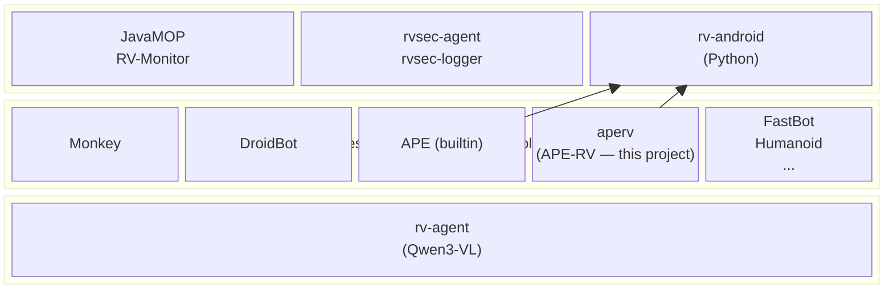
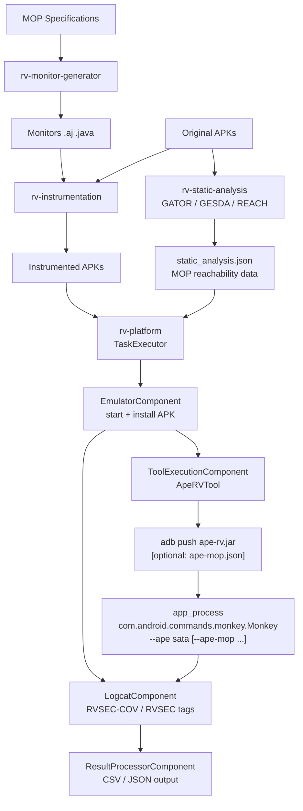
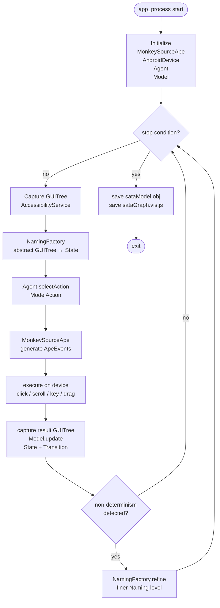
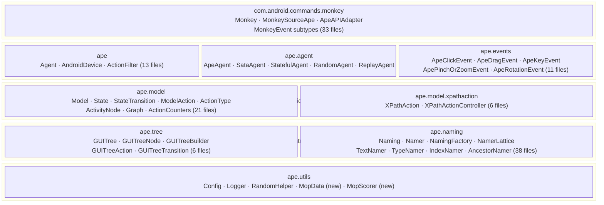
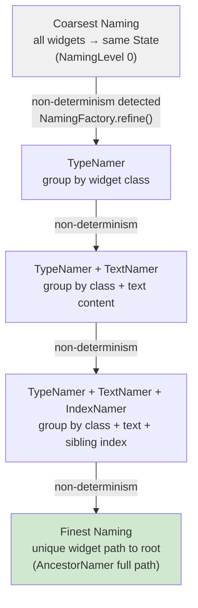
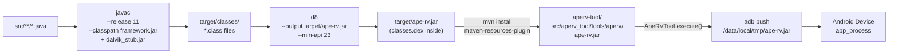
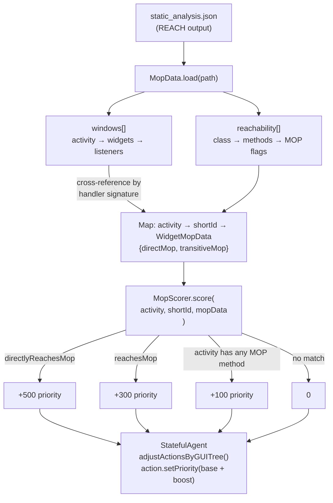
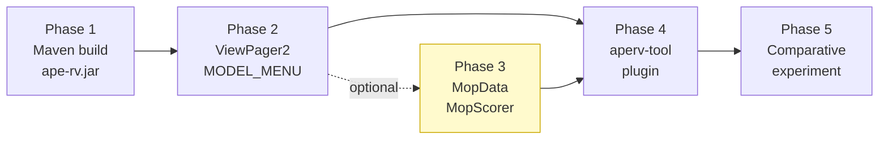

# APE-RV — Product Requirements Document

## 1. Overview

APE-RV is an enhanced fork of APE (Android Property Explorer), a model-based Android GUI testing tool originally developed by the AST Lab at ETH Zurich and published at ICSE 2019. The fork is developed at the University of Brasília (UnB) as a component of the RVSEC (Runtime Verification for Security) research infrastructure, with two interconnected goals: (1) restore and modernize APE's build system so the tool remains buildable with current Android SDK toolchains, and (2) enrich APE's exploration strategy with UI coverage improvements and optional MOP (Monitor-Oriented Programming) guidance derived from rv-android's static analysis pipeline.

The project is part of a PhD thesis at UnB investigating how combining automated test-case generation with runtime verification detects cryptographic API misuses in Android applications. APE-RV produces `ape-rv.jar`, a Dalvik-compatible JAR deployed and executed via ADB on Android devices. The JAR is also distributed as the `aperv` plugin for rv-android's tool registry, enabling controlled comparative experiments between the original APE builtin and the enhanced APE-RV variant within the rv-experiment framework.

### 1.1 Key Facts

- **140 Java source files** across 9 packages, compiled to a single Dalvik JAR via Apache Ant + `dx` (original) or Maven + `d8` (target)
- **ICSE 2019 publication**: *"Practical GUI Testing of Android Applications via Model Abstraction and Refinement"* — one of the most cited automated Android testing papers of the decade
- **Coverage achieved in rv-android Experiment 01**: 25.27% overall method coverage, 14.56% MOP method coverage at 300s timeout (3rd best among 11 tool configurations)
- **Known build breakage**: Java 25 + Android build-tools 35 removed `dx` and reject `--source/--target 1.7`; the original Ant build is non-functional with modern toolchains
- **5 exploration strategies**: `sata` (Symbolic Action Type Abstraction — primary), `bfs`, `dfs`, `random`, `ape` (full CEGAR with refinement)
- **Plugin ID**: `aperv` — distinct from the original `ape` builtin already registered in rv-android's ToolRegistry

### 1.2 RVSEC Ecosystem Context

APE-RV is part of the **RVSEC** ecosystem developed at UnB. APE-RV occupies the tool layer: it is one of the test-case generation tools evaluated against instrumented Android APKs alongside Monkey, DroidBot, FastBot, ARES, DroidMate, Humanoid, and QTesting.

| Component | Language | Role in ecosystem |
|-----------|----------|-------------------|
| **JavaMOP** | Java | Reads MOP specifications, generates AspectJ code and RVM intermediaries |
| **RV-Monitor** | Java | Reads RVM specifications, synthesizes Java monitor classes |
| **rvsec** (Java classes) | Java | Core runtime classes: rvsec-core, rvsec-logger, rvsec-agent |
| **rv-android** | Python | APK instrumentation, test execution orchestration, LLM-guided exploration |
| **APE-RV** (this project) | Java | Enhanced Android GUI testing tool; `aperv` plugin for rv-android |

The rv-android ecosystem integrates the **original APE** as a builtin tool (`rv-tools/builtin/ape/tool.py`). APE-RV introduces a distinct `aperv` plugin that extends the original with a working build, UI improvements, and optional MOP-guided scoring. Both tools coexist in rv-android's ToolRegistry, enabling direct comparison within the same experiment.



### 1.3 Origin: APE from ETH Zurich

APE was developed by Jue Wang, Yanyan Jiang, Chang Xu, Shunkun Yang, and Chang Zhang at ETH Zurich's AST Lab. It was published at ICSE 2019 and subsequently open-sourced. APE builds on top of Android's **Monkey** tool: the Monkey binary (`com.android.commands.monkey.Monkey`) serves as the execution harness, and APE replaces Monkey's random event source (`MonkeySourceRandom`) with an intelligent source (`MonkeySourceApe`) backed by a CEGAR (Counterexample-Guided Abstraction Refinement) model.

APE's central research contribution is a **lattice-based abstraction/refinement algorithm** (the `naming` package) that dynamically adjusts how GUI states are abstracted. When the model detects non-determinism — the same abstract state producing different concrete GUI trees — it refines the abstraction by introducing finer-grained naming predicates. This allows the model to distinguish states that appeared identical at a coarser abstraction level, enabling more targeted exploration.

In the comparative study conducted in rv-android's Experiment 01 (188 F-Droid apps, 300s timeout, 3 repetitions), APE ranked third in overall method coverage (25.27%) and fourth in MOP method coverage (14.56%), behind Humanoid, FastBot, and DroidBot BFS Greedy. Its advantage over pure random tools (Monkey: 21.00%) demonstrates the value of model-based exploration.

---

## 2. Problem Statement

### 2.1 Broken Build Prevents Reproduction and Extension

The original APE repository uses Apache Ant with the `dx` tool (`dalvik-tools`) for compilation. Android SDK build-tools 35 removed `dx` entirely, and Java 25's stricter source/target version requirements reject `--source 1.7 --target 1.7` (the values specified in APE's `build.xml`). As a result, the original build is non-functional with any modern Android SDK and any Java version ≥ 17. Research groups attempting to build APE from source cannot do so without downgrading the entire toolchain.

This creates a reproducibility gap: the pre-compiled `ape.jar` bundled in the repository cannot be traced to buildable sources with modern tools, making it impossible to audit, extend, or patch the binary.

### 2.2 Limited Coverage of Modern AndroidX UI Components

APE detects horizontally-scrollable containers to generate scroll events. Its detection logic in `GUITreeNode.getScrollType()` checks for the class name `android.support.v4.view.ViewPager` — the support library name that was superseded by AndroidX in 2018. Modern applications use `androidx.viewpager.widget.ViewPager` and `androidx.viewpager2.widget.ViewPager2`, which APE does not recognize. As a result, APE cannot scroll through tab pages or carousels in any application built with AndroidX, leaving entire UI regions unexplored.

### 2.3 OptionsMenu Is Not Systematically Explored

Android's `KEYCODE_MENU` event opens the three-dot overflow menu (`OptionsMenu`) in many applications. APE's event system includes menu key generation, but only as part of random fuzzing (controlled by `doFuzzing` and `fuzzingRate`, enabled by default at 2% probability). There is no `MODEL_MENU` action type in APE's exploration model, so the OptionsMenu is never explored as a first-class systematic action. Applications that expose significant functionality only through the OptionsMenu are therefore underexplored by APE in its default configuration.

### 2.4 APE Has No Awareness of Runtime Verification Specifications

Existing test-generation tools, including APE, explore Android applications without any knowledge of which code paths are relevant to runtime verification monitors. The RVSEC infrastructure produces static analysis data (via REACH) that identifies, for each widget handler, whether it directly invokes a monitored API method (`directlyReachesMop`) or has a transitive path to one (`reachesMop`). None of the third-party tools integrated in rv-android exploit this data. The consequence is that exploration is driven purely by coverage heuristics, not by RV specification relevance, leaving MOP-relevant code paths underexplored despite being identifiable statically.

---

## 3. Solution

APE-RV addresses these problems through four sequential improvements, each buildable independently:

1. **Build modernization**: Replace Ant+dx with Maven+d8+Java 11. The Maven build produces `ape-rv.jar` (a Dalvik DEX JAR) using the same compile-time dependencies as the original (`framework/classes-full-debug.jar` and `dalvik_stub/classes.jar`), which expose `@hide` Android APIs required by APE. The `mvn install` phase copies the JAR into the `aperv-tool` Python module so the Python plugin always ships the latest binary.

2. **UI coverage improvements**: Two targeted changes expand APE's coverage of modern Android UIs. The first adds AndroidX class names for ViewPager/ViewPager2 to APE's scroll detection, enabling horizontal scroll exploration in any application using the AndroidX widget library. The second adds `MODEL_MENU` as a first-class systematic action in APE's exploration model, causing every reachable state to be probed for OptionsMenu content.

3. **MOP-guided action scoring (optional)**: When a static analysis JSON file is provided (produced by rv-android's REACH pipeline), APE-RV loads widget-to-MOP mappings and applies a priority boost to actions whose handlers reach monitored API methods. This variant (`aperv:sata_mop`) requires the static analysis file; all other variants run without it.

4. **aperv plugin for rv-android**: A new Python module (`aperv-tool`) implementing `ApeRVTool(AbstractTool)` and registering under the plugin ID `aperv` in rv-android's ToolRegistry. The plugin wraps the JAR deployment and execution via ADB, supports all four variants (`sata`, `sata_mop`, `bfs`, `random`), and integrates with rv-android's logcat-based coverage infrastructure.

### 3.1 Pipeline Position in rv-android

APE-RV runs as a tool within rv-android's task execution pipeline. It does not participate in the instrumentation or static analysis phases — those are handled by rv-platform's component architecture. APE-RV receives an instrumented APK (already installed on the emulator) and a device ID, executes the JAR via `app_process`, and its output is consumed by rv-platform's `LogcatComponent` for coverage tracking.



---

## 4. System Architecture

### 4.1 Java Component (ape-rv.jar)

The Java component is the core of APE-RV. It runs on the Android device as a Dalvik process via `app_process`. The entry point is `com.android.commands.monkey.Monkey`, which reads command-line arguments, selects the `MonkeySourceApe` event source, and enters the main testing loop.

```
Monkey (entry point)
  └── MonkeySourceApe (bridges Agent → Monkey event queue)
        ├── AndroidDevice (singleton: AccessibilityService, UiAutomation, Display)
        ├── Model (exploration graph: State, StateTransition, ModelAction)
        └── Agent (strategy interface)
              ├── ApeAgent     — full CEGAR with naming lattice refinement
              ├── SataAgent    — SATA heuristic (primary strategy; wraps StatefulAgent)
              ├── StatefulAgent — base class: action ranking, priority, MOP injection point
              ├── RandomAgent  — uniform random action selection
              └── ReplayAgent  — replay recorded action sequences
```

The testing loop runs inside `MonkeySourceApe.nextEventImpl()`. Each iteration:

1. Captures the current `GUITree` from the Android AccessibilityService
2. `NamingFactory` abstracts the tree into an abstract `State` via the current `Naming` level
3. The `Agent` selects a `ModelAction` from the state's available actions
4. `MonkeySourceApe` translates the action into Monkey events (`ApeEvent` subclasses) and enqueues them
5. After execution, the result tree is captured and the `Model` is updated
6. `NamingFactory` checks for non-determinism and refines the abstraction if needed



### 4.2 Package Structure

| Package | Files | Responsibility |
|---------|-------|----------------|
| `com.android.commands.monkey` | 33 | Monkey harness, event types (AOSP-derived), entry point |
| `ape` | 13 | Agent interface, AndroidDevice singleton, ActionFilter |
| `ape.agent` | 5 | ApeAgent, SataAgent, StatefulAgent, RandomAgent, ReplayAgent |
| `ape.model` | 21 | Exploration graph: Model, State, StateTransition, Action, ActionType, ActivityNode |
| `ape.tree` | 6 | Current-screen representation: GUITree, GUITreeNode, GUITreeBuilder |
| `ape.naming` | 38 | Core abstraction/refinement: Naming, Namer lattice, NamingFactory |
| `ape.events` | 11 | Event generation: ApeClickEvent, ApeDragEvent, ApeKeyEvent, etc. |
| `ape.utils` | 7 | Config (100+ flags), Logger, RandomHelper, Utils |
| `ape.model.xpathaction` | 6 | XPath-based action sequencing (scripted test injection) |



**Compile-time dependencies** (not bundled in APK; accessed via reflection at runtime):
- `framework/classes-full-debug.jar` — `@hide` Android APIs: `android.app.UiAutomationConnection`, `android.hardware.display.DisplayManagerGlobal`, `com.android.internal.*`
- `dalvik_stub/classes.jar` — Dalvik-specific stubs required at compile time

### 4.3 Core Innovation: Naming/Abstraction

The `naming` package implements the central contribution of the ICSE 2019 paper. The abstraction mechanism maps each concrete `GUITree` to an abstract `State` via a `Naming` — a set of `Namer` predicates applied to widget attributes (text, type, index, ancestor). The `NamingFactory` maintains a lattice of `Naming` levels, from coarsest (all widgets map to the same state) to finest (each widget is uniquely identified).

When two different concrete GUI trees map to the same abstract state but produce different available actions — a non-determinism event — `NamingFactory` refines the naming by introducing a finer predicate. This CEGAR loop continues until the abstraction is precise enough to distinguish all observed states within each abstract equivalence class.

The refinement algorithm is implemented in `NamingFactory.refine()` and `NamingFactory.checkDivergence()`. Key predicates are: `TextNamer` (widget text content), `TypeNamer` (widget class name), `IndexNamer` (sibling index), `AncestorNamer` (path from root), `ParentNamer` (immediate parent attributes). Predicates are composed into `CompoundNamer` instances, forming the lattice nodes.



### 4.4 Python Component (aperv-tool)

The Python component is a new uv workspace module inside rv-android's module directory (`rvsec/rv-android/modules/aperv-tool/`). It implements `ApeRVTool(AbstractTool)` following the same pattern as the existing `rvsmart-tool` module. The tool is registered in rv-android's `ToolRegistry` under the plugin ID `aperv` via a lazy import in `rv-platform/__init__.py`'s `_register_external_tools()` function.

```
aperv-tool/
├── pyproject.toml                   ← uv workspace member (auto-discovered)
└── src/aperv_tool/
    └── tools/aperv/
        ├── __init__.py
        ├── tool.py                  ← ApeRVTool(AbstractTool)
        ├── ape-rv.jar               ← copied by mvn install (gitignored)
        └── .gitignore
```

`ApeRVTool` responsibilities:
- Locate `ape-rv.jar` via `JarResolver` with priority: module directory → `$RVSEC_HOME/ape/target/` → `$TOOLS_DIR/aperv/`
- Push JAR to device via ADB (`/data/local/tmp/ape-rv.jar`)
- Push static analysis JSON for `sata_mop` variant (`/data/local/tmp/ape-mop.json`)
- Execute via `app_process` with appropriate flags
- Return `CommandResult` for logcat capture and timeout handling

### 4.5 Build Architecture

The Maven build (`pom.xml`) replaces the Ant build (`build.xml`) with four key steps:

1. `javac --release 11` — compile Java source against `framework/classes-full-debug.jar` and `dalvik_stub/classes.jar` (system-scoped dependencies)
2. `exec-maven-plugin` invokes `d8 --output target/ape-rv.jar --min-api 23 target/classes/**/*.class` — converts class files to a Dalvik DEX JAR
3. On `mvn package`, `target/ape-rv.jar` is ready for deployment
4. On `mvn install`, `maven-resources-plugin` copies `target/ape-rv.jar` to `../rvsec/rv-android/modules/aperv-tool/src/aperv_tool/tools/aperv/ape-rv.jar`

The Ant `build.xml` is retained with a deprecation notice and continues to work for users with legacy toolchains (Java 7, dx available).



---

## 5. Functional Requirements

### 5.1 Build System

#### FR01: Maven Build Producing Dalvik JAR

The build system MUST compile APE-RV's Java source code and produce a Dalvik-compatible `ape-rv.jar` using Maven and `d8`. The build MUST:
- Use `javac --release 11` to compile to Java 11 bytecode
- Invoke `d8` post-compile with `--min-api 23` (Android 6.0 Marshmallow, the minimum supported version)
- Include `framework/classes-full-debug.jar` and `dalvik_stub/classes.jar` as compile-time dependencies (system scope — not bundled in output)
- Produce `target/ape-rv.jar` containing `classes.dex`

The output JAR MUST be deployable to an Android device via `adb push` and executable via `app_process`.

**Entry point**: `com.android.commands.monkey.Monkey`
**Build commands**: `mvn clean package` (build only), `mvn clean install` (build + copy to aperv-tool)

#### FR02: Automatic JAR Deployment to aperv-tool

The Maven `install` phase MUST copy `target/ape-rv.jar` to `${aperv_tool_dir}/src/aperv_tool/tools/aperv/ape-rv.jar`, where `${aperv_tool_dir}` is configurable via a Maven property (default relative path to the sibling rv-android module). This ensures that the Python plugin always contains the latest compiled binary after a `mvn install`.

The `ape-rv.jar` file inside the Python module MUST be gitignored. The Maven property MUST have a default that works for the expected workspace layout (`../rvsec/rv-android/modules/aperv-tool/src/aperv_tool/tools/aperv/`) and MUST be overridable for non-standard layouts.

#### FR03: Ant Build Retained with Deprecation Notice

The original `build.xml` MUST be retained in the repository with a header comment indicating deprecation in favor of `pom.xml`. The Ant build is kept to support users who cannot upgrade their toolchain, but it is not the primary build path.

### 5.2 Exploration Engine

#### FR04: Model-Based GUI Exploration via Agent Interface

APE-RV MUST implement model-based GUI exploration through the `Agent` interface. The exploration loop captures the current GUI tree, abstracts it to a state via the naming system, selects a model action, executes it, and updates the exploration model. The loop terminates when the configured stop condition is met (time limit via `--running-minutes` or step count via `-v`).

The exploration MUST produce an exploration graph (serialized as `sataModel.obj` and `sataGraph.vis.js`) recording states, transitions, and action visit counts. On normal termination, the graph MUST be saved before exit.

#### FR05: Exploration Strategies

APE-RV MUST support the following exploration strategies selectable via the `--ape <strategy>` command-line argument:

| Strategy | Class | Status | Description |
|----------|-------|--------|-------------|
| `sata` | `SataAgent` | **Implemented** | SATA heuristic: epsilon-greedy with unvisited action priority; primary strategy for experiments |
| `random` | `RandomAgent` | **Implemented** | Priority-weighted random action selection using `StatefulAgent` priority infrastructure; serves as experimental baseline |
| `replay` | `ReplayAgent` | **Implemented** (via `ape.replayLog` config, not `--ape` flag) | Replays a recorded action log |
| `ape` | `ApeAgent` | **Planned — Phase 2** | Full CEGAR with naming lattice refinement (original APE algorithm); class exists but not wired into `createAgent()` |
| `bfs` | `StatefulAgent` with BFS queue | **Planned — Phase 2** | Breadth-first state exploration |
| `dfs` | `StatefulAgent` with DFS stack | **Planned — Phase 2** | Depth-first state exploration |

The `sata` strategy MUST be the default when `--ape` is provided without a strategy argument.

> **Current state**: The CLI (`--ape [AGENT_TYPE(random,sata)]`) exposes only `sata` and `random`. The `replay` strategy is accessible via `ape.replayLog` configuration. The `ape`, `bfs`, and `dfs` strategies are Phase 2 deliverables.

#### FR06: SATA Heuristic Action Selection

The `SataAgent` MUST implement the SATA (Symbolic Action Type Abstraction) heuristic:

1. **Unvisited action priority**: Actions not yet executed in the current state have highest priority. Among unvisited actions, the BACK action is checked first, then MENU (after FR09), then widget actions ordered by type priority.
2. **Epsilon-greedy fallback**: When all actions in the current state are visited, `SataAgent.selectNewActionEpsilonGreedyRandomly()` selects a new state to explore with probability `1 - epsilon` (exploitation) or a random unvisited action in the current state with probability `epsilon`.
3. **Restart on stable graph**: When the exploration graph has been stable for `graphStableRestartThreshold` consecutive steps (default: 100), the tool restarts the target application.

#### FR07: Action Priority System

The `StatefulAgent` MUST maintain a priority system for model actions. `action.setPriority(int)` stores the priority; `action.getPriority()` retrieves it. The `SataAgent` uses priorities to rank unvisited actions. Higher priority values are preferred. The priority system is the injection point for MOP-guided scoring (FR14).

#### FR08: AndroidX ViewPager Scroll Detection *(Phase 2 — not yet implemented)*

> **Current state**: `GUITreeNode.getScrollType()` detects only `android.support.v4.view.ViewPager` (legacy support library). AndroidX class names are absent from the codebase. This requirement is a Phase 2 deliverable.

APE-RV MUST detect horizontally-scrollable containers using both the legacy support library class name and the current AndroidX class names. `GUITreeNode.getScrollType()` MUST return `ScrollType.HORIZONTAL` for nodes with any of the following class names:

- `android.support.v4.view.ViewPager` (legacy, pre-AndroidX)
- `androidx.viewpager.widget.ViewPager` (AndroidX ViewPager)
- `androidx.viewpager2.widget.ViewPager2` (AndroidX ViewPager2)

When a horizontal scroll is detected, APE-RV MUST generate `MODEL_SCROLL_LEFT_RIGHT` and `MODEL_SCROLL_RIGHT_LEFT` actions for the container node, enabling systematic exploration of all tab pages.

`androidx.recyclerview.widget.RecyclerView` MUST NOT be added to scroll detection — RecyclerView orientation is dynamic and determined at runtime, not by class name; unconditional horizontal scroll detection for RecyclerView causes false positives on vertical lists.

#### FR09: MODEL_MENU as Systematic Model Action *(Phase 2 — not yet implemented)*

> **Current state**: `MODEL_MENU` does not exist in `ActionType`. The enum ends at `MODEL_SCROLL_RIGHT_LEFT`. The `State` constructor creates only `backAction`. This requirement is a Phase 2 deliverable.

APE-RV MUST add `MODEL_MENU` to the `ActionType` enum as a systematic model action that is present in every abstract `State`, following the same pattern as `MODEL_BACK`. This requires changes across five files:

1. **`ActionType.java`**: Add `MODEL_MENU` after `MODEL_BACK` in the enum; verify `requireTarget()` returns `false` for `MODEL_MENU` (it targets no widget); verify `isModelAction()` returns `true`.

2. **`State.java`**: Add `menuAction = new ModelAction(this, ActionType.MODEL_MENU)` in the constructor; add `getMenuAction()` accessor; `menuAction` MUST be part of the state's available action set.

3. **`MonkeySourceApe.java`**: Add `case MODEL_MENU` in `generateEventsForActionInternal()` calling `generateKeyMenuEvent()`; add `MODEL_MENU` to `validateResolvedAction()` as always-valid (no target required), following the existing `MODEL_BACK` handling.

4. **`GUITreeNode.java`**: Add `MODEL_MENU` to the explicit block list in `resetActions()`, preventing widget nodes from being assigned a non-widget action type.

5. **`SataAgent.java`**: After the existing BACK unvisited check, add a MENU unvisited check with equivalent priority. When the current state's `menuAction` is unvisited, it MUST be tried before regular widget actions.

After pressing MENU, the resulting GUI tree captures menu items as regular clickable widgets — no special post-MENU handling is needed.

`KEYCODE_MENU` has no effect on devices without a hardware MENU button. In that case, `MODEL_MENU` will be attempted once, produce no UI change, become visited, and be deprioritized. This is acceptable behavior and requires no workaround.

#### FR10: Configuration via ape.properties

APE-RV MUST load configuration from `/data/local/tmp/ape.properties` and `/sdcard/ape.properties` at startup (same as the original APE). The `Config` class reads all flags via `Config.get(key, default)`. Configuration is read-only after initialization — no runtime reconfiguration.

Key configuration flags:
- `ape.takeScreenshot` (default: `true`) — save screenshots to output directory
- `ape.saveGUITreeToXmlEveryStep` (default: `true`) — save UI tree XML per step
- `ape.evolveModel` (default: `true`) — enable model refinement
- `ape.doFuzzing` (default: `true`) — enable random fuzzing
- `ape.fuzzingRate` (default: `0.02`) — probability of fuzzing per step when enabled
- `ape.graphStableRestartThreshold` (default: `100`) — steps before forced restart
- `ape.defaultGUIThrottle` (default: `200ms`) — delay between actions

### 5.3 MOP-Guided Exploration (Optional)

#### FR11: Static Analysis Data Loading

When the configuration flag `ape.mopDataPath` is set to a non-null file path, APE-RV MUST load and parse the static analysis JSON file produced by rv-android's REACH pipeline. The loading MUST be performed at startup by `MopData.load(String path)`.

The JSON format is:
```json
{
  "reachability": [
    { "className": "com.example.MainActivity",
      "methods": [
        { "name": "onClick",
          "signature": "<com.example.MainActivity: void onClick(android.view.View)>",
          "directlyReachesMop": true,
          "reachesMop": true }
      ]}
  ],
  "windows": [
    { "name": "com.example.MainActivity",
      "widgets": [
        { "idName": "btn_encrypt",
          "type": "Button",
          "listeners": [
            { "handler": "<com.example.MainActivity: void onClick(android.view.View)>" }
          ]}
      ]}
  ]
}
```

`MopData` MUST cross-reference `windows[].widgets[].listeners[].handler` with `reachability[].methods[].signature` to produce a map of `activityClassName → (shortResourceId → WidgetMopData)`.



Widget resource ID matching MUST transform APE's full resource ID format (`"com.example.app:id/btn_encrypt"`) to the short form used in the JSON (`"btn_encrypt"`) by splitting on `":id/"`. Null resource IDs MUST fall back to activity-level scoring.

#### FR12: MOP-Guided Action Priority Boost

When `MopData` is loaded, `StatefulAgent.adjustActionsByGUITree()` MUST apply a priority boost to model actions after the base priority assignment. The boost MUST be applied only to actions that `requireTarget()` (widget actions) and are valid. `MopScorer.score()` computes the boost based on the widget's MOP flags:

| Condition | Priority boost |
|-----------|---------------|
| Widget handler directly invokes a monitored API method (`directlyReachesMop = true`) | +500 |
| Widget handler has a transitive path to a monitored API method (`reachesMop = true`) | +300 |
| Widget's activity has at least one MOP-reachable method (no specific widget match) | +100 |
| No match | 0 |

The injection point is `StatefulAgent.adjustActionsByGUITree()`, after `action.setPriority(priority)`, using `newState.getActivity()` to retrieve the current activity class name.

#### FR13: Graceful Degradation When MOP Data Is Absent

All exploration strategies MUST function correctly when `ape.mopDataPath` is not configured or when the file cannot be parsed. When `MopData` is absent, the exploration behavior MUST be identical to the original APE — no priority boosts are applied. The `sata_mop` variant activates MOP scoring; all other variants (`sata`, `bfs`, `random`) run without it. MOP data loading MUST log a warning on parse failure but MUST NOT abort the exploration.

### 5.4 rv-android Plugin (aperv-tool)

#### FR14: ApeRVTool AbstractTool Implementation

The `aperv-tool` Python module MUST implement `ApeRVTool(AbstractTool)` following rv-android's `AbstractTool` contract. `ApeRVTool` MUST implement:
- `get_variants()` — returns the four supported variants with their configurations
- `get_tool_spec()` — returns `ToolSpec` with `name="aperv"`, `process_pattern="ape-rv.jar"`, and supported variants
- `configure(variant, parameters)` — applies variant-specific configuration
- `execute_tool_specific_logic(task)` — pushes JAR, optionally pushes MOP JSON, executes via `app_process`

#### FR15: Four Supported Variants

`ApeRVTool` MUST support the following variants:

| Variant | Strategy flag | MOP data |
|---------|--------------|----------|
| `default` (alias for `sata`) | `--ape sata` | No |
| `sata` | `--ape sata` | No |
| `sata_mop` | `--ape sata --ape-mop /data/local/tmp/ape-mop.json` | Yes — requires `static_data_path` in task parameters |
| `bfs` | `--ape bfs` | No |
| `random` | `--ape random` | No |

The `sata_mop` variant MUST push the static analysis JSON file to the device before invoking `app_process`. The file path on the host is taken from `task.config.tool_config.parameters["static_data_path"]`. If the parameter is absent, the variant MUST log a warning and fall back to `sata` behavior.

#### FR16: JAR Location Resolution

`ApeRVTool` MUST locate `ape-rv.jar` using a priority-based resolution strategy:

1. **Module directory**: `<aperv_tool_dir>/ape-rv.jar` (populated by `mvn install`)
2. **RVSEC home**: `$RVSEC_HOME/ape/target/ape-rv.jar`
3. **Tools directory**: `$TOOLS_DIR/aperv/ape-rv.jar`

If none of these locations contain a valid JAR, `ApeRVTool` MUST raise `JarNotFoundError` with a message listing the searched paths.

#### FR17: Tool Registration in rv-platform

`ApeRVTool` MUST be registered in `rv-platform`'s `_register_external_tools()` using a lazy import with graceful fallback:

```python
if not registry.is_tool_registered("aperv"):
    try:
        from aperv_tool.tools.aperv.tool import ApeRVTool
        registry.register_tool_class(ApeRVTool)
    except ImportError as e:
        logging.getLogger(__name__).warning(f"aperv tool not available: {e}")
    except Exception as e:
        logging.getLogger(__name__).error(f"Failed to register aperv tool: {e}")
```

The `aperv-tool` package MUST be declared as an optional dependency of `rv-platform` and added to `[tool.uv.sources]` in rv-android's root `pyproject.toml`. The lazy import ensures rv-android continues to function when `aperv-tool` is not installed.

### 5.5 Experiment Support

#### FR18: Comparative Experiment: Original APE vs APE-RV

APE-RV MUST support controlled comparative experiments within rv-android's `rv-experiment` framework comparing `ape:sata` (original builtin) vs `aperv:sata` (enhanced) on the same APK set, with optional inclusion of `aperv:sata_mop`.

The experiment uses rv-android's existing task generation (cartesian product of APKs × tools × repetitions × timeout), coverage tracking (via RVSEC-COV logcat), and result generation (CSV/JSON). No modifications to rv-experiment or rv-platform are required for basic comparative experiments — only APK set configuration and tool list selection.

The primary comparison metrics are:
- Activity coverage (%)
- Method coverage (%)
- MOP method coverage (%)
- MOP violations detected (count and unique specs)

#### FR19: Ablation: aperv:sata vs aperv:sata_mop

For Phase 3 evaluation, APE-RV MUST support an ablation experiment isolating the effect of MOP-guided scoring. The `aperv:sata` variant provides the baseline (enhanced build + UI improvements, no MOP scoring); `aperv:sata_mop` adds MOP scoring. The difference in MOP method coverage between these variants quantifies the contribution of static analysis guidance.

The experiment MUST use the same APK set, timeout, and repetition count for both variants. Seed management follows rv-android's existing deterministic seed conventions (seeds: 42, 123, 456 per repetition).

---

## 6. Non-Functional Requirements

#### NFR01: Build Compatibility

The Maven build MUST work with Java 11, Java 17, and Java 21. The `d8` tool MUST be on the system PATH or specified via `$ANDROID_HOME/build-tools/<version>/d8`. Java 11 is the target compatibility level; higher versions compile successfully because `javac --release 11` is version-agnostic for the caller's JVM. Java 7 compatibility is not a goal.

#### NFR02: Android API Compatibility

The compiled `ape-rv.jar` MUST run on Android Marshmallow (API 23) through Android 14 (API 34). API-version-specific behavior is handled via reflection in `ApeAPIAdapter.java`. The `--min-api 23` flag passed to `d8` enforces this constraint at the DEX level. Android 15+ compatibility is not guaranteed and is not a stated goal.

#### NFR03: Backward Compatibility with Original APE

The `ape-rv.jar` command-line interface MUST remain compatible with the original APE's invocation syntax. Existing `ape.properties` files and `ape.py` invocation scripts MUST work without modification. New flags (`--ape-mop`) are additive only.

The original APE builtin in rv-android (`rv-tools/builtin/ape/tool.py`) MUST NOT be modified. It continues to use the original `ape.jar`. APE-RV is a separate tool registered under a different plugin ID.

#### NFR04: No Memory Regression

APE keeps all `GUITree` instances in memory throughout the session (a known limitation documented in the original repository). APE-RV MUST NOT introduce additional unbounded memory growth. The `MopData` map is loaded once at startup and is immutable; its memory footprint is bounded by the static analysis file size (typically <10MB). The `MODEL_MENU` action adds one `ModelAction` per state — negligible overhead.

#### NFR05: Test Isolation for MOP Data

`MopData.load()` MUST validate that the JSON file exists and is parseable before returning. If the file is missing or malformed, a warning MUST be logged and `null` MUST be returned (enabling graceful degradation per FR13). `MopData.load()` MUST NOT throw unchecked exceptions that abort the exploration process.

#### NFR06: Output Compatibility with rv-android

APE-RV's stdout and logcat output MUST be compatible with rv-android's `LogcatParser`. APE writes exploration summaries to stdout; these are captured by rv-android's logcat infrastructure. The format MUST remain parseable by rv-android's existing pattern matchers for activity coverage extraction.

---

## 7. Java Component Map

| File | Package | Lines (approx) | Role |
|------|---------|-----------------|------|
| `Monkey.java` | `com.android.commands.monkey` | 1,200 | Entry point; parses args, runs event loop |
| `MonkeySourceApe.java` | `com.android.commands.monkey` | 1,800 | Bridges Agent → Monkey event queue; generates events |
| `AndroidDevice.java` | `ape` | 900 | Singleton: AccessibilityService, UiAutomation, ADB |
| `ApeAPIAdapter.java` | `com.android.commands.monkey` | 400 | Reflection wrappers for `@hide` APIs |
| `NamingFactory.java` | `ape.naming` | 1,100 | CEGAR refinement: divergence detection, lattice management |
| `StatefulAgent.java` | `ape.agent` | 1,300 | Base agent: action ranking, priority adjustment, graph management |
| `SataAgent.java` | `ape.agent` | 700 | SATA heuristic on top of StatefulAgent |
| `Model.java` | `ape.model` | 600 | Exploration graph: state + transition management |
| `State.java` | `ape.model` | 500 | Abstract state: action set, backAction, menuAction (new) |
| `GUITreeNode.java` | `ape.tree` | 900 | Widget node: properties, action generation, scroll detection |
| `ActionType.java` | `ape.model` | 200 | Enum of all action types including MODEL_MENU (new) |
| `Config.java` | `ape.utils` | 220 | All configuration flags loaded from ape.properties |
| `MopData.java` | `ape.utils` | — | **NEW**: static analysis loader for MOP guidance (Phase 3) |
| `MopScorer.java` | `ape.utils` | — | **NEW**: priority boost computation (Phase 3) |

---

## 8. Research Integration

### 8.1 Research Questions

APE-RV supports two research questions that extend rv-android's Experiment 01 findings:

**RQ-APE-1**: Does fixing APE's build and adding AndroidX UI coverage (ViewPager, OptionsMenu) improve activity coverage and MOP violation detection compared to the original APE builtin, measured on the same APK set from Experiment 01?

*Hypothesis*: Modern AndroidX applications use ViewPager2 and OptionsMenus extensively. APE-RV's `aperv:sata` variant should show higher activity coverage than `ape:sata` on apps with those UI patterns, with a measurable increase in MOP violations detected.

**RQ-APE-2**: Does MOP-guided action scoring (`aperv:sata_mop`) further increase MOP method coverage compared to the unguided variant (`aperv:sata`)?

*Hypothesis*: Boosting actions that lead to monitored API methods (+500/+300/+100 priority) should increase the proportion of MOP-reachable methods exercised, even if overall method coverage changes only slightly.

### 8.2 Experimental Design

| Parameter | Value |
|-----------|-------|
| APK set | 188 apps from rv-android Experiment 01 (or subset with ViewPager/OptionsMenu usage) |
| Tools compared | `ape:sata` (original builtin) vs `aperv:sata` vs `aperv:sata_mop` |
| Timeout | 300 seconds (primary), 60 seconds (secondary) |
| Repetitions | 3 per configuration per APK |
| Metrics | Activity coverage, method coverage, MOP method coverage, violation count |
| Controls | Same emulator image, same seed sequence, animations disabled, fresh app install per run |
| Statistical test | Wilcoxon signed-rank test (paired, same APKs) with Bonferroni correction |

### 8.3 Baseline Context from Experiment 01

The APE builtin (original) achieved the following in rv-android Experiment 01 (300s timeout, 3 repetitions, 188 apps):

| Metric | APE (original) | Humanoid (best overall) |
|--------|----------------|------------------------|
| Overall method coverage | 25.27% | 26.77% |
| MOP method coverage | 14.56% | 17.16% |
| Violations detected | 198 | 221 |

APE-RV's goal is to close or exceed Humanoid's MOP method coverage with `aperv:sata_mop`, leveraging static analysis data that Humanoid does not use.

---

## 9. Planned Roadmap

The implementation is divided into five sequential phases, each producing an independently usable artifact:

| Phase | Scope | SDD Track | Repository | Deliverable |
|-------|-------|-----------|------------|-------------|
| **1** | Build modernization | Quick Path | `workspace-rv/ape/` | `ape-rv.jar` buildable with Maven + d8 |
| **2** | UI enhancements | Fast-Forward | `workspace-rv/ape/` | ViewPager2 detection + MODEL_MENU |
| **3** | MOP awareness | Full SDD | `workspace-rv/ape/` | `MopData`, `MopScorer`, `sata_mop` variant |
| **4** | aperv-tool plugin | Fast-Forward | `rvsec/rv-android/modules/aperv-tool/` | `ApeRVTool` registered in rv-android |
| **5** | Comparative experiment | Quick Path | `rvsec/rv-android/modules/rv-experiment/` | Experiment config + results |

Phase 3 is optional — Phases 1, 2, and 4 deliver a complete, usable `aperv:sata` plugin for rv-android without MOP guidance. The `aperv:sata_mop` variant is available only after Phase 3.

```mermaid
gantt
    title APE-RV Implementation Roadmap
    dateFormat  X
    axisFormat  Phase %s

    section Java (workspace-rv/ape)
    Phase 1 — Build (Maven + d8)        :p1, 1, 2
    Phase 2 — UI (ViewPager2 + MENU)    :p2, 2, 3
    Phase 3 — MOP awareness (optional)  :p3, 3, 4

    section Python (rv-android)
    Phase 4 — aperv-tool plugin         :p4, 3, 4
    Phase 5 — Comparative experiment    :p5, 4, 5
```





---

## 10. Out of Scope

- **Java 17/21 migration**: The target is Java 11, which is the same version used by rv-android's Maven components (rvsmart). Java 17+ features (records, sealed classes, text blocks) are not used.
- **Code modernization**: No lambdas, streams, or modern Java idioms are introduced. The goal is to build and extend existing code, not modernize its style.
- **LLM integration in APE**: LLM-guided exploration is rv-agent's responsibility. APE-RV uses static analysis data (not LLM inference) for MOP guidance.
- **Runtime MOP coverage monitoring inside APE**: Coverage collection via logcat is handled by rv-android's Python infrastructure (rv-platform/rv-coverage). APE-RV does not read logcat from within the `app_process` context.
- **RecyclerView horizontal scroll detection**: RecyclerView orientation is set at runtime via `LayoutManager`, not determinable from the class name alone. Unconditional detection causes false positives on vertical lists.
- **Replacing APE's adaptive naming with dual-hash**: The dual-hash approach used in the discontinued `rvsmart` tool is not ported to APE-RV. The CEGAR naming lattice is preserved as-is.
- **Android 15+ compatibility**: Not a stated goal. API 23–34 is the supported range.
