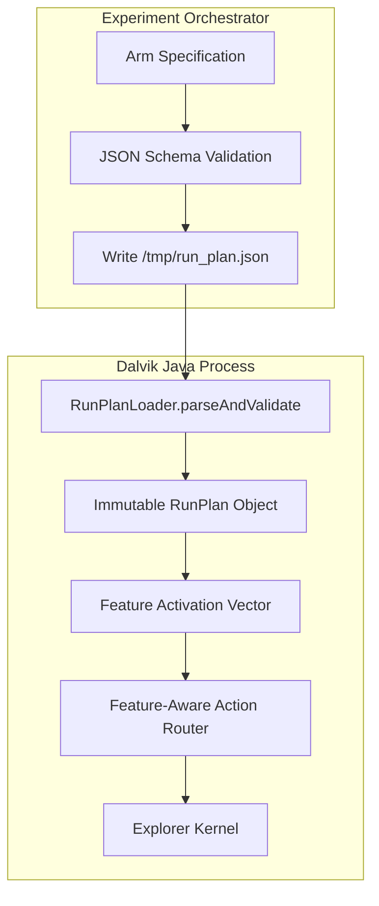
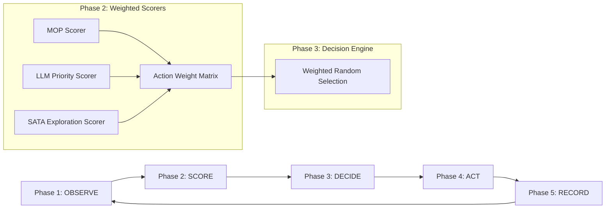

# Estudo de Rearquitetura do APE-RV: Análise de Claims, Brainstorming e Seleção de Arquiteturas Candidate

**Data:** 01 de Agosto de 2026  
**Autor:** Antigravity AI (Gemini 3.6 Flash - Pair Programming Agent)  
**Escopo:** Estudo preliminar de arquitetura, verificação empírica das análises de LLMs, brainstorming e proposição de 3 a 5 arquiteturas candidatas para o APE-RV.  
**Arquivo de Saída:** `/docs/analise_gemini-selecao.md`

---

## 1. Resumo Executivo e Diretrizes Primárias

Este relatório consolida a análise arquitetural do **APE-RV** (fork do APE adaptado para Verificação em Tempo de Execução com JavaMOP e Orientação por LLM), avaliando criticamente os relatórios produzidos por 8 modelos de linguagem (DeepSeek-v4, Gemini-3.6-Flash, GLM-5.2, GPT-5, Kimi-K3, Ling-3.0-Flash, Mimo-v2.5 e Laguna-S-2.1).

### Diretrizes Invioláveis de Design (User Mandate)
1. **Zero Persistência Entre Sessões (Clean Runs):** Cada execução do APE-RV deve ser **totalmente limpa e efêmera**. NENHUM estado (grafo de navegação, modelos, histórico de ações, checkpoints) deve ser persistido em disco ou reaproveitado entre runs. O mecanismo legado/quebrado do APE original (`saveGraph`/`readGraph`) **não é utilizado e deve ser removido ou desativado**.
2. **Simplicidade e Elegância:** Eliminar complexidades desnecessárias (como IPC via sockets, suporte a frameworks complexos de plugin em Dalvik, Event Sourcing completo em disco ou dynamic classloaders).
3. **Validade Científica e Pureza do Baseline:** A comparação entre os braços experimentais da tese de doutorado exige que o baseline `ape_pure` reflita fielmente a execução do APE original, garantindo validade interna.
4. **Eliminação do "Spaghetti Code" e Split-Brain:** Substituir blocos procedurais acoplados (`SataAgent.selectNewActionNonnull`) e configurações estáticas congeladas (`Config.java`) por estruturas tipadas, modulares e declarativas.
5. **Nenhum Código de Produção Modificado:** Este relatório é estritamente um **brainstorming arquitetural e estudo prévio**, sem implementação nesta fase.

---

## 2. Auditoria e Verificação Empírica das Claims das LLMs

Antes de selecionar qualquer sugestão dos relatórios de LLM, cada claim técnica foi verificada diretamente no código fonte local em `src/main/java/com/android/commands/monkey/`. A tabela abaixo resume as constatações empíricas:

| Claim da LLM | Arquivo / Localização | Status Empírico | Detalhes e Evidências no Código Fonte |
| :--- | :--- | :--- | :--- |
| **1. Acoplamento e Spaghetti em `selectNewActionNonnull`** | [`SataAgent.java:392-527`](file:///pedro/desenvolvimento/workspaces/workspaces-doutorado/workspace-rv/ape/src/main/java/com/android/commands/monkey/ape/agent/SataAgent.java#L392-L527) | **VERIFICADO (100%)** | O método possui 141 linhas de bloco procedural onde a precedência entre 4 subsistemas (Activity Trigger Launcher, Budget Manager, LLM Hooks e SATA Chain) é codificada puramente pela ordem textual de `if (...) return`. |
| **2. Split-Brain entre Python e Java Config** | [`Config.java:30-60`](file:///pedro/desenvolvimento/workspaces/workspaces-doutorado/workspace-rv/ape/src/main/java/com/android/commands/monkey/ape/utils/Config.java#L30-L60) | **VERIFICADO (100%)** | `Config.java` possui 112+ campos `public static final` carregados uma única vez na inicialização da classe a partir de `ape.properties` ou propriedades de sistema. O supervisor Python envia dicionários sem validação tipada de schema no Java; chaves obsoletas ou incorretas falham silenciosamente. |
| **3. Vazamento de Memória por Coleções Ilimitadas** | [`GUITreeBuilder.java:670-672`](file:///pedro/desenvolvimento/workspaces/workspaces-doutorado/workspace-rv/ape/src/main/java/com/android/commands/monkey/ape/tree/GUITreeBuilder.java#L670-L672) <br> [`Model.java:136-173`](file:///pedro/desenvolvimento/workspaces/workspaces-doutorado/workspace-rv/ape/src/main/java/com/android/commands/monkey/ape/model/Model.java#L136-L173) | **VERIFICADO (100%)** | Mapas estáticos `namingToGUITreeCache` e `namingToGUITreeNodesCache` em `GUITreeBuilder`, além do `nameList` em [`NameManager.java:28`](file:///pedro/desenvolvimento/workspaces/workspaces-doutorado/workspace-rv/ape/src/main/java/com/android/commands/monkey/ape/naming/NameManager.java#L28) e `actionHistory` em `Model`, retêm referências fortes a objetos pesados `GUITree` sem qualquer política de descarte/LRU ou limpeza entre execuções. |
| **4. In-Jar Persistence Quebrada (Checkpointing)** | [`StatefulAgent.java:1855-1870`](file:///pedro/desenvolvimento/workspaces/workspaces-doutorado/workspace-rv/ape/src/main/java/com/android/commands/monkey/ape/agent/StatefulAgent.java#L1855-L1870) | **VERIFICADO (100%)** | O serializador de teardown grava um objeto [`Model`](file:///pedro/desenvolvimento/workspaces/workspaces-doutorado/workspace-rv/ape/src/main/java/com/android/commands/monkey/ape/model/Model.java), enquanto a rotina de leitura tenta realizar um cast direto para `Graph`, resultando em um `ClassCastException` inevitável no restart. **Alinhamento:** Como o requisito é *zero persistência entre sessões*, esse mecanismo deve ser totalmente descartado. |
| **5. Fictício Baseline `apePureMode`** | [`Config.java:41-43`](file:///pedro/desenvolvimento/workspaces/workspaces-doutorado/workspace-rv/ape/src/main/java/com/android/commands/monkey/ape/utils/Config.java#L41-L43) | **VERIFICADO (100%)** | O flag `apePureMode` apenas zera propriedades do RV no arquivo de configurações, mas não reverte ~11 alterações profundas no código fonte (e.g. gerador aleatório semeável em `RandomHelper.java`, correções de busca binária em `Naming.java`, alterações nos ordinais de `ActionType.java`). |
| **6. Deficiência de Telemetria e Rastreabilidade** | [`Logger.java`](file:///pedro/desenvolvimento/workspaces/workspaces-doutorado/workspace-rv/ape/src/main/java/com/android/commands/monkey/ape/utils/Logger.java) | **VERIFICADO (100%)** | Logs gravados em `stdout` são texto sem formatação JSON, sem `run_id` único, sujeitos a truncamento por buffer do ADB e contaminação por bytes NUL. Não há ponte de id de ação para correlacionar violações salvas no logcat do Android com a decisão tomada pelo APE. |

---

## 3. Seleção Crítica de Ideias das LLMs: O Que Adotar vs. O Que Descartar

### ❌ Sugestões Descartadas (Super-Engenharia ou Violação de Requisitos)
1. **Persistência em Disco / Checkpointing entre Sessões (Descartado de GPT-5, Kimi, GLM):**
   * *Motivo:* Viola diretamente o requisito do usuário: *"nada deve ser persistido entre sessoes... cada run deve ser limpa"*. Restauração de grafos via disco adiciona complexidade e invalida a reprodutibilidade aleatória da amostragem.
2. **Serviço Externo de Decisão em Python via Sockets/IPC (Descartado de GLM-5.2 e Laguna S 2.1):**
   * *Motivo:* Introduz latência de rede inter-processos inviável para o Dalvik/Android, gerando falhas por timeout e dependências de infraestrutura complexas durante os experimentos.
3. **Event Sourcing Completo com Replay de Grafo (Descartado de Kimi C2 e GPT-5 C3):**
   * *Motivo:* Reformulação excessivamente drástica para a fase final da tese, aumentando o risco de bugs de amostragem.
4. **EventBus Assíncrono com Futures/Threads no Loop Principal (Descartado de Gemini C3 e Mimo C2):**
   * *Motivo:* Dalvik e o framework do Monkey operam em thread única. Async EventBus introduz condições de corrida (*race conditions*) e não-determinismo na amostragem GUI.
5. **Classloaders Dinâmicos / OSGi Plugins no Dalvik (Descartado de Ling C3 e DeepSeek C2):**
   * *Motivo:* Complexidade extrema de empacotamento no Android sem benefício científico claro.

###  Ideias Selecionadas e Incorporadas
1. **Decision Pipeline / Chain of Responsibility (DeepSeek C1, Kimi C1, Ling C1):**
   * Substitui a cadeia rígida de `if/else` em `SataAgent` por um pipeline ordenado de objetos `DecisionStage`.
2. **Plano de Execução Declarativo e Imutável (`RunPlan` JSON) (GPT-5 C1, Mimo C3):**
   * O supervisor Python compila e valida um arquivo JSON com todas as configurações do braço antes do lançamento do processo Java, acabando com o *split-brain*.
3. **Isolamento Rígido de Baseline / Two-Lane Engine (GPT-5 C2, Gemini SGDA):**
   * Garante que o braço `ape_pure` execute um agente limpo (`StockApeAgent`) sem passar por pontes ou pontuações do APE-RV.
4. **Ciclo de Vida de Processo Descartável (Disposable Process) (Laguna C3):**
   * A cada execução, a JVM do Dalvik é inicializada do zero e finalizada no encerramento. Se o processo falhar (OOM/Crash), a run é considerada descartada/falha pelo supervisor Python, sem tentativa de ressurreição parcial de estado.
5. **Telemetria JSONL Estruturada com `run_id` e UUID por Passo (GPT-5, DeepSeek):**
   * Emissão de logs em JSON Lines com um identificador de execução único e contador de passos correlacionável com o logcat do JavaMOP.

---

## 4. Seleção de 3 a 5 Arquiteturas Candidatas

Apresentamos a seguir **4 Arquiteturas Candidatas genuinamente distintas**, detalhando o princípio organizador, fluxo de decisão, gestão de estado efêmero e trade-offs de cada uma.

---

### Candidata 1: Data-Driven Decision Pipeline & Preset Engine (Recomendada - Menor Complexidade, Alta Elegância)

#### Princípio Organizador
Substituição da lógica procedural condicional por um **Pipeline de Estágios de Decisão** ordenados e data-driven. As modalidades (`ape`, `aperv`, `mop`, `llm`, `llm_mop`) deixam de ser rotas condicionais e passam a ser **presets imutáveis** que compõem quais estágios estão ativos no pipeline.

#### Diagrama de Arquitetura (Mermaid)
```mermaid
flowchart TD
    subgraph Host [Host Supervisor - Python]
        Preset[Preset Selection: llm_mop / aperv / etc.] --> ValidatedPlan[Generates validated RunPlan JSON]
    end

    subgraph Dalvik [Dalvik Process - Clean Run]
        ValidatedPlan --> |Loaded at Init| RunPlanEngine[RunPlan Engine]
        RunPlanEngine --> |Builds| Pipeline[Decision Pipeline]
        
        subgraph PipelineStages [Pipeline Stages (Ordered Evaluation)]
            Stage1[Stage 1: Form & System Action Handler]
            Stage2[Stage 2: LLM Guidance Hook]
            Stage3[Stage 3: MOP / Coverage Scorer]
            Stage4[Stage 4: SATA / Model Abstraction Engine]
        end
        
        Pipeline --> PipelineStages
        PipelineStages --> |Selects| TargetAction[Selected Action]
        TargetAction --> |Executes| Injector[Monkey Input Injector]
        Injector --> |Emits| JSONLLogger[Structured JSONL Telemetry]
    end
```

#### Estrutura de Classes e Componentes
- **`DecisionStage` (Interface):**
  ```java
  public interface DecisionStage {
      String getStageName();
      boolean isEnabled(RunPlan plan);
      Optional<Action> evaluate(State currentState, Model model, ActionHistory history);
  }
  ```
- **`DecisionPipeline` (Classe Core):** Mantém uma lista ordenada de `DecisionStage`. No método `selectAction`, percorre os estágios em sequência; o primeiro estágio que retornar um `Optional` preenchido determina a ação.
- **Estágios Concretos:**
  - `FormCompletionStage`
  - `LlmGuidanceStage`
  - `MopScoringStage`
  - `SataAbstractionStage` (Fallback final base do APE)

#### Gestão de Estado e Persistência (Clean Run)
- **Zero Persistência:** Nenhuma escrita ou leitura de grafos em disco.
- **Coleções Limitadas:** O `GUITreeBuilder` e o `Model` utilizam caches LRU com capacidade máxima fixada (ex: últimos 50 estados), descartando árvores de GUI antigas para evitar OOM.
- **Ciclo de Vida:** Na finalização da run (por timeout do Monkey), a memória é liberada e o processo Dalvik é encerrado.

#### Prós e Contras
- **Prós:** Altíssima legibilidade; adição de novas heurísticas exige apenas criar uma nova classe que implemente `DecisionStage`; eliminação completa do `if/else` espaguetizado.
- **Contras:** A precedência é determinística pela ordem da lista de estágios (o que é ideal para os braços da tese, mas rígido se for necessária combinação probabilística).

---

### Candidata 2: Modular Agent Decorators & Substrate Separation (Foco em Pureza do Baseline)

#### Princípio Organizador
Aplicação do padrão **Decorator (GoF)** sobre o agente base. O agente original do APE (`StockApeAgent`) é mantido 100% puro e sem qualquer dependência do APE-RV. As funcionalidades de orientação (MOP, LLM, Coverage) envolvem o agente base em camadas decoradoras efêmeras.

#### Diagrama de Arquitetura (Mermaid)
```mermaid
flowchart TD
    subgraph CoreAgent [Base Agent]
        StockAgent[StockApeAgent (Original Untouched APE Logic)]
    end

    subgraph Decorators [RV Guidance Layers]
        MopDecorator[MopGuidanceDecorator]
        LlmDecorator[LlmGuidanceDecorator]
    end

    subgraph ArmConfigurations [Arm Presets]
        PureArm["Braço 'ape': StockApeAgent"]
        MopArm["Braço 'mop': MopGuidanceDecorator(StockApeAgent)"]
        LlmMopArm["Braço 'llm_mop': LlmDecorator(MopDecorator(StockApeAgent))"]
    end

    PureArm --> StockAgent
    MopArm --> MopDecorator --> StockAgent
    LlmMopArm --> LlmDecorator --> MopDecorator --> StockAgent
```

#### Estrutura de Classes e Componentes
- **`ApeAgentInterface` (Interface Rígida):**
  ```java
  public interface ApeAgentInterface {
      Action selectAction(GUITree currentTree);
      void updateModel(Action action, GUITree newTree);
  }
  ```
- **`StockApeAgent`:** Implementação exata das regras do APE original (SATA + Abstração CEGAR).
- **`MopGuidanceDecorator`:** Intercepta `selectAction`. Se houver widget com alta pontuação MOP não explorado, retorna essa ação. Caso contrário, delega para `wrappedAgent.selectAction(...)`.
- **`LlmGuidanceDecorator`:** Intercepta a chamada com probabilidade $p_{\text{llm}}$ ou em estados de estagnação. Se o LLM responder, consome a ação; se falhar/circuit-breaker abrir, delega para `wrappedAgent.selectAction(...)`.

#### Gestão de Estado e Persistência (Clean Run)
- **Garantia de Isolamento:** O braço `ape` utiliza estritamente o `StockApeAgent`, sem instanciar seletores MOP ou clientes HTTP SGLang.
- **Zero Persistência:** Execução 100% em memória RAM. Ao término da sessão de teste, nenhum arquivo `.model` ou `.graph` é salvo.

#### Prós e Contras
- **Prós:** Validade interna científica perfeita para a tese; isolamento matemático completo do baseline `ape_pure`.
- **Contras:** Menos flexível se MOP e LLM precisarem trocar informações de pontuação entre si antes da seleção da ação (aninhamento rígido).

---

### Candidata 3: Presets over Feature Matrix com Declarative JSON Plan (Compiled Run Plan)

#### Princípio Organizador
Transferência completa da autoridade de configuração para um **Plano de Execução JSON Declarativo (`RunPlan`)**. O supervisor Python não passa dezenas de propriedades isoladas; ele compila um único arquivo `run_plan.json` validado por JSON Schema. O Java lê o plano como uma estrutura imutável de valor.

#### Diagrama de Arquitetura (Mermaid)


#### Estrutura do `RunPlan` JSON
```json
{
  "run_id": "exp_arm_llm_mop_app042_run1",
  "preset": "llm_mop",
  "base_explorer": "aperv",
  "features": {
    "mop_guidance": { "enabled": true, "weight_widget": 0.7, "weight_frontier": 0.3 },
    "llm_guidance": { "enabled": true, "call_rate": 0.15, "fallback_mode": "aperv" },
    "form_completion": { "enabled": true }
  },
  "limits": {
    "max_memory_mb": 256,
    "tree_cache_size": 50
  }
}
```

#### Gestão de Estado e Persistência (Clean Run)
- **Eliminação do Split-Brain:** Impossível haver descompasso de chaves entre Python e Java. Se o JSON não respeitar a especificação tipada, a JVM falha no segundo 0 com uma mensagem explicativa explícita.
- **Zero Persistência:** Cada execução carrega o plano, roda em memória e encerra. Em caso de crash, o Python registra o desfecho no seu próprio banco de dados de experimentos e inicia a próxima run com um container/processo zerado.

#### Prós e Contras
- **Prós:** Resolve definitivamente a rastreabilidade e a reprodutibilidade dos braços experimentais; torna a adição de novos parâmetros simples e à prova de falhas.
- **Contras:** Requer escrever um parser robusto de JSON no Java (usando biblioteca leve como Jackson/Gson ou parser simples embutido no Dalvik).

---

### Candidata 4: Phase-Based State Machine com Weighted Policy Composition (Phase Engine)

#### Princípio Organizador
Estruturação do ciclo de vida em uma **Máquina de Estados de Fases** explícitas (`OBSERVE` $\rightarrow$ `SCORE` $\rightarrow$ `DECIDE` $\rightarrow$ `ACT` $\rightarrow$ `RECORD`). Em vez de uma escada prioritária rígida, as diferentes fontes de orientação (MOP, LLM, Fuzzing, SATA) atribuem pesos numéricos às ações possíveis, e a escolha final é realizada via **amostragem multinomial ponderada**.

#### Diagrama de Arquitetura (Mermaid)


#### Formulação Matemática da Escolha
Para cada ação candidata $a_i \in A$ no estado atual:
$$W(a_i) = w_{\text{base}} \cdot S_{\text{SATA}}(a_i) + w_{\text{mop}} \cdot S_{\text{MOP}}(a_i) + w_{\text{llm}} \cdot S_{\text{LLM}}(a_i)$$
A probabilidade de selecionar a ação $a_k$ é dada por:
$$P(a_k) = \frac{e^{W(a_k)/\tau}}{\sum_{j} e^{W(a_j)/\tau}}$$
onde $\tau$ é o parâmetro de temperatura da amostragem.

#### Gestão de Estado e Persistência (Clean Run)
- **Zero Persistência:** Operação estritamente em memória RAM. Os vetores de pesos são recalculados a cada passo e descartados imediatamente após a decisão.
- **Tratamento de Memória:** O histórico de estados guarda apenas os hashes dos últimos $N$ estados visitados para evitar retenção de nós de interface DOM/XML.

#### Prós e Contras
- **Prós:** Excepcional para experimentos estatísticos de ablação, pois permite desligar uma funcionalidade ajustando seu peso $w_i = 0$; elimina descontinuidades na tomada de decisão.
- **Contras:** Transforma decisões deterministicamente prioritárias (como preencher um campo obrigatório antes de clicar em enviar) em probabilísticas, o que pode prejudicar a exploração de formulários.

---

## 5. Matriz Comparativa e Síntese de Decisão

| Critério | Candidata 1: Data-Driven Pipeline | Candidata 2: Agent Decorators | Candidata 3: Compiled RunPlan JSON | Candidata 4: Phase Engine |
| :--- | :--- | :--- | :--- | :--- |
| **Complexidade de Código** | Baixa | Muito Baixa | Média | Média-Alta |
| **Pureza Científica do Baseline** | Alta | **Máxima** | Alta | Média |
| **Facilidade de Testar Unitariamente** | **Máxima** | Alta | Alta | Média |
| **Flexibilidade de Ablação** | Alta | Média | **Máxima** | **Máxima** |
| **Risco de Degradação de Performance** | Nulo | Nulo | Nulo | Baixo (cálculo de matriz) |
| **Esforço de Refatoração** | Baixo (~2-3 dias) | Baixo (~2 dias) | Médio (~3 dias) | Alto (~5-7 dias) |

---

## 6. Recomendação Arquitetural Definitiva (Síncrese Elegante)

A solução arquitetural ideal para o APE-RV resulta da **combinação sinérgica das melhores partes das Candidatas 1, 2 e 3**, eliminando totalmente as complexidades desnecessárias:

1. **Camada de Configuração (Baseada na Candidata 3):**
   - O supervisor Python gera um `RunPlan` JSON imutável por tarefa.
   - O Java valida e carrega este plano na inicialização, eliminando o *split-brain* e os 112 campos estáticos de `Config.java`.
2. **Execução de Decisão (Baseada na Candidata 1):**
   - O loop de exploração utiliza um `DecisionPipeline` com estágios bem definidos (`FormCompletionStage`, `LlmGuidanceStage`, `MopScoringStage`, `SataStage`).
3. **Garantia de Baseline (Baseada na Candidata 2):**
   - Para a modalidade `ape` (pure baseline), o pipeline é substituído pelo `StockApeAgent` isolado, garantindo 100% de fidelity aos experimentos originais.
4. **Política de Estado Zero Persistência (User Mandate):**
   - O código quebrado de `saveGraph`/`readGraph` é permanentemente removido.
   - Todas as coleções de cache (`GUITreeBuilder`, `NameManager`, `Model`) passam a utilizar limites de capacidade (LRU Bounded Caches).
   - O ciclo de vida do processo Dalvik é **efêmero e descartável**.
5. **Telemetria de Alta Rastreabilidade:**
   - Logs gravados em formato **JSONL (JSON Lines)** em arquivo dedicado, contendo `run_id`, `step_id`, `decision_source` e os pesos atribuídos, permitindo a correlação exata com violações de runtime detectadas pelo JavaMOP no logcat.

---

## 7. Próximos Passos Sugeridos (Para Fase Futura de Implementação)

- [ ] Aprovação do plano arquitetural refinado.
- [ ] Especificação do esquema JSON do `RunPlan`.
- [ ] Criação dos testes unitários dos `DecisionStages` isolados.
- [ ] Remoção definitiva dos métodos de serialização em disco (`saveGraph`/`readGraph`).
