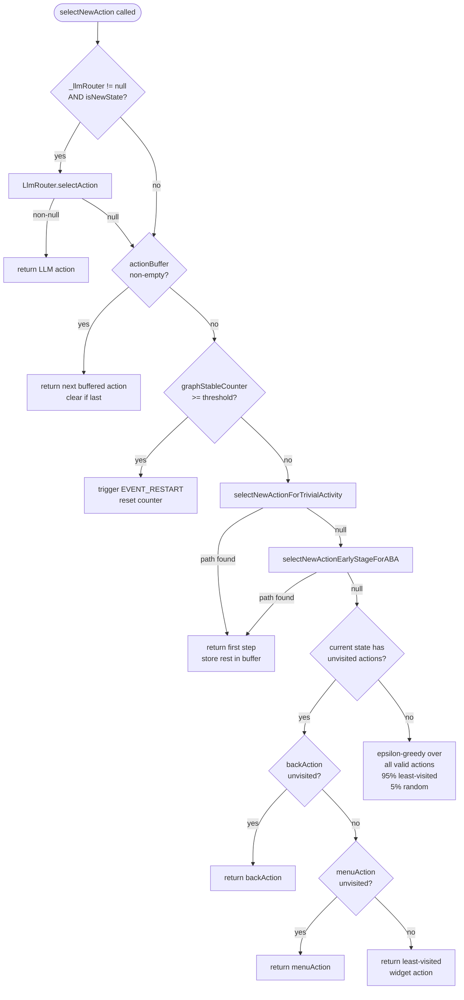

## Purpose

This delta spec modifies the exploration engine to integrate LLM routing into the action selection flow. The changes are minimal and surgically placed: two new fields on `StatefulAgent`, a bug fix in `updateStateInternal()`, an action history ring buffer for prompt context, and two guarded hooks in the `SataAgent` selection flow that return null (falling through to SATA) when LLM is disabled or unavailable.

The LLM integration follows the same extension pattern as MOP scoring (Phase 3): a higher-level component influences action selection without rewriting agent logic. Where MOP scoring uses `adjustActionsByGUITree()` to boost priorities, LLM routing uses hooks at the top of `selectNewActionNonnull()` and in the stability check to override the selected action entirely — but only when the LLM returns a non-null result.

---

## MODIFIED Requirements

### Requirement: StatefulAgent — LLM Router Integration

`StatefulAgent` SHALL declare the following new fields for LLM integration:

| Field | Type | Initialized | Description |
|-------|------|-------------|-------------|
| `_llmRouter` | `LlmRouter` | Constructor: `new LlmRouter()` when `Config.llmUrl != null`, else `null` | Orchestrates all LLM infrastructure; null disables all LLM features |
| `_isNewState` | `boolean` | `updateStateInternal()`: set before `markVisited()` | True when current state has never been visited |
| `_actionHistory` | `List<ActionHistoryEntry>` (ring buffer, max 5) | Constructor: empty list | Last 3-5 executed actions with results, fed to prompt builder |
| `_lastState` | `State` | `updateStateInternal()`: set to previous state before update | Previous state, used for action history result determination |
| `_stateBeforeLast` | `State` | `updateStateInternal()`: set to previous `_lastState` | State two steps ago, used for "previous screen" detection |

When `Config.llmUrl` is null, `_llmRouter` SHALL be null and no LLM-related objects SHALL be created. This satisfies INV-RTR-01 (defined in `llm-routing/spec.md`).

#### Scenario: LLM enabled via Config

- **WHEN** `Config.llmUrl` equals `"http://10.0.2.2:30000/v1"`
- **THEN** `StatefulAgent` constructor SHALL create a `LlmRouter` instance
- **AND** `_llmRouter` SHALL be non-null for the entire session

#### Scenario: LLM disabled (default)

- **WHEN** `Config.llmUrl` is null
- **THEN** `_llmRouter` SHALL be null
- **AND** no `SglangClient`, `ScreenshotCapture`, or other LLM infrastructure objects SHALL be instantiated

---

### Requirement: StatefulAgent — isNewState Capture Before markVisited

In `StatefulAgent.updateStateInternal()`, the `_isNewState` flag SHALL be captured as `(newState.getVisitedCount() == 0)` **before** the call to `getGraph().markVisited(newState, timestamp)`. This is a bug fix: previously, `markVisited()` increments the visit count, making `getVisitedCount() == 0` always false at any point after the call.

The corrected flow in `updateStateInternal()`:

```
1. State newState = model.getState(naming, guiTree)
2. _stateBeforeLast = _lastState                          ← [NEW] shift history
3. _lastState = currentState                               ← [NEW] save outgoing state
4. _isNewState = (newState.getVisitedCount() == 0)         ← [NEW] capture BEFORE markVisited
5. getGraph().markVisited(newState, getTimestamp())         ← existing (increments count)
6. ... (existing logic: transition creation, stability counters, etc.)
```

#### Scenario: First visit detection is accurate

- **WHEN** `updateStateInternal()` is called with a `newState` that has `visitedCount == 0`
- **THEN** `_isNewState` SHALL be `true`
- **AND** after `markVisited()`, `newState.getVisitedCount()` SHALL be `1`
- **AND** `_isNewState` remains `true` (captured before increment)

#### Scenario: Revisit detection is accurate

- **WHEN** `updateStateInternal()` is called with a `newState` that has `visitedCount == 3`
- **THEN** `_isNewState` SHALL be `false`

---

### Requirement: StatefulAgent — Action History Ring Buffer

`StatefulAgent` SHALL maintain a ring buffer of the last 5 executed actions with their results. After each action is executed and the new state is determined, an `ActionHistoryEntry` SHALL be appended to the buffer.

**`ActionHistoryEntry`** is a simple data class:

| Field | Type | Description |
|-------|------|-------------|
| `actionType` | `String` | "click", "long_click", "type_text", "back" |
| `widgetClass` | `String` | Widget class simple name (e.g., "Button", "EditText"), null for back |
| `widgetText` | `String` | Widget text or content-description, truncated to 50 chars |
| `normX` | `int` | Center X in [0,1000) normalized space |
| `normY` | `int` | Center Y in [0,1000) normalized space |
| `typedText` | `String` | For type_text: the text that was typed; null otherwise |
| `result` | `String` | "same", "new screen", "previous screen" |

**Result determination**: After `updateStateInternal()` resolves the new state:
- If `newState == _lastState` → `"same"`
- If `newState == _stateBeforeLast` → `"previous screen"`
- Else → `"new screen"`

The buffer is passed to `ApePromptBuilder.build()` via `LlmRouter.selectAction()` as the `recentActions` parameter.

#### Scenario: Action history populated after action

- **WHEN** a click action on Button "Login" is executed
- **AND** the resulting state is different from the previous state and from the state before that
- **THEN** an `ActionHistoryEntry` SHALL be added with `actionType="click"`, `widgetClass="Button"`, `widgetText="Login"`, `result="new screen"`

#### Scenario: Ring buffer evicts oldest entry

- **WHEN** the action history buffer has 5 entries
- **AND** a new action is executed
- **THEN** the oldest entry SHALL be removed
- **AND** the new entry SHALL be appended
- **AND** the buffer size SHALL remain 5

#### Scenario: Action returns to previous screen

- **WHEN** a back action is executed
- **AND** the resulting state equals `_stateBeforeLast`
- **THEN** the `ActionHistoryEntry.result` SHALL be `"previous screen"`

---

### Requirement: SataAgent — LLM New-State Hook

The `SataAgent.selectNewActionNonnull()` method SHALL check for LLM routing **at the top**, before any existing SATA strategy logic (buffer check, ABA navigation, trivial activity, unvisited priority, epsilon-greedy).

The check is:
```
if (_llmRouter != null && _llmRouter.shouldRouteNewState(_isNewState)) {
    LlmActionResult result = _llmRouter.selectAction(tree, state, actions, _mopData, _actionHistory);
    if (result != null) {
        // handle type_text: if result.text != null, call resolvedNode.setInputText(text)
        return result.isModelAction() ? result.modelAction : handleRawClick(result);
    }
    // null → fall through to SATA chain
}
```

When `_llmRouter` is null (LLM disabled), the check is a single null comparison and has zero cost.

**Updated SataAgent Action Selection Flow**:



#### Scenario: LLM provides action on new state

- **WHEN** `selectNewActionNonnull()` is called
- **AND** `_isNewState` is `true`
- **AND** `_llmRouter.shouldRouteNewState(true)` returns `true`
- **AND** `_llmRouter.selectAction(...)` returns a non-null `LlmActionResult`
- **THEN** the LLM action SHALL be returned immediately
- **AND** the SATA chain (buffer, ABA, trivial, greedy) SHALL NOT execute

#### Scenario: LLM returns null, SATA takes over

- **WHEN** `_llmRouter.selectAction(...)` returns `null`
- **THEN** execution SHALL fall through to the existing SATA chain starting at the buffer check
- **AND** a warning SHALL be logged: `[APE-RV] LLM new-state returned null, falling back to SATA`

#### Scenario: LLM disabled, zero overhead

- **WHEN** `_llmRouter` is `null`
- **THEN** the `if (_llmRouter != null ...)` check SHALL evaluate to `false`
- **AND** no LLM-related method SHALL be called
- **AND** the existing SATA chain SHALL execute identically to pre-gh6 behavior

---

### Requirement: SataAgent — LLM Stagnation Hook

The stability check path (where `graphStableCounter` is evaluated against thresholds) SHALL include an LLM stagnation hook at `graphStableCounter > graphStableRestartThreshold / 2`, earlier than the existing restart at `graphStableCounter >= graphStableRestartThreshold`.

This modifies the existing `SataAgent — Forced App Restart on Graph Stability` requirement by inserting an intermediate check:

```
if (graphStableCounter > threshold/2 && _llmRouter != null
    && _llmRouter.shouldRouteStagnation(graphStableCounter)) {
    LlmActionResult result = _llmRouter.selectAction(...);
    if (result != null) {
        // use LLM action, reset graphStableCounter
        graphStableCounter = 0;
        return result;
    }
    // null → continue stagnation logic (may eventually reach restart)
}
// existing: if (graphStableCounter >= threshold) → requestRestart()
```

#### Scenario: LLM breaks stagnation

- **WHEN** `graphStableCounter` equals `60` (and `graphStableRestartThreshold` is `100`, so `threshold/2 = 50`)
- **AND** `_llmRouter.shouldRouteStagnation(60)` returns `true`
- **AND** `_llmRouter.selectAction(...)` returns a non-null action
- **THEN** the action SHALL be used
- **AND** `graphStableCounter` SHALL be reset to `0`
- **AND** `requestRestart()` SHALL NOT be called

#### Scenario: LLM fails, stagnation continues to restart

- **WHEN** `graphStableCounter` equals `60`
- **AND** LLM returns `null` (or is disabled)
- **THEN** normal stagnation logic SHALL continue
- **AND** if `graphStableCounter` eventually reaches `100`, `requestRestart()` SHALL be called (existing behavior per INV-EXPL-09)

#### Scenario: Stagnation hook does not fire before threshold/2

- **WHEN** `graphStableCounter` equals `40` (below `threshold/2 = 50`)
- **THEN** the LLM stagnation check SHALL NOT execute
- **AND** the existing stability check logic SHALL proceed unchanged

---

### Requirement: StatefulAgent — LLM Telemetry at tearDown

`StatefulAgent.tearDown()` SHALL call `_llmRouter.printSummary()` (when `_llmRouter` is non-null) to print the aggregate LLM telemetry summary. This is where the `[APE-RV] LLM Summary:` and `[APE-RV] Decision ratio:` log lines are emitted (format defined in `llm-routing/spec.md`).

#### Scenario: Telemetry printed on normal termination

- **WHEN** `StatefulAgent.tearDown()` is called after `StopTestingException`
- **AND** `_llmRouter` is non-null
- **THEN** the LLM summary log SHALL be emitted before the method returns
