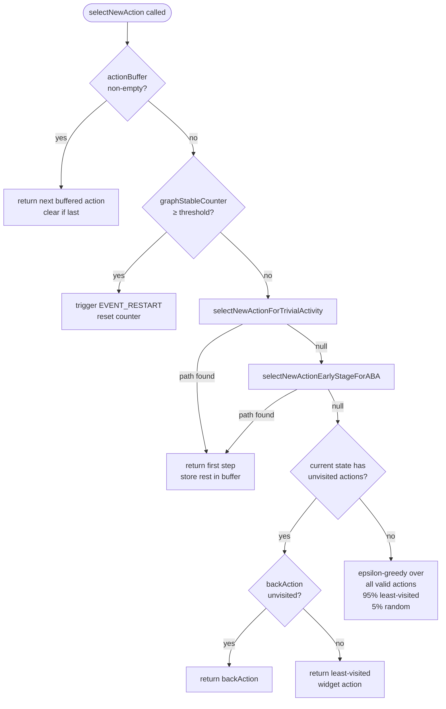

# Specification: Exploration Engine

## Purpose

APE-RV's exploration engine is responsible for systematically exercising an Android application under test by navigating its GUI state space. The core motivation for model-based exploration — rather than pure random input generation as in AOSP Monkey — is that random exploration wastes most of its budget re-visiting already-seen states and rarely penetrates deeply into an app's feature set. APE-RV builds an explicit, labeled graph of abstract GUI states and state transitions as it runs, enabling the agent to reason about which parts of the application have already been covered and which have not. This directed exploration dramatically increases code and feature coverage within a fixed time budget.

The central abstraction mechanism, inherited from the original APE tool (ICSE 2019), is CEGAR-style (Counterexample-Guided Abstraction Refinement). The `NamingFactory` component maps concrete `GUITree` snapshots to abstract `State` nodes via a configurable `Naming` (a level in a widget-attribute lattice). When the abstraction is too coarse — detected by observing non-deterministic transitions from a single abstract state — the naming is automatically refined to a finer level, splitting the offending state. This adaptive refinement ensures the model stays sound (no false merging of distinct screens) without over-specifying upfront.

APE-RV supports selectable exploration strategies, each suited to a different use case. `SataAgent` (`--ape sata`) is the primary strategy and implements an epsilon-greedy heuristic that aggressively prioritises unvisited actions while using graph-guided navigation to reach under-explored parts of the app. `RandomAgent` (`--ape random`) provides an experimental baseline using priority-weighted random selection over model actions — it still uses the `StatefulAgent` priority infrastructure but without SATA's directed navigation. `ReplayAgent` (activated via the `ape.replayLog` configuration key) replays a recorded action sequence for deterministic regression testing. Phase 2 will add `ApeAgent` (`--ape ape`, full CEGAR naming-refinement), BFS (`--ape bfs`), and DFS (`--ape dfs`) as additional selectable strategies. The strategy is selected once at startup and does not change during a session.

The exploration loop, implemented inside `MonkeySourceApe.nextEventImpl()`, is the heartbeat of the system. Each iteration captures the current screen as a `GUITree`, maps it to an abstract `State`, asks the active `Agent` to choose a `ModelAction`, translates that action into one or more `ApeEvent` objects (click, drag, key press, scroll gesture), enqueues those events in Monkey's event queue for execution on the device, then captures the resulting screen and updates the model. The loop terminates when a wall-clock time limit (`--running-minutes N`) or an event-count limit (`-v N`) is reached; on termination the serialised exploration graph is saved to disk. The priority system on `ModelAction` objects allows extensions such as the APE-RV Phase 3 MOP guidance layer to influence action selection without rewriting agent logic: `StatefulAgent.adjustActionsByGUITree()` is the designated hook where a higher-level component may call `action.setPriority(int)` to promote preferred actions before the agent's selection step.

## Data Contracts

### Input

- `--ape <strategy>: String` — selects the exploration strategy; currently accepted values are `sata` (default) and `random`; Phase 2 will add `ape`, `bfs`, `dfs`; passed as a Monkey command-line argument (source: `Monkey.main()`)
- `--running-minutes <N>: int` — wall-clock time limit in minutes after which exploration stops (source: Monkey command-line)
- `-v <N>: int` — maximum number of Monkey events; used as an alternative stop condition (source: Monkey command-line)
- `/data/local/tmp/ape.properties` or `/sdcard/ape.properties: Properties file` — optional key-value configuration overrides loaded at startup by `Config` (source: device filesystem)
- `AccessibilityNodeInfo: Android API` — live accessibility tree of the current screen, fetched by `AndroidDevice` via `UiAutomation` at each step (source: Android AccessibilityService)
- `ComponentName: Android API` — identity of the foreground activity, used to scope states per activity (source: `ActivityManager`)

### Output

- `sataModel.obj: file` — Java-serialised `Model` object written to the output directory on normal termination (when `ape.saveObjModel=true`, default `true`)
- `sataGraph.dot: file` — Graphviz DOT representation of the exploration graph written on normal termination (when `ape.saveDotGraph=true`, default `false`)
- `sataGraph.vis.js: file` — vis.js JSON visualisation of the exploration graph written on normal termination (when `ape.saveVisGraph=true`, default `true`)
- `*.png screenshots: files` — per-step or per-new-state PNG screenshots written to the output directory (when `ape.takeScreenshot=true`, default `true`)
- `*.xml GUITree files: files` — XML serialisation of the accessibility tree at each step (when `ape.saveGUITreeToXmlEveryStep=true`, default `true`)
- `ape_log: logcat entries` — structured log lines emitted via `Logger` for every action selected, strategy event type, and state transition

### Side-Effects

- **Android device**: GUI events (touches, key presses, drags) are injected into the device via `UiAutomation.injectInputEvent()`, causing the app under test to change state.
- **App lifecycle**: The exploration engine may force-kill and restart the app under test (via `EVENT_RESTART` or `EVENT_CLEAN_RESTART` action types) when stability thresholds are exceeded.
- **Model graph**: The in-memory `Graph` object is mutated on every step as new `State` nodes and `StateTransition` edges are discovered.
- **NamingFactory lattice**: If `ape.evolveModel=true` (default `true`), the naming abstraction may be refined mid-session, causing existing `State` objects to be split and the model to be rebuilt.
- **Stability counters**: `StatefulAgent` maintains `graphStableCounter`, `stateStableCounter`, and `activityStableCounter` that are incremented each step and reset on graph/state/activity changes.

### Error

- `StopTestingException` — thrown by the agent to signal a clean stop condition (time limit or step limit reached); caught by `MonkeySourceApe` to terminate the loop gracefully.
- `BadStateException` — thrown by `StatefulAgent.selectNewActionNonnull()` when no valid action is available on the current state; triggers a recovery path (restart or back navigation).
- `NoValidActionException` — thrown when action validation fails after all candidates are exhausted; causes the loop to attempt a forced restart.
- `OutOfMemoryError` — possible but unhandled; caused by retaining all `GUITree` objects in `treeHistory` lists throughout the session.

## Invariants

- **INV-EXPL-01**: The exploration loop SHALL continue dispatching actions until either `StopTestingException` is thrown (time/step limit reached) or the process is killed externally. No other condition MAY cause silent loop exit.
- **INV-EXPL-02**: `ActionType.MODEL_BACK.requireTarget()` SHALL return `false`. `MODEL_BACK` does not require a widget target because it maps directly to the Android BACK key event.
- **INV-EXPL-03**: The serialised exploration graph file (`sataModel.obj`) MUST contain a Java-serialised `Model` object, not a bare `Graph`. `StatefulAgent.saveGraph()` writes `oos.writeObject(model)`, where `model` is the `Model` instance (which in turn owns the `Graph`).
- **INV-EXPL-04**: `ActionType.MODEL_CLICK.requireTarget()`, `MODEL_LONG_CLICK.requireTarget()`, `MODEL_SCROLL_BOTTOM_UP.requireTarget()`, `MODEL_SCROLL_TOP_DOWN.requireTarget()`, `MODEL_SCROLL_LEFT_RIGHT.requireTarget()`, and `MODEL_SCROLL_RIGHT_LEFT.requireTarget()` SHALL each return `true`.
- **INV-EXPL-05**: `ActionType.isModelAction()` SHALL return `true` for all `MODEL_*` enum constants (`MODEL_BACK`, `MODEL_CLICK`, `MODEL_LONG_CLICK`, `MODEL_SCROLL_BOTTOM_UP`, `MODEL_SCROLL_TOP_DOWN`, `MODEL_SCROLL_LEFT_RIGHT`, `MODEL_SCROLL_RIGHT_LEFT`) and `false` for all other constants (`PHANTOM_CRASH`, `FUZZ`, `EVENT_START`, `EVENT_RESTART`, `EVENT_CLEAN_RESTART`, `EVENT_NOP`, `EVENT_ACTIVATE`).
- **INV-EXPL-06**: Every `State` object SHALL have a non-null `backAction` field holding a `ModelAction` of type `MODEL_BACK`. This field is initialised in the `State` constructor and MUST NOT be set to null at any point.
- **INV-EXPL-09**: When `SataAgent` triggers a forced app restart due to graph stability (i.e., `graphStableCounter` reaching `ape.graphStableRestartThreshold`), the `graphStableCounter` MUST be reset to zero immediately after the restart is initiated.
- **INV-EXPL-10**: `RandomAgent` extends `StatefulAgent` and uses the same priority-weighted selection infrastructure. It does NOT implement a separate pure-random algorithm. The distinction from `SataAgent` is that `RandomAgent` uses `StatefulAgent`'s base priority assignment without SATA's directed graph navigation heuristics.
- **INV-EXPL-11**: `StatefulAgent.adjustActionsByGUITree()` SHALL be called after base priority assignment and before the agent's selection step. Any priority modifications made by external components (e.g., MOP guidance in Phase 3) MUST be applied inside or after this method, not before it.
- **INV-EXPL-12**: A `ModelAction` with a higher `priority` value SHALL be preferred over one with a lower `priority` value when `RandomHelper.randomPickWithPriority()` is used for selection within `StatefulAgent`.

## Requirements

### Requirement: Strategy Selection

The exploration strategy MUST be selected at process startup via the `--ape <strategy>` command-line argument passed to `Monkey`. The argument value is a case-sensitive string. The five legal values are `sata` (creates `SataAgent`), `ape` (creates `ApeAgent`), `bfs` (creates `StatefulAgent` with BFS queue discipline), `dfs` (creates `StatefulAgent` with DFS stack discipline), and `random` (creates `RandomAgent`). If the argument is absent or does not match any legal value, the implementation SHALL default to `sata`. The strategy object is constructed once and shared for the entire session; it MUST NOT be replaced or re-instantiated during a running session.

#### Scenario: Valid strategy argument provided

- **WHEN** the process is launched with `app_process ... com.android.commands.monkey.Monkey -p com.example.app --ape sata`
- **THEN** a `SataAgent` instance SHALL be created and used for all `Agent.updateState()` calls for the duration of the session
- **AND** no other agent type SHALL be instantiated

#### Scenario: Strategy argument is `random`

- **WHEN** the process is launched with `--ape random`
- **THEN** a `RandomAgent` instance SHALL be created
- **AND** `RandomAgent.selectNewActionNonnull()` SHALL be called at each exploration step instead of any `SataAgent` or `ApeAgent` method

#### Scenario: Strategy argument is absent

- **WHEN** the process is launched without an `--ape` argument
- **THEN** the strategy SHALL default to `sata` and a `SataAgent` SHALL be created

---

### Requirement: Exploration Loop Termination

The exploration loop inside `MonkeySourceApe.nextEventImpl()` SHALL run continuously until a stop condition is reached. Two stop conditions are supported: (1) elapsed wall-clock time exceeds the value specified by `--running-minutes N`, and (2) the total Monkey event count reaches the value specified by `-v N`. When either condition is detected, the agent SHALL throw `StopTestingException`, which `MonkeySourceApe` catches to exit the loop. The loop MUST NOT exit silently on any other condition. Crashes and ANRs in the app under test MUST be logged and counted but MUST NOT terminate the loop unless a stop condition is also triggered.

#### Scenario: Time limit reached

- **WHEN** `--running-minutes 30` is specified and 30 minutes of wall-clock time have elapsed since the session started
- **THEN** the agent SHALL throw `StopTestingException`
- **AND** `MonkeySourceApe` SHALL catch the exception and proceed to the teardown phase (saving `sataModel.obj` and `sataGraph.vis.js`)

#### Scenario: App crash does not stop exploration

- **WHEN** the app under test crashes (process dies) during a step
- **AND** the time limit has not been reached
- **THEN** `Agent.appCrashed()` SHALL be called and the crash SHALL be logged
- **AND** the agent SHALL initiate an app restart via an `EVENT_RESTART` action
- **AND** the exploration loop SHALL continue from the restarted app state

---

### Requirement: GUITree Capture and State Abstraction

At each exploration step, `MonkeySourceApe` MUST capture the current screen as a `GUITree` by fetching the root `AccessibilityNodeInfo` from Android's accessibility service via `AndroidDevice`. The raw `GUITree` MUST then be passed to the `NamingFactory`/`Model` abstraction layer, which maps it to an abstract `State` using the current `Naming` level. If `ape.evolveModel=true` (default `true`), the naming layer MAY refine the abstraction after the step completes if non-determinism is detected. The resulting abstract `State` is the input to `Agent.selectAction()`.

#### Scenario: First visit to a new screen

- **WHEN** the accessibility tree differs from all previously seen trees such that no existing `State` matches
- **THEN** a new `State` SHALL be created and added to the `Graph`
- **AND** the new `State` SHALL be initialised with a `backAction` (`MODEL_BACK`) plus one `ModelAction` per actionable widget identified by the current `Naming`

#### Scenario: Revisit of a known screen

- **WHEN** the accessibility tree maps to an existing abstract `State` under the current `Naming`
- **THEN** no new `State` SHALL be created
- **AND** the visit counter on the existing `State` SHALL be incremented

---

### Requirement: ActionType Classification

`ActionType` is an enum in `com.android.commands.monkey.ape.model.ActionType` that classifies every action the exploration engine can perform. The `requireTarget()` predicate SHALL return `true` if and only if the action type requires a specific widget node as its target (i.e., the action is a gesture or input directed at a UI element). The `isModelAction()` predicate SHALL return `true` for all `MODEL_*` constants and `false` for all event and phantom constants.

The full set of `MODEL_*` action types and their `requireTarget()` values are:

| ActionType | requireTarget() | Description |
|---|---|---|
| `MODEL_BACK` | `false` | BACK key press; no widget target |
| `MODEL_CLICK` | `true` | Tap on a widget node |
| `MODEL_LONG_CLICK` | `true` | Long-press on a widget node |
| `MODEL_SCROLL_BOTTOM_UP` | `true` | Scroll-up gesture on a widget |
| `MODEL_SCROLL_TOP_DOWN` | `true` | Scroll-down gesture on a widget |
| `MODEL_SCROLL_LEFT_RIGHT` | `true` | Swipe-right gesture (ViewPager tabs) |
| `MODEL_SCROLL_RIGHT_LEFT` | `true` | Swipe-left gesture (ViewPager tabs) |

Non-model types (`PHANTOM_CRASH`, `FUZZ`, `EVENT_START`, `EVENT_RESTART`, `EVENT_CLEAN_RESTART`, `EVENT_NOP`, `EVENT_ACTIVATE`) SHALL have `isModelAction()` return `false` and are not used as graph edge labels.

#### Scenario: requireTarget() on BACK

- **WHEN** `ActionType.MODEL_BACK.requireTarget()` is called
- **THEN** the return value SHALL be `false`

#### Scenario: requireTarget() on CLICK

- **WHEN** `ActionType.MODEL_CLICK.requireTarget()` is called
- **THEN** the return value SHALL be `true`

#### Scenario: isModelAction() on EVENT_RESTART

- **WHEN** `ActionType.EVENT_RESTART.isModelAction()` is called
- **THEN** the return value SHALL be `false`

---

## SataAgent Action Selection Flow

### Requirement: SataAgent — Unvisited Action Priority

`SataAgent` is the default and primary exploration strategy. Its core heuristic is to exhaustively visit all unvisited actions before re-visiting known actions. An action is considered unvisited when `ModelAction.isUnvisited()` returns `true` (i.e., its execution count is zero for that named widget). Among unvisited actions in the current state, `SataAgent` MUST check BACK first, then widget-targeted actions ordered by their natural priority. Only when all actions in the current state have been visited does the agent fall back to the epsilon-greedy path.

#### Scenario: State has unvisited BACK action

- **WHEN** `SataAgent.selectNewActionEpsilonGreedyRandomly()` is called
- **AND** the current `State`'s `backAction` passes `ActionFilter.ENABLED_VALID` and `ModelAction.isUnvisited()` returns `true`
- **THEN** the BACK action SHALL be returned immediately, before any MENU or widget action is considered

#### Scenario: State has visited BACK but unvisited widget actions

- **WHEN** `SataAgent.selectNewActionEpsilonGreedyRandomly()` is called
- **AND** the current `State`'s `backAction` has already been visited
- **AND** at least one widget-targeted action in the current state is unvisited and passes `ActionFilter.ENABLED_VALID`
- **THEN** the agent SHALL apply the epsilon-greedy decision: with probability `1 - ape.defaultEpsilon` (default: `1 - 0.05 = 0.95`) the least-visited valid action SHALL be returned; with probability `ape.defaultEpsilon` (default: `0.05`) a random valid action SHALL be returned

#### Scenario: All actions in current state are visited

- **WHEN** every `ModelAction` in the current `State` has been visited at least once
- **AND** no buffer path is available
- **THEN** `SataAgent` SHALL fall through to `selectNewActionEpsilonGreedyRandomly()` and apply the epsilon-greedy rule over all valid actions in the current state

---

### Requirement: SataAgent — Forced App Restart on Graph Stability

`SataAgent` (via its superclass `StatefulAgent`) monitors whether the exploration graph has stopped growing. The counter `graphStableCounter` is incremented each step in which no new `State` or `StateTransition` is added to the `Graph`. When `graphStableCounter` reaches `ape.graphStableRestartThreshold` (default: `100`) consecutive stable steps, the agent SHALL trigger a forced app restart via an `EVENT_RESTART` action and MUST reset `graphStableCounter` to zero immediately. This prevents the exploration from getting stuck in a saturated region of the state space.

#### Scenario: Graph stable for threshold steps

- **WHEN** `graphStableCounter` reaches `100` (the value of `ape.graphStableRestartThreshold`) consecutive steps without any change to the `Graph`
- **THEN** `StatefulAgent.onGraphStable(100)` SHALL be called on the active agent
- **AND** `SataAgent.onGraphStable()` SHALL return `true`, indicating a restart should be performed
- **AND** an `EVENT_RESTART` action SHALL be enqueued
- **AND** `graphStableCounter` SHALL be reset to `0`

#### Scenario: Graph grows; counter resets

- **WHEN** a new `State` is discovered on step N (making `graphStableCounter = 0` at step N-1 become irrelevant)
- **THEN** `graphStableCounter` SHALL be reset to `0`
- **AND** the restart SHALL NOT be triggered regardless of the previous counter value

#### Scenario: RandomAgent ignores graph stability

- **WHEN** `RandomAgent` is the active strategy
- **AND** `graphStableCounter` reaches `100`
- **THEN** `RandomAgent.onGraphStable(100)` SHALL return `false`
- **AND** no forced restart SHALL be initiated by the graph-stability path

---

### Requirement: SataAgent — ABA Graph Navigation

Beyond simple greedy unvisited-action selection, `SataAgent` uses multi-step graph navigation to reach under-explored regions of the app. The ABA pattern (A → B → A) describes moving from the current state A to a "greedy state" B (a state with unvisited actions), executing actions at B, then returning to A. `SataAgent.selectNewActionEarlyStageForABA()` searches for such paths using `Graph.moveToState()`. A state B is considered a greedy state if `getGreedyActions(null, B)` returns a non-empty list. ABA navigation MUST NOT navigate to a saturated dialog state (a state with many in-edges and no forward unsaturated actions).

#### Scenario: Greedy state reachable in graph

- **WHEN** `SataAgent.selectNewActionEarlyStageForABAInternal()` is called
- **AND** there exists a state B reachable from the current state A via strong transitions (deterministic edges)
- **AND** B has at least one unvisited widget-targeted action (`getGreedyActions(A, B)` is non-empty)
- **AND** B is not a saturated dialog state
- **THEN** the first action on the shortest path from A to B SHALL be returned
- **AND** the remaining path steps SHALL be stored in the `actionBuffer` for subsequent steps

#### Scenario: No greedy state reachable

- **WHEN** `selectNewActionEarlyStageForABAInternal()` finds no state B satisfying the greedy condition
- **THEN** `null` SHALL be returned and the caller SHALL fall through to the next selection strategy

---

### Requirement: SataAgent — Trivial Activity Detection

`SataAgent` identifies activities that are difficult to explore further as "trivial" and avoids spending excessive time in them. An activity is trivial when it has fewer states than `ape.trivialActivityRankThreshold` (default: `3`) OR when its visited rate is below a threshold relative to the median/mean visit count across all activities. When the current activity is non-trivial and a trivial activity has unvisited actions reachable via strong transitions, `SataAgent` SHOULD navigate to that trivial activity to exploit unexplored actions there.

#### Scenario: Current activity is trivial

- **WHEN** `SataAgent.selectNewActionForTrivialActivity()` is called
- **AND** the current state's activity is itself in the `trivialActivities` set
- **THEN** the method SHALL return `null` (no navigation needed; caller handles action selection locally)

#### Scenario: Trivial activity reachable

- **WHEN** the current state's activity is not trivial
- **AND** at least one trivial activity has a state with unvisited actions reachable by a forward (non-BACK) path
- **THEN** the first action of the shortest path to that trivial activity SHALL be returned

---

### Requirement: RandomAgent — Stateless Uniform Random Selection

`RandomAgent` MUST select actions without any reference to visit counts, state history, or graph structure. On each step, it MUST call `selectNewActionRandomly()`, which picks uniformly at random over all currently enabled, valid actions on the current state (as determined by `ActionFilter.ENABLED_VALID`). `RandomAgent` MUST override `onGraphStable()` and `onStateStable()` to return `false`, ensuring no restart is triggered by stability counters. `RandomAgent` does not maintain any per-state or per-action counters of its own.

#### Scenario: Action selection with multiple candidates

- **WHEN** `RandomAgent.selectNewActionNonnull()` is called
- **AND** the current state has 5 enabled valid actions
- **THEN** each of the 5 actions SHALL have equal probability (`0.2`) of being selected
- **AND** no preference SHALL be given to unvisited or high-priority actions

#### Scenario: Graph stable — no restart

- **WHEN** `RandomAgent.onGraphStable(100)` is called
- **THEN** the return value SHALL be `false`
- **AND** no restart event SHALL be enqueued as a result

---

### Requirement: StatefulAgent — Priority-Based Action Selection

`StatefulAgent` and its subclasses use a `priority` integer field on each `ModelAction` to break ties and express preferences. Higher numeric priority means higher preference. The method `StatefulAgent.adjustActionsByGUITree()` is called after the base priority has been assigned and before the agent selects an action. This is the designated extension point where external components (such as the APE-RV Phase 3 MOP guidance layer) MAY call `ModelAction.setPriority(int)` to boost specific actions. The selection method `RandomHelper.randomPickWithPriority(List<ModelAction>)` MUST prefer actions with higher priority; actions with equal priority are selected uniformly at random among that priority tier.

#### Scenario: Higher priority action wins

- **WHEN** `StatefulAgent` has two candidate actions `actionA` (priority=10) and `actionB` (priority=1)
- **AND** `RandomHelper.randomPickWithPriority()` is called with both candidates
- **THEN** `actionA` SHALL be selected with probability proportional to its priority weight relative to `actionB`'s weight
- **AND** `actionB` MAY still be selected (random pick with priority is not deterministic winner-take-all)

---

### Requirement: StatefulAgent — BFS and DFS Traversal Modes

When the strategy is `bfs` or `dfs`, `MonkeySourceApe` creates a `StatefulAgent` configured with a BFS queue or DFS stack respectively. These modes do not use the ABA heuristic or epsilon-greedy selection of `SataAgent`; instead they traverse the state graph using classical breadth-first or depth-first order over unvisited states. Both modes still use the `Model` for state tracking and both apply `adjustActionsByGUITree()` for priority adjustments.

#### Scenario: BFS strategy visits states level by level

- **WHEN** the strategy is `bfs`
- **AND** the model graph has states at depths 1, 2, and 3 from the initial state
- **THEN** all depth-1 states SHALL be fully explored before any depth-2 state is targeted
- **AND** all depth-2 states SHALL be explored before any depth-3 state is targeted

#### Scenario: DFS strategy goes deep before backtracking

- **WHEN** the strategy is `dfs`
- **AND** the model graph has a linear chain of states A → B → C
- **THEN** the agent SHALL navigate to C before backtracking to explore siblings of B or A

---

### Requirement: Output Persistence on Termination

On normal termination (when `StopTestingException` is caught), the exploration engine SHALL save graph artefacts to the output directory. The serialised graph (`sataModel.obj`) is written by `ObjectOutputStream` and contains the full in-memory `Graph` object. The Graphviz file (`sataGraph.dot`) is a DOT representation of every state and transition. The visualisation file (`sataGraph.vis.js`) is a vis.js JSON representation. All writes MUST complete before the process exits. If `ape.saveObjModel=false`, the `sataModel.obj` file SHALL NOT be written (default `true`). If `ape.saveDotGraph=false`, the `sataGraph.dot` file SHALL NOT be written (default `false`). If `ape.saveVisGraph=false`, the `sataGraph.vis.js` file SHALL NOT be written (default `true`).

#### Scenario: Normal termination with defaults

- **WHEN** `StopTestingException` is caught after the time limit expires
- **AND** `ape.saveObjModel` and `ape.saveVisGraph` are both at their defaults (`true`), and `ape.saveDotGraph` is at its default (`false`)
- **THEN** `sataModel.obj` SHALL be written to the output directory via Java object serialisation
- **AND** `sataGraph.vis.js` SHALL be written to the output directory as a vis.js JSON file
- **AND** `sataGraph.dot` SHALL NOT be written (disabled by default)
- **AND** all writes SHALL complete before the process returns

#### Scenario: saveObjModel disabled

- **WHEN** `ape.saveObjModel=false` is set in `ape.properties`
- **AND** the session terminates normally
- **THEN** `sataModel.obj` SHALL NOT be created or overwritten
- **AND** `sataGraph.vis.js` SHALL still be written (independent flag)

---

### Requirement: Fuzzing Integration

When `ape.doFuzzing=false`, the fuzzing path is disabled and the agent never injects random `FUZZ` actions outside the structured exploration loop. When `ape.doFuzzing=true`, at each step the agent MAY inject a random `FuzzAction` with probability `ape.fuzzingRate` (default: `0.02`, i.e., 2% of steps). The fuzzing decision is made in `Agent.canFuzzing()` and checked in `MonkeySourceApe` before the normal action-selection path. Fuzzing MUST only activate after the app's activity has been visited at least `ape.fuzzingActivityVisitThreshold` (default: `10`) times, preventing fuzzing from disrupting early exploration.

#### Scenario: Fuzzing disabled

- **WHEN** `ape.doFuzzing=false`
- **THEN** `Agent.canFuzzing()` SHALL return `false` at every step
- **AND** no `FuzzAction` SHALL be injected into the event queue

#### Scenario: Fuzzing fires at expected rate

- **WHEN** `ape.doFuzzing=true` and `ape.fuzzingRate=0.02`
- **AND** the current activity's visit count exceeds `ape.fuzzingActivityVisitThreshold` (default: `10`)
- **THEN** across a large number of steps, approximately 2% of steps SHALL inject a `FuzzAction`
- **AND** the remaining 98% of steps SHALL proceed through the normal action-selection path

---

### Requirement: Configuration Loading

All numeric and boolean tuning parameters MUST be loaded from `ape.properties` at process startup. The `Config` class in `com.android.commands.monkey.ape.utils.Config` loads properties from `/data/local/tmp/ape.properties` first, then overlays `/sdcard/ape.properties` if present. System properties (set via `-D` on the command line) are also honoured. All `Config` fields are `public static final` and are resolved once at class-loading time; they MUST NOT change for the lifetime of the process. The table below lists the configuration keys relevant to the exploration engine with their types and defaults:

| Key | Type | Default | Description |
|---|---|---|---|
| `ape.graphStableRestartThreshold` | int | 100 | Steps without graph growth before forced restart |
| `ape.stateStableRestartThreshold` | int | 50 | Steps in same state before forced restart |
| `ape.activityStableRestartThreshold` | int | `Integer.MAX_VALUE` | Steps in same activity before forced restart |
| `ape.evolveModel` | boolean | true | Enable CEGAR naming refinement |
| `ape.doFuzzing` | boolean | true | Enable random fuzzing injection |
| `ape.fuzzingRate` | double | 0.02 | Probability of fuzzing per step |
| `ape.fuzzingActivityVisitThreshold` | int | 10 | Minimum activity visits before fuzzing activates |
| `ape.defaultEpsilon` | double | 0.05 | Epsilon for SataAgent epsilon-greedy |
| `ape.saveObjModel` | boolean | true | Save serialised graph on termination |
| `ape.saveDotGraph` | boolean | false | Save Graphviz DOT graph on termination |
| `ape.saveVisGraph` | boolean | true | Save vis.js JSON visualisation on termination |
| `ape.takeScreenshot` | boolean | true | Save screenshots |
| `ape.saveGUITreeToXmlEveryStep` | boolean | true | Save GUITree XML per step |
| `ape.defaultGUIThrottle` | long (ms) | 200 | Delay between injected events |
| `ape.trivialActivityRankThreshold` | int | 3 | Minimum activity count before trivial-activity logic activates |

#### Scenario: Property file present on device

- **WHEN** `/data/local/tmp/ape.properties` contains `ape.graphStableRestartThreshold=200`
- **THEN** `Config.graphStableRestartThreshold` SHALL equal `200` for the entire session
- **AND** the default value of `100` SHALL NOT be used

#### Scenario: No property file present

- **WHEN** neither `/data/local/tmp/ape.properties` nor `/sdcard/ape.properties` exists
- **THEN** all `Config` fields SHALL take their hardcoded default values as listed above
