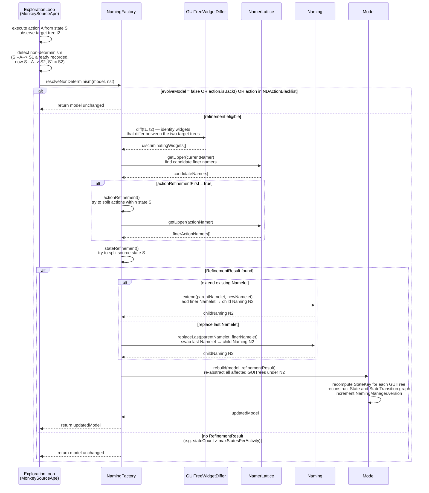

# Specification: Naming and Abstraction System

## Purpose

Android GUI testing faces a fundamental scalability problem: every distinct pixel arrangement, widget tree, or transient animation could be treated as a unique state, causing the state space to explode combinatorially. APE solves this with a *naming system* — a formal abstraction function that maps each concrete `GUITree` (a full DOM snapshot of the Android UI, captured via AccessibilityNodeInfo) to a compact abstract `State`. Two GUITrees that produce the same abstract representation under the current `Naming` are treated as one state in the exploration model, collapsing what would otherwise be thousands of ephemeral variants into a tractable model graph.

The core innovation is that abstraction is not fixed at design time. APE implements a CEGAR (Counterexample-Guided Abstraction Refinement) loop: the system starts with a deliberately coarse abstraction, detects when that coarseness introduces *non-determinism* (i.e., the same abstract state exhibits contradictory behaviour across separate visits), and automatically refines the abstraction to split the offending state into finer-grained states. Refinement is conservative — it produces a strictly finer `Naming` — and terminates when the finest possible abstraction (`AncestorNamer` over all attributes) is reached or when configuration limits are hit.

The abstraction is defined by a `Naming`, which is a set of `Namelet` rules. Each `Namelet` binds an XPath selector (identifying which widgets in the tree to match) to a `Namer` strategy (defining how to compute an abstract name for each matched widget). The `Namer` interface has a `naming(GUITreeNode) -> Name` method. When `Naming.naming(GUITree)` is called, it applies every `Namelet` to the tree's DOM, assigns a `Name` to each widget, and returns a `NamingResult` mapping each abstract `Name` to the set of `GUITreeNode`s that share that name. The `StateKey` is derived from the ordered array of `Name` values produced by the current `Naming`; two `GUITree`s with identical `Name` arrays map to the same abstract `State`.

The `Namer` implementations form a lattice ordered by discriminating power. The coarsest element is `EmptyNamer`, which returns the same empty `Name` (`""`) for every widget — meaning all widgets collapse into one group. The finest reachable element (without `useAncestorNamer`) is `parentTypeTextIndexNamer`, which considers the parent's attributes, the widget's class, its text/content-description, and its sibling index. When `useAncestorNamer=true`, the full-path `AncestorNamer` becomes the lattice top. This partial order is encoded in `NamerLattice`, which maps every `EnumSet<NamerType>` key to the corresponding `Namer` singleton and precomputes upper (finer), lower (coarser), and incomparable sets for each element. `NamerType` is an enum with values `TYPE`, `INDEX`, `PARENT`, `TEXT`, `ANCESTOR`; a `Namer`'s discriminating power is the cardinality and composition of its `NamerType` set.

Non-determinism is detected by `NamingFactory.resolveNonDeterminism()`, which is called by the exploration loop whenever a `StateTransition` is observed to have multiple distinct target states (`StateTransition`s diverging from the same action). For each pair of diverging transitions, the system computes a `GUITreeWidgetDiffer` to identify widgets that differ, then calls `refine()`, which tries state refinement first (splitting the *source* state) and, if `actionRefinementFirst=true`, action refinement first (splitting the *actions* within a state). The chosen `RefinementResult` selects a finer `Namer` for the XPath selector of the discriminating widget, produces a new child `Naming` via `Naming.extend()` or `Naming.replaceLast()`, and then rebuilds the exploration model with `Model.rebuild()`, re-abstracting all affected `GUITree`s under the new `Naming`.

The `NamingManager` interface (with implementations `ActivityNamingManager`, `StateNamingManager`, and `MonolithicNamingManager`) mediates between the `NamingFactory` and the rest of the system. It maintains a per-tree `treeToNaming` map so that each `GUITree` is associated with exactly one current `Naming`, and provides `getNaming(GUITree)` as the single access point for the rest of the code. Configuration flags in `ape.utils.Config` govern the entire system: `evolveModel` (default `true`) enables CEGAR; when `false`, the base `Naming` is used throughout and `resolveNonDeterminism` returns the model unchanged.

---

## CEGAR Refinement Flow

---

## Data Contracts

### Input

- `tree: GUITree` — a concrete UI snapshot captured after each action; its `Document` (W3C DOM) is the primary input to `Naming.naming()`; its `ActivityName: ComponentName` is used by `ActivityNamingManager` to select the per-activity `Naming`
- `naming: Naming` — the current abstraction level; selected from the `NamingManager` by activity or globally
- `nst: StateTransition` — the newly observed non-deterministic transition; carries `source: State`, `target: State`, and `action: ModelAction`; passed to `NamingFactory.resolveNonDeterminism()` to trigger CEGAR
- `ape.evolveModel: boolean` (default `true`) — permits refinement; read from `ape.properties` at startup
- `ape.actionRefinementFirst: boolean` (default `true`) — when `true`, action refinement is attempted before state refinement
- `ape.maxStatesPerActivity: int` (default `10`) — upper bound on abstract states per activity before refinement is suppressed
- `ape.maxGUITreesPerState: int` (default `20`) — upper bound on stored GUITrees per state before refinement is suppressed
- `ape.useAncestorNamer: boolean` (default `true`) — includes `AncestorNamer` variants in the lattice, making full-path discrimination available
- `ape.activityManagerType: String` (default `"state"`) — selects the `NamingManager` implementation: `"activity"` selects `ActivityNamingManager` (one `Naming` per activity); any other value (including the default `"state"`) selects `StateNamingManager` (one `Naming` per state). `MonolithicNamingManager` is only used when constructed explicitly (e.g., in replay scenarios).

### Output

- `NamingResult` — returned by `Naming.naming(GUITree, boolean)`: contains `Name[] names` (sorted, one per distinct abstract widget group) and `Object[] nodes` (each entry is a single `GUITreeNode` or a `GUITreeNode[]` sharing that name); used to construct `StateKey`
- `StateKey` — the abstract state identifier: a tuple `(ComponentName activity, Naming naming, Name[] widgetNames)`; two `GUITree`s produce equal `StateKey` values iff they map to the same abstract `State`
- `Model` (updated) — returned by `NamingFactory.rebuild()` after refinement; the model graph is reconstructed with all affected `GUITree`s re-abstracted under the new `Naming`; the `NamingManager` version counter is incremented

### Side-Effects

- **[NamingManager.treeToNaming]**: `updateNaming(GUITree, Naming)` writes the new `Naming` into the per-tree dictionary and increments `NamingManager.version`; the exploration loop uses this version to detect when the model needs rebuilding
- **[GUITreeNode.xpathName / tempXPathName]**: `Naming.naming(tree, updateNodeName=true)` writes `Name` values back into each `GUITreeNode`; `tempXPathName` is a scratch field cleared after each naming pass; `xpathName` is the persisted value used by `ParentNamer` and `AncestorNamer` when processing children
- **[Naming.treeToNamingResult]**: results of `naming()` are cached per `GUITree` inside the `Naming` instance; cache entries are evicted via `Naming.release(GUITree)` when the tree is discarded from the model
- **[NamingFactory.NDActionBlacklist]**: actions whose non-determinism exceeds 2 diverging transitions are added to a blacklist and excluded from future refinement attempts
- **[NamingFactory.guiTreeNamingBlacklist]**: records which `(GUITree, Naming)` pairs have already been attempted for refinement to prevent cycles

### Error

- `IllegalStateException("A node has no namelets.")` — thrown during `Naming.namingInternal()` when a DOM element matches no `Namelet`; indicates a corrupt or unexpected tree structure; the bad tree is saved to `/sdcard/badtree.xml`
- `IllegalStateException("A node has no namelet.")` — thrown when `Namelet` selection among multiple candidates returns `null`; should not occur if `Naming` is well-formed
- `NullPointerException("Parent name should not be null.")` — thrown by `ParentNamer.naming()` when a parent node's `tempXPathName` and `xpathName` are both `null`; indicates a top-down traversal was not performed before accessing child names
- `IllegalArgumentException("Extended child namer should refine to parent namer.")` — thrown by `Naming.extend()` when the candidate `Namelet`'s `Namer` does not satisfy `refinesTo()` with respect to the parent `Namelet`'s `Namer`; enforces the monotonicity of refinement
- `IllegalArgumentException("Incomplete lattice")` — thrown by `NamerLattice` constructor if either the bottom (`noneOf()`) or top (`allOf()`) element is absent, or if the complement of any element is missing; the lattice MUST be complete at construction time

---

## Invariants

- **INV-NAME-01**: For any `GUITree` `t` and current `Naming` `N`, `N.naming(t)` MUST return exactly one `NamingResult`; every node in `t`'s DOM MUST be assigned to exactly one `Name` group. No node MAY be unassigned (enforced by the `IllegalStateException` on missing namelets).

- **INV-NAME-02**: If `N2 = N.extend(parentNamelet, newNamelet)`, then `N2` MUST be strictly finer than `N`: for every pair of `GUITree`s `t1`, `t2` that map to the same `StateKey` under `N2`, they MUST also map to the same `StateKey` under `N`. The converse MUST NOT hold for at least the pair of trees that triggered refinement.

- **INV-NAME-03**: Refinement MUST be monotone: `Naming.extend()` creates a child `Naming` that adds exactly one new `Namelet` to the parent's `Namelet` array; `Naming.replaceLast()` replaces the last `Namelet` with a strictly finer one. In both cases, the new `Namer` MUST satisfy `newNamer.refinesTo(existingNamer) == true` (i.e., `newNamer.getNamerTypes()` properly contains `existingNamer.getNamerTypes()`).

- **INV-NAME-04**: The `NamerLattice` MUST have `EmptyNamer` (with `NamerType` set `{}`) as its unique bottom element (`getBottomNamer()`) and the namer with the full `NamerType` set (either `{TYPE, INDEX, PARENT, TEXT}` or `{TYPE, INDEX, PARENT, TEXT, ANCESTOR}` depending on `useAncestorNamer`) as its unique top element (`getTopNamer()`).

- **INV-NAME-05**: `EmptyNamer.naming(node)` MUST always return `EmptyNamer.emptyName` — the same singleton `Name` instance — regardless of the `GUITreeNode`'s attributes. This makes `EmptyNamer` the identity for the `meet` operation in the lattice.

- **INV-NAME-06**: `CompoundNamer.naming(node)` MUST return a `CompoundName` whose `toString()` is the concatenation of `toString()` of each component `Namer`'s `Name` in array order. Equality between two `CompoundName` values MUST be determined by element-wise equality of the component `Name` array via `Arrays.equals()`.

- **INV-NAME-07**: `AncestorNamer.naming(node)` MUST return an `AncestorName` whose `Name[]` array encodes the full path from the root to the node, in root-first order. Two nodes that differ at any ancestor MUST produce unequal `AncestorName` values.

- **INV-NAME-08**: When `ape.evolveModel=false`, `NamingFactory.resolveNonDeterminism()` MUST return the model unchanged. No `Naming.extend()`, `Naming.replaceLast()`, or `NamingManager.updateNaming()` call MAY occur during the session.

- **INV-NAME-09**: The `treeToNamingResult` cache inside each `Naming` MUST be invalidated (via `Naming.release(GUITree)`) whenever the `GUITree` is removed from the model. Stale cache entries MUST NOT be used; after `release()`, a subsequent call to `naming(tree)` for the same tree MUST recompute from the DOM.

- **INV-NAME-10**: `NamingManager.version` MUST be incremented exactly once per call to `updateNaming(GUITree, Naming)`. The exploration loop MAY use this version counter to determine whether model state counts are still valid without recomputing.

- **INV-NAME-11**: `Namer.refinesTo(other)` MUST return `true` if and only if `this.getNamerTypes().containsAll(other.getNamerTypes())`. In particular, `namer.refinesTo(namer)` MUST return `true` (reflexivity), and if `a.refinesTo(b)` and `b.refinesTo(c)`, then `a.refinesTo(c)` MUST hold (transitivity).

- **INV-NAME-12**: For any two `GUITree`s `t1` and `t2` that differ only in widget properties not covered by `N`'s `Namelet` set (i.e., no `NamerType` in any `Namelet`'s `Namer` reads those properties), `N.naming(t1)` and `N.naming(t2)` MUST produce equal `StateKey` values. Abstraction MUST ignore irrelevant properties.

---

## Requirements

### Requirement: Uniform Abstraction

Every concrete `GUITree` observed during a testing session MUST be mapped to exactly one abstract `State` under the `Naming` current at the time of observation. The `NamingManager` MUST resolve the applicable `Naming` via `getNaming(GUITree)`, falling back to `getNaming(tree, activityName, document)` if the tree has not been previously registered.

#### Scenario: same-structure trees map to same state

- **WHEN** two `GUITree`s `t1` and `t2` have identical widget class names, resource IDs, text values, and sibling indices for every node, and the current `Naming` uses at most `TypeNamer` (class + resource-id) and `TextNamer` (text + content-desc),
- **THEN** `naming.naming(t1).getNames()` and `naming.naming(t2).getNames()` MUST be equal arrays (element-wise via `Name.equals()`),
- **AND** the `StateKey` derived from both MUST satisfy `key1.equals(key2)`.

#### Scenario: same-structure trees with ignored properties

- **WHEN** `t1` and `t2` differ only in widget bounds (screen coordinates) and enabled/checked flags, and the current `Naming` contains only a `TypeNamer` `Namelet` covering all nodes (`//*`),
- **THEN** `naming.naming(t1)` and `naming.naming(t2)` MUST return equal `NamingResult` objects,
- **AND** no refinement MUST be triggered by this difference alone.

---

### Requirement: TextNamer Discrimination

When a `TextNamer` `Namelet` is active in the current `Naming`, two widgets with different `text` or `content-desc` attribute values MUST receive distinct `Name` values and therefore map to distinct abstract widget groups.

#### Scenario: two buttons with different labels map to different names

- **WHEN** a `GUITree` contains two `android.widget.Button` nodes with `text="OK"` and `text="Cancel"` respectively, and the current `Naming` includes a `TextNamer` `Namelet` matching both nodes (XPath `//*`),
- **THEN** `naming.naming(tree).getNames()` MUST contain at least two distinct `Name` entries,
- **AND** `textNamer.naming(okButton).toString()` MUST equal `"text=OK;"` and `textNamer.naming(cancelButton).toString()` MUST equal `"text=Cancel;"`.

#### Scenario: EditText widget text is ignored by TextNamer

- **WHEN** a widget has class name matching `android.widget.EditText` (as determined by `GUITreeBuilder.isEditText()`), and `TextNamer.naming()` is applied,
- **THEN** the `text` attribute MUST be treated as the empty string `""` regardless of the actual text content,
- **AND** two `EditText` nodes with different `text` values but identical `content-desc` MUST receive equal `TextName` values.

---

### Requirement: Non-Determinism Detection

The system MUST detect when the same abstract `State` (same `StateKey`) yields different observable behaviour across separate visits — specifically, when the same `ModelAction` from that state leads to two different target `State`s. This constitutes a non-determinism event and MUST trigger the CEGAR refinement step when `ape.evolveModel=true`.

#### Scenario: same action leads to two different target states

- **WHEN** action `A` is executed from abstract `State` `S` on two separate occasions, producing target trees `t1` and `t2` that map to distinct abstract states `S1 != S2` under the current `Naming`,
- **THEN** `NamingFactory.resolveNonDeterminism(model, nst)` MUST be called where `nst` is the newer `StateTransition`,
- **AND** the system MUST attempt to find a `RefinementResult` that splits `S` into sub-states that distinguish `t1` from `t2`.

#### Scenario: BACK action non-determinism is not refined

- **WHEN** non-determinism is detected on an action `A` where `A.isBack() == true`,
- **THEN** `NamingFactory.resolveNonDeterminism()` MUST log a message and return the model unchanged,
- **AND** no `Naming.extend()` or `NamingManager.updateNaming()` call MUST occur.

#### Scenario: action blacklisted after three-way divergence

- **WHEN** a `ModelAction` `A` has accumulated three or more diverging `StateTransition`s (i.e., `outStateTransitions.size() >= 3`),
- **THEN** `A` MUST be added to `NDActionBlacklist`,
- **AND** future calls to `resolveNonDeterminism()` with a transition whose action equals `A` MUST be skipped without attempting refinement.

---

### Requirement: Refinement Produces a Strictly Finer Naming

When `NamingFactory.refine()` succeeds, the resulting `Naming` MUST be a strict refinement of the current `Naming`. The new `Naming` MUST distinguish the two `GUITree`s that triggered the non-determinism event by mapping them to different `StateKey` values.

#### Scenario: state refinement splits diverging trees

- **WHEN** trees `t1` and `t2` both map to abstract state `S` under `Naming` `N`, but exhibit different available action sets,
- **AND** `NamingFactory.stateRefinement()` finds a candidate `Namelet` with a finer `Namer` `R` such that `R.refinesTo(currentNamer)` is `true` and `R` assigns different `Name` values to the discriminating widget in `t1` vs. `t2`,
- **THEN** the returned `RefinementResult.updatedNaming` MUST satisfy `N.isAncestor(updatedNaming) == true` (i.e., `updatedNaming` is a descendant of `N` in the naming tree),
- **AND** `N.naming(t1)` under `updatedNaming` MUST produce a `StateKey` different from `N.naming(t2)` under `updatedNaming`.

#### Scenario: action refinement is preferred when actionRefinementFirst=true

- **WHEN** `ape.actionRefinementFirst=true` and a non-determinism event is detected,
- **THEN** `NamingFactory.actionRefinement()` MUST be attempted before `stateRefinement()`,
- **AND** `stateRefinement()` MUST be attempted only if `actionRefinement()` produces no `RefinementResult`.

#### Scenario: refinement suppressed when state count exceeds limit

- **WHEN** the activity containing the non-deterministic state already has `ActivityNode.getStates().size() > ape.maxStatesPerActivity` (default `10`),
- **THEN** `NamingFactory.refine()` MUST return an empty list without attempting any `Naming.extend()` call,
- **AND** the model MUST be returned unchanged by `resolveNonDeterminism()`.

---

### Requirement: Model Rebuild After Refinement

When a `RefinementResult` is accepted, the model MUST be fully reconstructed under the updated `Naming`. All `GUITree`s previously assigned to the split state MUST be re-abstracted, potentially producing new `State` nodes in the model graph.

#### Scenario: affected trees are re-abstracted under new naming

- **WHEN** `NamingFactory.rebuild(model, rr)` is called with a non-null `RefinementResult` `rr`,
- **THEN** for every `GUITree` `t` in the affected set, `nm.updateNaming(t, rr.updatedNaming)` MUST be called,
- **AND** `model.rebuild()` MUST be invoked, which recomputes all `StateKey`s and reconstructs the `State` and `StateTransition` graph,
- **AND** `NamingManager.version` MUST be strictly greater after `rebuild()` than before.

#### Scenario: post-rebuild consistency check

- **WHEN** `NamingFactory.rebuild()` completes and debug mode is active (`debug=true` in `NamingFactory`),
- **THEN** for every affected `GUITree` `t`, `t.getCurrentNaming()` MUST equal `nm.getNaming(t)` MUST equal `nm.getNaming(t, activityName, document)`,
- **AND** any inconsistency MUST throw `IllegalStateException("Inconsistent naming update.")`.

---

### Requirement: evolveModel=false Freezes the Naming

When `ape.evolveModel=false`, the system MUST behave as a static abstraction tool. The base `Naming` (constructed at startup) MUST be used for all `GUITree`s throughout the entire testing session. No refinement MUST occur regardless of how many non-deterministic events are observed.

#### Scenario: non-determinism observed but not refined

- **WHEN** `ape.evolveModel=false` is set in `ape.properties`,
- **AND** action `A` from state `S` leads to two distinct target trees `t1` and `t2` with different action sets on two separate visits,
- **THEN** `NamingFactory.resolveNonDeterminism(model, nst)` MUST return the original `model` object without modification,
- **AND** `NamingManager.version` MUST remain unchanged,
- **AND** no `Naming.extend()`, `Naming.replaceLast()`, or `NamingManager.updateNaming()` call MUST occur during the session.

---

### Requirement: AncestorNamer Full-Path Discrimination

`AncestorNamer` MUST produce a `Name` that uniquely encodes the full path from the root of the widget tree to the target node, such that two nodes that share all local attributes but differ in any ancestor are assigned distinct `Name` values.

#### Scenario: siblings with same local attributes are distinguished

- **WHEN** a `GUITree` contains two `android.widget.TextView` nodes `n1` and `n2` that are siblings (same parent) with identical `text`, `class`, `resource-id`, and `index` values,
- **AND** `AncestorNamer` is the active `Namer` for both nodes,
- **THEN** `ancestorNamer.naming(n1)` and `ancestorNamer.naming(n2)` MUST return equal `AncestorName` values (since they share the same path),
- **AND** if `n1` and `n2` are instead at different depths or under different parents with different `class` values, their `AncestorName` values MUST NOT be equal.

#### Scenario: root node gets single-element path

- **WHEN** `AncestorNamer.naming()` is called on the root node of a `GUITree` (i.e., `node.getParent() == null`),
- **THEN** the returned `AncestorName` MUST contain exactly one `Name` element equal to `localNamer.naming(rootNode)`,
- **AND** `AncestorName.toString()` MUST be `"/" + localNamer.naming(rootNode).toString()`.

---

### Requirement: CompoundNamer Conjunction

`CompoundNamer` MUST combine multiple `SingletonNamer` components such that its output `Name` is the conjunction (logical AND) of all component names. Two nodes MUST receive the same `CompoundName` if and only if every component `Namer` assigns them the same individual `Name`.

#### Scenario: TypeNamer + TextNamer compound name

- **WHEN** `CompoundNamer(typeNamer, textNamer)` is applied to a `GUITreeNode` with `className="android.widget.Button"`, `resourceId=""`, `text="Submit"`, and `content-desc=""`,
- **THEN** `compoundNamer.naming(node).toString()` MUST equal `"class=android.widget.Button;text=Submit;"`,
- **AND** a node with `className="android.widget.Button"` but `text="Cancel"` MUST receive a distinct `CompoundName`.

#### Scenario: CompoundName equality is array-wise

- **WHEN** two `CompoundName` instances `cn1` and `cn2` are compared via `cn1.equals(cn2)`,
- **THEN** the result MUST be `true` if and only if `Arrays.equals(cn1.names, cn2.names)` is `true`,
- **AND** reordering the component `Namer`s in `CompoundNamer` (e.g., `CompoundNamer(textNamer, typeNamer)` vs. `CompoundNamer(typeNamer, textNamer)`) MUST produce different `CompoundName` values for the same node when the component `Name.toString()` values differ.

---

### Requirement: Namelet XPath Selector Completeness

Every node in a `GUITree`'s DOM MUST be matched by at least one `Namelet` in the current `Naming`. The base `Naming` MUST use a catch-all XPath expression (`//*`) so that no node can be unmatched, regardless of widget type or depth.

#### Scenario: base naming covers all nodes

- **WHEN** the base `Naming` is constructed by `NamingFactory.createBaseNaming()`,
- **THEN** for every `GUITree` encountered during testing, `Naming.namingInternal()` MUST complete without throwing `IllegalStateException("A node has no namelets.")`,
- **AND** `NamingResult.getNodeSize()` MUST equal the total number of `GUITreeNode`s in the tree.

#### Scenario: refined naming preserves coverage

- **WHEN** a new `Naming` `N2` is produced by `N.extend(parentNamelet, newNamelet)`, where `newNamelet` has XPath `//android.widget.Button`,
- **THEN** all `GUITreeNode`s NOT matched by `//android.widget.Button` MUST still be covered by the parent `Namelet` (`//*`),
- **AND** `Naming.namingInternal()` on any previously observed `GUITree` MUST still complete without error under `N2`.

---

### Requirement: NamerLattice Ordering Consistency

The `NamerLattice` MUST correctly implement a partial order over `Namer` instances such that `getLower(namer)` returns all strictly coarser `Namer`s, `getUpper(namer)` returns all strictly finer `Namer`s, and `join(n1, n2)` returns the least upper bound.

#### Scenario: join of TypeNamer and TextNamer is typeTextNamer

- **WHEN** `NamerLattice.join(typeNamer, textNamer)` is called,
- **THEN** the result MUST be the `Namer` with `getNamerTypes()` equal to `EnumSet.of(NamerType.TYPE, NamerType.TEXT)`,
- **AND** `result.refinesTo(typeNamer)` MUST be `true` and `result.refinesTo(textNamer)` MUST be `true`.

#### Scenario: emptyNamer is below all other namers

- **WHEN** `NamerLattice.getLower(emptyNamer)` is called,
- **THEN** the result MUST be an empty collection (no namer is strictly coarser than `EmptyNamer`),
- **AND** `NamerLattice.getUpper(emptyNamer)` MUST include all other `Namer`s in the lattice.

---

### Requirement: Naming Cache Consistency

The per-`Naming` cache of `NamingResult` values (`Naming.treeToNamingResult`) MUST be consistent with the live `GUITree` DOM at all times. Cache entries MUST be evicted when a `GUITree` is released from the model to prevent stale data from influencing subsequent abstraction decisions.

#### Scenario: cache hit returns identical result

- **WHEN** `Naming.naming(tree, false)` is called twice on the same `tree` and `Naming` without any intervening modification,
- **THEN** the second call MUST return the same `NamingResult` object reference (cache hit),
- **AND** no DOM traversal MUST occur on the second call.

#### Scenario: release evicts cache entry

- **WHEN** `Naming.release(tree)` is called for a `GUITree` `t`,
- **THEN** the cache entry for `t` MUST be removed from `treeToNamingResult`,
- **AND** a subsequent call to `Naming.naming(t, false)` MUST recompute the `NamingResult` from the DOM.
